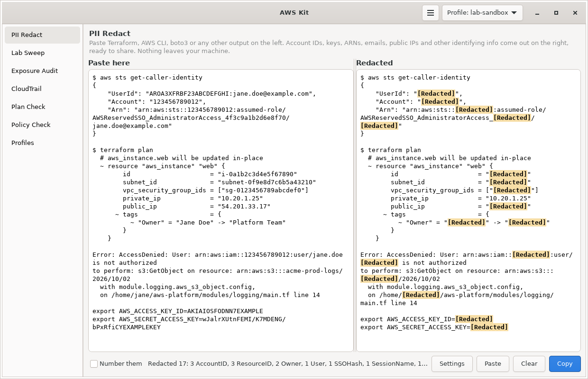

# Cloud Tools

     [](LICENSE)

These are small tools I made for my own AWS and Terraform work on Fedora. Each one started from something that kept slowing me down while working on my [aws-platform](https://github.com/Snowblind019/aws-platform) projects and lab accounts: redacting output before asking for help, leftover resources costing money, chasing down AccessDenied errors, reading long Terraform plans, and keeping track of which AWS account I'm in.

They all live in one Linux app called **AWS Kit**: one GTK 4 window with a sidebar for the seven tools, plus commands for everything in the terminal.



## How I built these

I built these with AI. I used Claude to help me brainstorm the ideas, plan how each tool should work, and write most of the code. The problems they solve are mine, and I decided which tools to make and what they needed to do.

## The tools

| Tool | What it does | Why I made it |
|---|---|---|
| [**PII Redact**](pii-redact/) | Swaps account IDs, keys, ARNs, emails and other identifying info for `[Redacted]` in Terraform, AWS CLI or any other output | Redacting output by hand every time I needed help troubleshooting got tedious |
| [**Lab Sweep**](lab-sweep/) | Finds anything still costing money in every region across your accounts, and tears it down after you confirm | Forgotten NAT gateways and Elastic IPs from labs keep billing, and the old lab accounts from my previous org needed cleaning up |
| [**Exposure Audit**](exposure-audit/) | Looks for things open to the internet or missing basic protection, like open security groups, public buckets and snapshots, and IMDSv1 | I wanted a small scanner I wrote and understand, like a mini Prowler |
| [**CloudTrail**](cloudtrail/) | Shows who did what and when from CloudTrail event history, and explains AccessDenied errors | Debugging permission errors in my own builds meant digging through raw CloudTrail events |
| [**Plan Check**](plan-check/) | Turns a Terraform plan into a short list of changes and flags the risky ones | Long plans are easy to skim past, and a destroyed bucket or an open port can hide in the middle |
| [**Policy Check**](policy-check/) | Checks an IAM policy for wildcards, privilege escalation paths, public access and weak GitHub OIDC trust | I wanted a quick way to sanity check policies before putting them in Terraform |
| [**Profiles**](profiles/) | Picks which AWS profile your terminals use from a small window or `awsp`, with SSO sign-in status | Once my AWS Organization has several accounts, it's easy to run a command in the wrong one |

Each tool's code and in-depth README live in its own folder. The parts they share, like the window, the commands and the installer, live in [awskit/](awskit/), which has its own README too.

PII Redact is built into the others. Every **Copy redacted** button in AWS Kit runs text through it with your settings, so a CloudTrail event, an audit finding or a plan summary can be shared without leaking account details.

## Install

On Fedora:

```bash
sudo dnf install python3-boto3 python3-gobject gtk4 wl-clipboard
git clone https://github.com/Snowblind019/cloud-tools.git
cd cloud-tools
./install.sh
```

| Distro | Packages |
|---|---|
| Fedora | `python3-boto3 python3-gobject gtk4 wl-clipboard` |
| Debian / Ubuntu | `python3-boto3 python3-gi gir1.2-gtk-4.0 wl-clipboard` |
| Arch | `python-boto3 python-gobject gtk4 wl-clipboard` |

On X11, use `xclip` instead of `wl-clipboard`. PII Redact, Plan Check and Policy Check don't need boto3.

Everything installs into your home folder: the `awskit` and `pii-redact` commands in `~/.local/bin`, and launcher entries for **AWS Kit**, **PII Redact**, **PII Redact Settings** and **AWS Profile Picker**. To update, run `git pull && ./install.sh`. To remove it all, run `awskit uninstall`.

If you had the standalone pii-redact installed before, your settings carry over and the old launcher entries are cleaned up.

### WSL

AWS Kit also runs on WSL2 with WSLg. Install the same packages inside the distro and run `./install.sh` as usual. A few things work differently there:

- The windows draw in software instead of on the GPU. WSL usually doesn't have a GL driver GTK can use, and GTK 4 crashes on startup without one, so AWS Kit switches to software drawing by itself. To try the GPU anyway, run `GSK_RENDERER=ngl awskit`.
- Copying goes straight to the Windows clipboard through `clip.exe`, and `pii-redact clip` reads it back with PowerShell, so you can copy in any Windows app, run it, and paste. wl-clipboard isn't needed, but it's used as a fallback if PowerShell is blocked.
- Desktop notifications, like the one `pii-redact clip` shows and the scheduled Lab Sweep ones, usually don't show up in Windows. Set `sns_topic` in the settings to get sweep summaries through SNS instead. The schedule also only runs while WSL is running.

## Quick start

| Command | What it does |
|---|---|
| `awskit` | Open the AWS Kit window |
| `pii-redact` | Open the small PII Redact paste window |
| `pii-redact clip` | Redact whatever is on the clipboard, in place |
| `terraform plan \| pii-redact` | Redact command output in the terminal |
| `awskit sweep` | List what's costing money in every region |
| `awskit audit -v` | Run the exposure checks |
| `awskit trail --mine --errors --since 2h` | My own failed AWS calls in the last 2 hours |
| `awskit plan` | Run `terraform plan` here and summarize it |
| `awskit policy policy.json` | Check a policy |
| `awsp` | Pick the AWS profile for your terminals |

Each tool's README has the full details.

## Keybinds

The quickest way to use these is from keybinds: one for the PII Redact paste window, one to redact the clipboard in place, one for the profile picker and one for the main window. [AWS Kit's README](awskit/README.md#keybinds) has them for Niri, Hyprland, Sway, i3, GNOME and KDE, with window rules so the small windows float.

## Repo layout

```text
cloud-tools/
├── README.md            this file
├── install.sh           installs AWS Kit with all seven tools
├── LICENSE
├── awskit/              the shared app: window, commands, installer, keybinds
├── pii-redact/          redact account IDs, keys and personal info from output
├── lab-sweep/           cost watchdog and teardown
├── exposure-audit/      public access and missing protection checks
├── cloudtrail/          who did what, from CloudTrail
├── plan-check/          Terraform plan summary and risk flags
├── policy-check/        IAM policy checker
├── profiles/            AWS profile switcher and shell integration
└── tests/               tests, with AWS calls run against a fake AWS
```

## Status

PII Redact gives the same output it did as a standalone tool, checked against its sample file. The AWS tools have been tested against [moto](https://github.com/getmoto/moto), which fakes AWS locally, and in the window with test data. That's what the screenshots show. They haven't been run against a real account yet, so do a dry run before the first real teardown.

To run the tests:

```bash
pip install --user moto
python3 -m unittest discover -s tests -v
```

## License

MIT. See [LICENSE](LICENSE).

These are personal projects and aren't affiliated with or endorsed by Amazon Web Services.
