# Cloud Map

Draws an AWS environment as a diagram. It reads a live AWS environment or your Terraform, and shows it on its own page in the AWS Kit window, where you can pan, zoom, search and click into anything. It also writes `.drawio` files with the official AWS icons, colors by category, short captions, a legend, layers you can turn on and off, and security problems marked in red, plus SVG and PNG pictures of the same map. You can rearrange a map in an offline draw.io editor, and the next scan keeps your arrangement, your colors and the notes you drew. And it works the other way too: draw a new network with the designer, and get Terraform for it. It can also tell whether one thing can reach another on a port, and what's blocking it, see [Reachability](#reachability).

There are two kinds of map. An **access map** shows who can get into what: the organization, OUs and accounts, SCPs, IAM Identity Center, roles, and who each role trusts, like GitHub through OIDC. A **network map** shows VPCs, subnets, routing and gateways. A **combined** map puts both in each account.

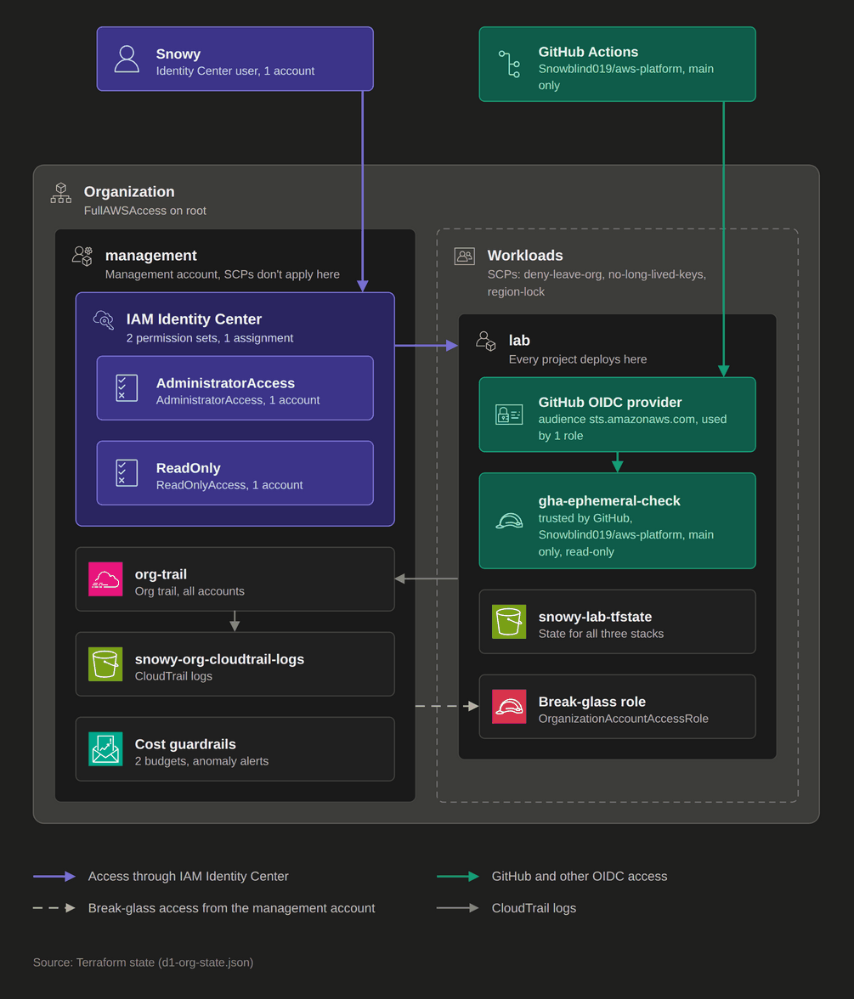

Part of [AWS Kit](../awskit/). The screenshots are drawn from the example Terraform states in `examples/`, with made-up account IDs.

## Why I made it

I have a diagram of my AWS Organization (D1) that shows how access works: me through Identity Center, GitHub through an OIDC role, CloudTrail logs going to the management account, and the break-glass role. It's the clearest picture of the setup I have, but it's a static picture, so it's only right until I change something. I wanted that same level of clarity generated from what's actually there, from a live scan or from the Terraform that builds it, so the diagram can't drift from reality. It also points out the things I'd want to catch, like a trust to an account outside the org or SSH open to the world.

Cloud Map was built in five parts: the model, scanners and the draw.io export, then the viewer page in the AWS Kit window with SVG and PNG export, then the offline draw.io editor and the layout memory that keeps where you moved things, then the designer, which writes Terraform from a diagram, and last reachability, which checks what can reach what (all below).

## What it draws

| Map | What's in it |
|---|---|
| **Access** | People and outside principals in a row on top (Identity Center users and groups, GitHub, outside AWS accounts), then the organization with the management account and each OU side by side, then the accounts, then what's in each account: Identity Center and its permission sets, OIDC and SAML providers, roles, the CloudTrail trail and its bucket, and a cost guardrails box |
| **Network** | Each account, then each region, then each VPC. Inside a VPC, the AZs are columns so subnets line up across them, public above private. Internet, egress-only and VPN gateways and transit gateway attachments sit on the VPC border, NAT gateways sit in their subnet, and instances, load balancers and databases sit where they run |
| **Combined** | Both. Each account gets an identity strip on top (IAM is global), with its regions and VPCs below |

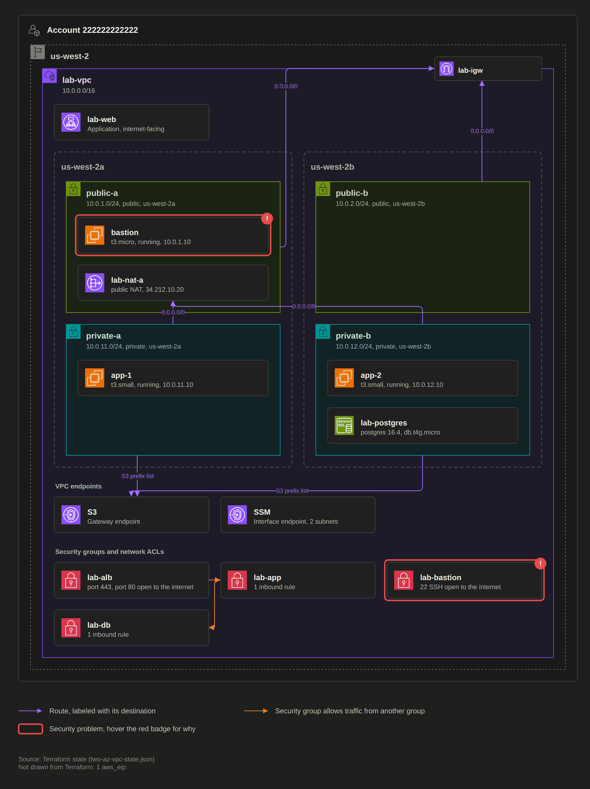

### Lines

| Line | Means |
|---|---|
| Purple | Access through IAM Identity Center: user or group to Identity Center, and Identity Center to the accounts it can reach. Hover the line into an account for the permission sets. |
| Green | GitHub (or another OIDC provider) to the OIDC provider in the account, and the provider to the role |
| Grey, ending at a role | A role trusted by another account in the org |
| Grey, dashed | Break-glass: the management account into `OrganizationAccountAccessRole` |
| Grey, ending at the trail or its bucket | CloudTrail logs: member accounts into the org trail, and the trail into its bucket |
| Violet, labeled | A route, labeled with its destination, like `0.0.0.0/0` or `S3 prefix list` |
| Violet, two-way | VPC peering and transit gateway attachments |
| Orange | One security group allowing traffic from another. Hover for the ports. |
| Orange, dashed | Site-to-Site VPN |
| Red | A security problem. Hover the red badge for why. |

The legend at the bottom of each map only lists the lines that map actually uses.

### Layers

Open **View**, then **Layers** in draw.io (Ctrl+Shift+L) to turn these on and off:

| Layer | What's on it |
|---|---|
| Base | Containers and resources |
| Routes | Route lines |
| Security groups | Security groups, network ACLs that aren't the default, and the lines between groups |
| Endpoints | VPC endpoints |
| Trust paths | Identity Center access, OIDC and SAML, role trust and break-glass lines |
| Flags | The red outlines and badges |
| Legend | The legend and the footnote |

A map only has the layers it uses. Turning a layer off also hides the lines that attach to it, so with Routes on and Endpoints off, the routes into the S3 endpoint go away with it. The space a detail layer takes inside a VPC stays when the layer is off. That's a draw.io limit: a shape nested inside a container always belongs to the container's layer, so anything that toggles has to float on its own layer at a fixed spot.

### Hovering and Edit Data

Hover any box for a summary: what it is, its ID, account, region, CIDR, rules, who trusts it, and any problems. Select it and press Ctrl+M (**Edit Data**) to see everything the scan knows about it, like the full trust policy, every tag, and the SCP summaries. Every box AWS Kit makes has `awskit="1"` in its data, so it can tell them apart from shapes you draw yourself.

## The Cloud Map page

The **Cloud Map** page in the AWS Kit window (Ctrl+9) draws the same maps as the `.drawio` export, from the same layout and the same colors and AWS icons, so what you see in the window is what the file shows in draw.io.

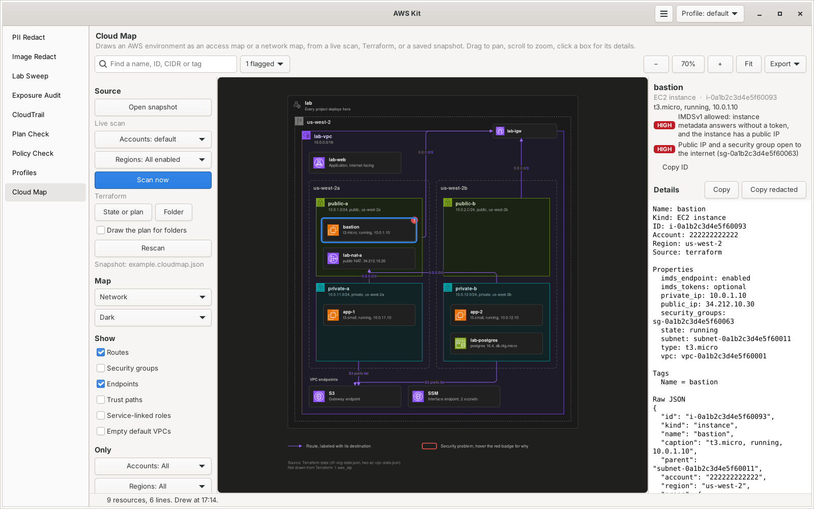

**On the left** are the controls:

| Control | What it does |
|---|---|
| **Open snapshot** | Opens a `.cloudmap.json` from `awskit map scan` or `awskit map tf` |
| **Accounts**, **Regions**, **Scan now** | Scans the picked profiles live, in the background, with progress and a Stop button. Read-only, the same scan as `awskit map scan` |
| **State or plan**, **Folder** | Reads Terraform: `terraform show -json` output, a `.tfstate`, a saved plan, or a folder. With **Draw the plan for folders** ticked, a folder runs `terraform plan` and draws what it would build. It never runs apply |
| **Rescan** | Runs the same scan or Terraform read again |
| Map type and theme | Access, Network or Combined, in dark or light |
| **Layout** | How much of your own arrangement is kept for this map, with **Tidy up** and **Reset layout**, see [Layout memory](#layout-memory) |
| **Show** | Routes, security groups, endpoints, trust paths, service-linked roles and empty default VPCs |
| **Only** | Limits the map to some accounts, regions or VPCs |

Every change redraws the map straight away. The page remembers the last snapshot, map type, filters, layers and theme, and opens on them next time.

**In the middle** is the map:

- Drag to pan. Scroll to zoom, centered on the pointer. Shift and scroll pans sideways. On a touchpad, two-finger scrolling pans, and pinching or Ctrl with two-finger scrolling zooms
- `+` and `-` zoom, `0` goes to 100%, `F` fits the map in the window, the arrow keys pan, Esc clears the selection. The same buttons are in the top bar
- Hover a box or a line for its tooltip, the same one draw.io shows
- Click a box to select it and open its details. Click a line to highlight it and both of its ends
- Double-click a container, like a VPC or a subnet, to zoom to it

**On the right** are the details of what's selected: its name, kind, ID and caption, its problems with their severity, every property and tag, and the raw JSON from the snapshot. **Copy** and **Copy redacted** work like on every other page, and **Copy ID** and **Copy ARN** copy just that.

**In the top bar**, the search box finds a name, ID, CIDR, IP or tag value. Press Enter to go to the next match. The flag button counts the problems on the map, and lists them all. Click one to jump to it. **Edit** opens the map in draw.io, see [Editing in draw.io](#editing-in-drawio).

Notes from the scan, like skipped services or AccessDenied, show in a bar above the map. Close it with the x. They're also in the map's footnote.

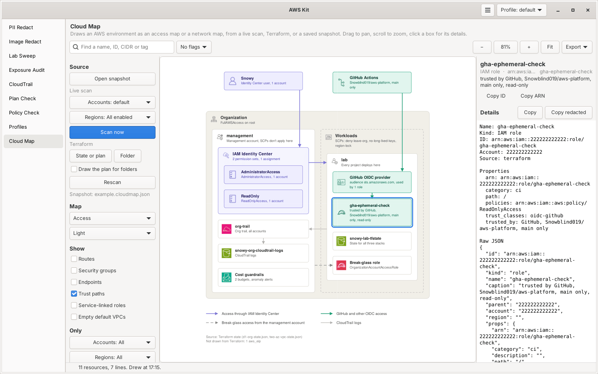

### Where snapshots go

Opening a snapshot uses that file. A scan from the page is saved as `scans/<profiles>.cloudmap.json` and a Terraform read as `terraform/<name>.cloudmap.json`, both in `~/.config/awskit/cloud-map/` (`%APPDATA%\awskit\cloud-map\` on Windows). Scanning the same profiles again replaces the same file, so the map keeps its name between scans.

### Exporting

**Export** in the top bar saves what's on screen, with the same map type, filters and layers:

| Format | What you get |
|---|---|
| `.drawio` | The draw.io file, with layers, tooltips and Edit Data, the same as `awskit map export` |
| SVG | A picture that scales, for docs and slides. Text is drawn as shapes, so it looks the same everywhere |
| PNG | A picture at twice the page size, for chats and tickets |

Tick **Redact** first to run everything through PII Redact, the same way `--redact` does (see [Redaction](#redaction)). The `.drawio` gets the keyed hash cell IDs, and SVG and PNG are drawn from the redacted text.

### Big maps

The map is drawn in tiles that are kept and reused, so panning only draws the strip coming into view, and the tiles just outside the window are drawn ahead while nothing else is happening. Only what's on screen is drawn, text too small to read is skipped, and icons are drawn once per size. A test map with 1,960 instances in 40 VPCs (about 2,250 boxes) pans at well under a millisecond a frame once the tiles are drawn. The first frame after a zoom takes 60 to 100 ms on it, and while the wheel is still turning, the tiles already drawn are stretched instead. The same holds with the software renderer AWS Kit uses on WSL.

## Editing in draw.io

**Edit** in the top bar opens the map in draw.io: drag boxes around, resize them, change colors, fix a caption, draw notes and arrows of your own. What you change is kept for the next scan, see [Layout memory](#layout-memory). It's the draw.io web app the installer downloaded, run fully offline (see [Offline](#offline)).

Edit writes the map, with your saved layout, to a working file next to the snapshot, `<name>-<type>.drawio`, and opens it.

### Linux

The editor opens right inside the page. The controls and details step aside to give it room.

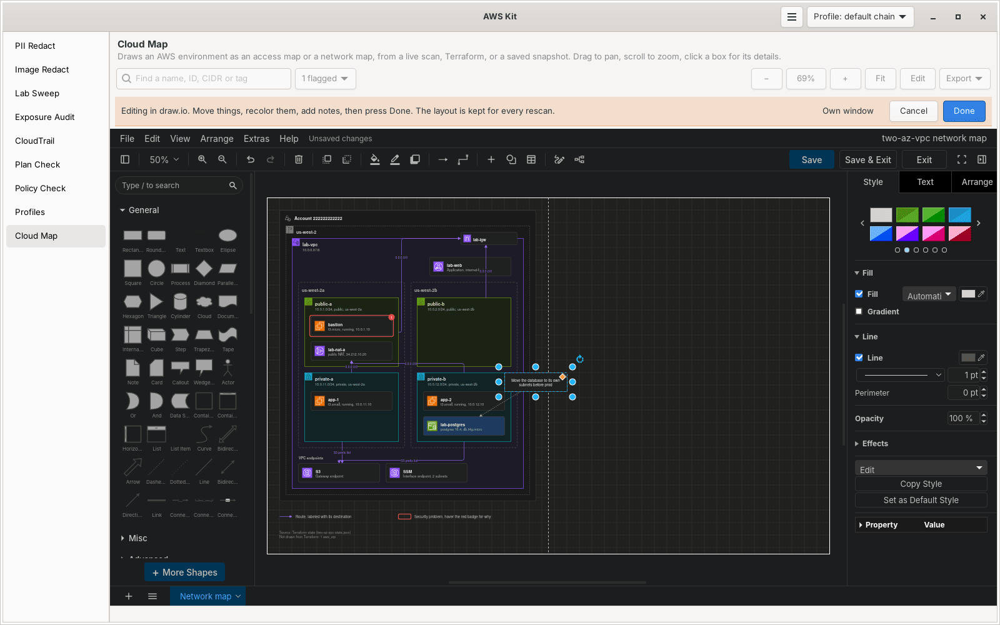

**Done** saves and goes back to the map, which redraws with the new layout. **Cancel** closes it without saving, after asking if something changed. draw.io's own **Save**, **Save & Exit** and **Exit** buttons work too: Save keeps the layout and stays in the editor, and Save & Exit is the same as Done.

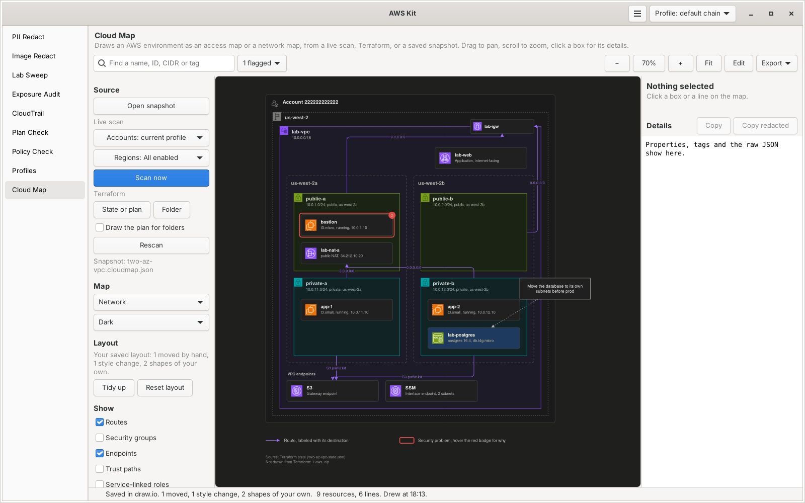

It needs WebKitGTK 6.0, which is optional:

| Distro | Package |
|---|---|
| Fedora | `webkitgtk6.0` |
| Debian / Ubuntu | `gir1.2-webkit-6.0` |
| Arch | `webkitgtk-6.0` |

Without it, or if it doesn't start, Edit works the Windows way below, and the page says what to install. If it shows up but doesn't draw properly, **Own window** in the editor's bar switches to the same editor in its own window for that edit.

### Windows

GTK for Windows (the gvsbuild bundle AWS Kit installs) doesn't include WebKitGTK, so the editor can't be part of the window. Where it would be, the page says so, with an **Open in draw.io** button:

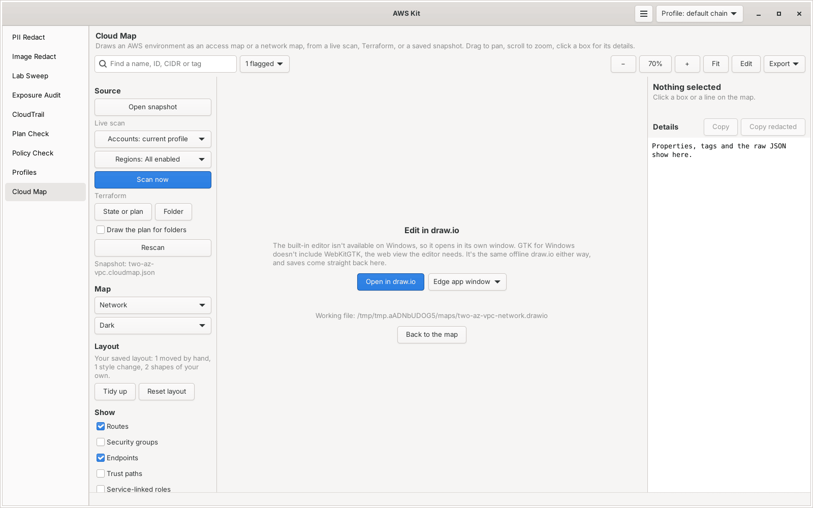

(This screenshot was taken on Linux, set to show what Windows shows.)

The button opens the same offline editor in an **Edge app window**: `msedge --app=...`, which looks like its own window with no browser bars, and uses a separate Edge profile in `%LOCALAPPDATA%\AWSKit\edge-profile` with no extensions or sync. Edge comes with Windows 10 and 11, needs no admin and nothing extra, and is found through the App Paths registry key or its usual folders. Saves come straight back to AWS Kit, and the map redraws. Close the window when you're done; Save & Exit also brings the page back to the map.

The dropdown next to the button picks what it uses, and the page remembers it:

| Choice | What happens |
|---|---|
| **Edge app window** | The default when Edge is there |
| **Default browser** | The same editor in your browser, if Edge isn't found or you'd rather |
| **draw.io desktop** | Only listed when it's installed. It opens the working `.drawio` file itself and saves to it. The page watches the file and offers to pull the new layout in |

I looked at pywebview with WebView2 for a window of AWS Kit's own, but it needs pythonnet, and support for Python 3.14 (which AWS Kit uses on Windows) wasn't certain, so Edge app mode it is.

### WSL

WSL usually has no graphics driver WebKitGTK can use, so AWS Kit turns its GPU paths off first (`WEBKIT_DISABLE_DMABUF_RENDERER`, `WEBKIT_DISABLE_COMPOSITING_MODE` and `WEBKIT_SKIA_ENABLE_CPU_RENDERING`) and tries the built-in editor. If it still won't start, it opens in Windows instead: Edge's app window when it's in its usual place under `C:\`, otherwise the Windows browser through `wslview` or `explorer.exe`. WSL2 forwards `127.0.0.1` to Windows, so the Windows browser reaches the editor running in WSL.

### Editing outside AWS Kit

The page watches the working `.drawio` file. When it changes and AWS Kit didn't write it, like after a save in draw.io desktop, a bar offers to **Pull in the new layout**. If the file was changed while the page wasn't watching, Edit reads it in first, so nothing saved there is lost.

### From the terminal

```bash
awskit map edit lab.cloudmap.json --type network                 # Edge, the browser, or draw.io desktop
awskit map edit lab.cloudmap.json --type network --open none     # just print the address
awskit map remember lab-network.drawio                           # keep the layout of a file saved elsewhere
awskit map layout lab.cloudmap.json --type network               # what's kept
awskit map layout lab.cloudmap.json --type network --tidy        # or --reset
```

`awskit map edit` keeps the layout after every save, the same as the page, until the window closes or you press Ctrl+C. `awskit map remember` reads any `.drawio` AWS Kit drew, like an export you edited in draw.io desktop, and finds its snapshot from the file (or `--snapshot`).

### Offline

Maps are full of account IDs, so the editor never talks to draw.io's servers or anything else:

- AWS Kit serves the draw.io files, the page that hosts them, and the one file being edited from a small server on `127.0.0.1` only, on a random port, with a random token in every address. A request without the token, from another host name, or for a path outside the draw.io folder gets nothing. The server stops when the editor closes.
- Every response carries a Content-Security-Policy that only allows that address, so even if something in draw.io tried, the browser wouldn't load, send or connect anywhere else. draw.io's service worker isn't served.
- draw.io runs in embed mode with its outside services off (`stealth`, `lockdown`, no Google Drive, OneDrive, Dropbox, GitHub, GitLab or Trello, no drafts or settings kept in the browser), and links to help pages or GitHub do nothing.
- On Linux, the web view keeps nothing on disk between edits.

The tests run the real editor in WebKitGTK with networking blocked: it loads, saves, and makes no request anywhere but `127.0.0.1`.

## Layout memory

Without this, moving boxes around in draw.io and rescanning next week would throw the arrangement away. After every save, AWS Kit reads the file back and keeps what you changed in a file next to the snapshot, `<name>.layout.json`, one section per map type:

| Kept | How |
|---|---|
| Where boxes are, and their size | Relative to their container (a VPC, a subnet...), by node ID. A box you moved or resized is **pinned** |
| Lines you rerouted | Their waypoints, by edge ID |
| Style changes | Colors, line width, dashes, fonts, by ID, as changes on top of the theme |
| Shapes you drew | Notes, text, arrows and anything else without `awskit="1"`, as draw.io XML, carried into every export. An arrow to a box stays attached to it |
| Captions you changed | In your [labels file](#captions), so they stick in every map |

The next export or redraw, from the page or `awskit map export`, puts it back:

- A box that's still in the same container goes where it was.
- A box that moved to another container in AWS, like an instance in another subnet now, is placed automatically in its new container.
- A new resource goes in its usual spot if that's free, otherwise in the nearest free space below, without moving anything pinned. Containers grow to fit.
- A resource that's gone is dropped, and its gap stays.
- Boxes that weren't moved by hand keep their places too. If something now overlaps them, like a pinned box or a subnet that grew, they move down a row at a time, so a row of cards stays a row.

The page, SVG and PNG exports and the `.drawio` file all use it, so they always show the same arrangement. The page draws your own shapes too: rectangles, rounded boxes, ellipses, diamonds, notes, text, AWS icons and arrows, with their colors and text. Shapes it doesn't know are drawn as rectangles there, and exactly in draw.io.

**Tidy up** puts everything you didn't move by hand back where the automatic layout wants it, around what you pinned. **Reset layout** forgets the map's layout: positions, style changes and your own shapes. Captions stay in the labels file. Deleting `<name>.layout.json` resets every map type of that snapshot.

A redacted export uses the layout too. Its cell IDs are keyed hashes, so the layout is applied by ID and your shapes get hashed IDs and redacted text; `<name>.layout.json` itself never goes along. If you edit a redacted `.drawio` and run `awskit map remember FILE --snapshot SNAPSHOT` on it (a redacted file doesn't name its snapshot), the hashed IDs are mapped back to the real ones with the same key, so the layout file only ever has real IDs.

Each box AWS Kit writes carries its geometry and short hashes of its label and style as written (`awskit_geo`, `awskit_lh`, `awskit_sh`), so reading a file back only counts what changed in draw.io as a change, even if AWS changed in between. The map type, filters and snapshot name are kept as data on the diagram itself.

## The designer

The designer goes the other way: draw a network in draw.io, and Cloud Map writes the Terraform for it. It's one way on purpose. The design is the source of truth for what the designer writes, into a folder it owns, and it never touches Terraform you wrote yourself. To see what's really deployed after you apply it, scan it or read its state with the rest of Cloud Map. There's no two-way sync.

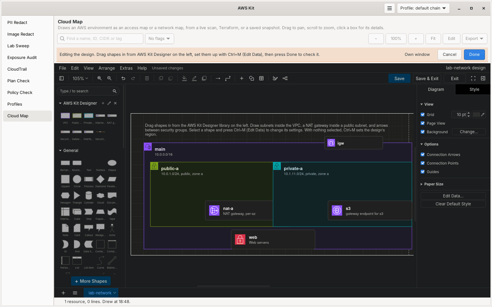

**New design** (under Designer on the left) saves a new design from the template, a VPC with an internet gateway and a public and a private subnet, and opens it in the editor with the **AWS Kit Designer** library at the top of the shapes. It's the same offline editor as [Editing in draw.io](#editing-in-drawio), so it works everywhere that does, including the Edge app window on Windows. **Open design** opens one you have.

- **Containment is the structure.** A subnet drawn inside a VPC belongs to it, a NAT gateway drawn inside a public subnet lives in that subnet, and the internet gateway sits on the VPC's border.
- **Settings are the shape's data.** Select a shape and press Ctrl+M (**Edit Data**) to change them, and its label follows. With nothing selected, Ctrl+M sets the design's region.
- **An arrow from one security group to another** allows traffic from the first into the second, on its protocol and ports.
- The shapes look like the maps, with the same icons and colors, so a design looks like a map of the finished network. Notes and anything else you draw without `awskit_type` are left out of the Terraform.

| Shape | Settings |
|---|---|
| VPC | `name`, `cidr`, `dns_hostnames` (true or false) |
| Public subnet, Private subnet | `name`, `cidr`, `az` (a zone letter like `a`, or a full name like `us-west-2a`), `type` (public or private) |
| Internet gateway | `name`. On the VPC's border, or inside it |
| NAT gateway | `name`, `mode`: `per-az` (private subnets in its zone use it) or `single` (shared by every zone, cheaper but not highly available). In a public subnet |
| Security group | `name`, `description`, `ingress` and `egress`: rules like `tcp 443 0.0.0.0/0`, one per line or separated by `;`, with an optional `# description`. `all` and `icmp` can leave out the ports: `all 0.0.0.0/0`. Ports can be a range: `tcp 8000-8080 10.0.0.0/16` |
| Security group arrow | `protocol` and `ports`, like `tcp` and `5432`. A plain arrow labeled `tcp 5432` works too |
| Gateway endpoint (S3) | `name`, `kind` gateway, `service` (`s3` or `dynamodb`), `route_tables` (`private`, `public` or `all`) |
| Interface endpoint | `name`, `kind` interface, `service` (like `ssm` or `ecr.api`), `security_groups` (names, comma-separated). Drawn in a subnet, it goes in that subnet; drawn in the VPC, in one private subnet per zone |

Route tables aren't drawn. They follow from the subnets: public subnets share one that routes `0.0.0.0/0` to the internet gateway, private subnets route to the NAT gateway in their zone (or the one set to `single`), and gateway endpoints are added to the route tables they name.

### Checks

**Done** saves the design and checks it. Problems show as a list (the flag button, and the details of each shape), and the shapes they're about are marked in red on the design, which the page draws like a map:

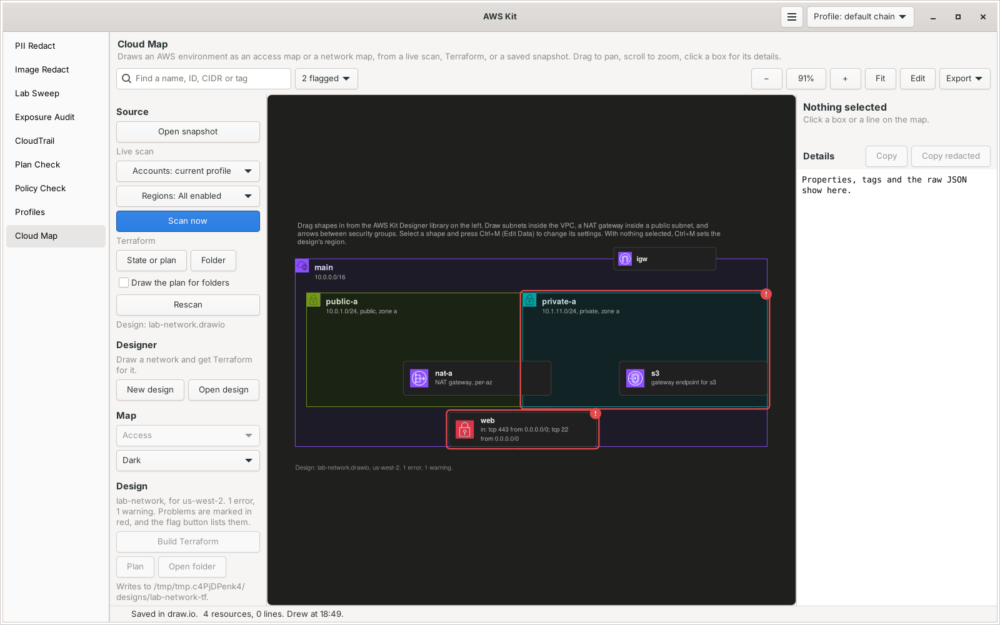

| Check | |
|---|---|
| CIDRs are valid, between /16 and /28, subnets fit inside their VPC, and subnets don't overlap | error |
| Every subnet has a zone, and the zone exists in the design's region | error |
| Subnets, NAT gateways, security groups, endpoints and the internet gateway are inside a VPC, subnets aren't inside each other, and VPCs aren't nested | error |
| NAT gateways sit in public subnets, and private subnets have a NAT gateway to route through when the VPC has any | error |
| A public subnet needs an internet gateway on its VPC, and a VPC has at most one | error |
| Security group rules are valid, and arrows connect two security groups in the same VPC | error |
| Names are set, unique, and safe as Terraform keys (letters, numbers, `-` and `_`, starting with a letter) | error |
| `0.0.0.0/0` or `::/0` on a risky port or all traffic (the same list as [Exposure Audit](../exposure-audit/)) | warning |
| One NAT gateway shared by several zones | warning |
| A VPC with no private subnets | warning |

Zones are checked against a table of each region's zone letters from AWS's list. Older accounts map letters to physical zones differently, so a letter that exists can still mean a different building than in another account.

`examples/broken-designs/` has one design per check, and the tests check each fails with its message.

### Building Terraform

**Build Terraform** checks the design and, if there are no errors, writes a reusable module and a small example that uses it, into `<design>-tf/` next to the design (**Change folder** picks another):

```text
<design>-tf/
├── .awskit-designer   marks the folder as the designer's: the design's name, its hash and each file written, with its hash
├── README.md          what was generated, from which design, and how to use it
├── versions.tf        Terraform or OpenTofu 1.6 and newer, AWS provider 6 and newer
├── variables.tf       name prefix, tags, and the network, as maps keyed by name
├── main.tf            VPC, subnets, gateways, route tables, routes, associations, endpoints
├── security.tf        security groups, and an ingress or egress rule resource per rule
├── outputs.tf         VPC ID, subnet IDs by name, security group IDs and more
└── examples/basic/    a root module calling it once per VPC, with a provider block
```

- Everything is a map keyed by name with `for_each`, never `count`, so adding a subnet doesn't move the others.
- Rules are separate `aws_vpc_security_group_ingress_rule` and `aws_vpc_security_group_egress_rule` resources.
- Every resource gets `var.tags` plus a `Name` tag.
- No account IDs or regions in the module: zones are letters added to the provider's region, and the region is in `examples/basic/terraform.tfvars`.
- Each file starts with a comment saying it was generated from the design, and that edits there get overwritten, so change the design instead.
- `terraform fmt` (or `tofu fmt`) runs on it when either is installed, and then `init -backend=false` and `validate` in `examples/basic/`. The results show in the details panel.

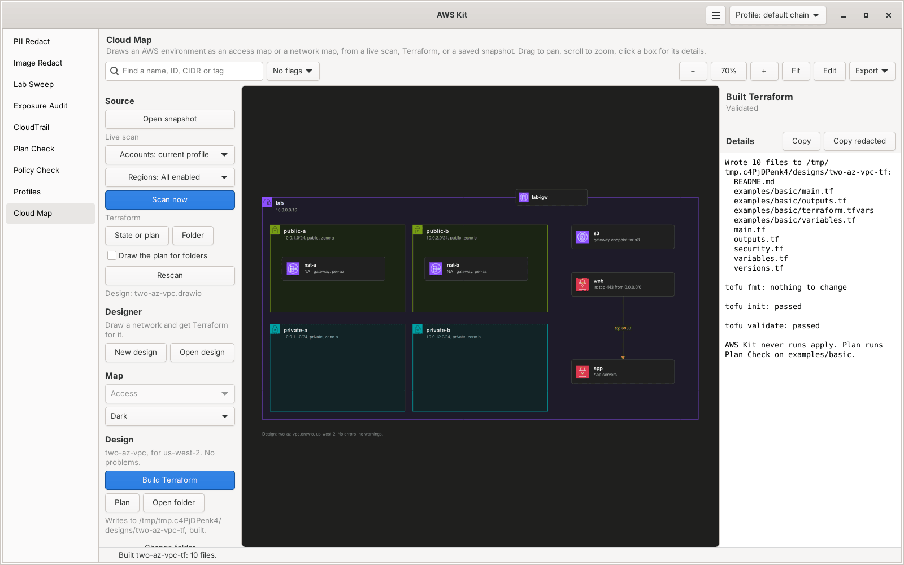

**Plan** runs [Plan Check](../plan-check/) on `examples/basic/` with the profile picked in the header, so the generated code gets the same risk flags as anything else. **Open folder** opens it.

**The folder is the designer's own.** It only writes into a folder that's empty, or that has its `.awskit-designer` marker. Anything else, it refuses and writes nothing. When it builds again, it rewrites the files it made before, removes the ones the design no longer makes (only when they're unchanged since it wrote them), and leaves everything else alone, like `.terraform/`, the lock file and state. It never writes through a link, never outside the folder, and never runs apply.

**Checking runs Terraform.** `init` and `validate` load every `.tf` file in the folder and in `examples/basic/`, and start the providers they name. Someone else's folder could hold its own `.tf` files, or providers already downloaded into `examples/basic/.terraform`. So when either folder has `.tf` files the designer didn't write, or a `.terraform` folder or lock file (an earlier check leaves those behind), the window asks first, once per folder each time AWS Kit runs, and `awskit map design build` skips the check and says why, so you can run `init` and `validate` yourself. **Plan** on the Plan Check page asks the same way.

The generated module is a starting point: read it, plan it, change the design and build again. After you apply it, `awskit map tf <design>-tf/examples/basic` draws what's really there, and it's the same map as the design. The tests check that loop: the example design's output is planned with OpenTofu, and the plan read back through the Terraform input has the same subnets, NAT gateways, routes, endpoint and security group arrow as the design.

From the terminal:

```bash
awskit map design new lab --region us-west-2      # lab.drawio, from the template
awskit map design edit lab.drawio                 # the offline editor with the library, checked on every save
awskit map design check lab.drawio                # problems, exit code 1 on errors
awskit map design build lab.drawio                # lab-tf/, then fmt, init and validate
awskit map design build lab.drawio -o ~/tf/lab --region eu-west-1 --no-validate
```

draw.io desktop works for designs too: open the design file, and add the library with **File**, **Open Library**, from `cloud-map/designer/awskit-designer.xml` (or `awskit-designer-light.xml`) in the repo, or in the installed copy: `~/.local/share/awskit/cloud-map/designer/`, or `%LOCALAPPDATA%\AWSKit\app\cloud-map\designer\` on Windows. The page watches the design file and offers to check it again when it's saved there.

## Reachability

Answers "can A reach B on this port, and if not, what's blocking it?" It walks the security groups, network ACLs and route tables in a snapshot, from a live scan or from Terraform, on your own machine. AWS has Reachability Analyzer for the same question, but it charges for each analysis and only sees what's already deployed. This is free, makes no AWS calls, and works on a plan before anything exists.

When something in a lab can't connect, like the app to the database, SSH to the bastion, or a private subnet to the internet, the answer is spread over two security groups, two network ACLs and a route table or two. This puts them in one list, in the order a packet meets them, and points at the rule that's in the way.

### What it checks, in order

| Step | What's checked |
|---|---|
| Source security groups, outbound | A rule allows the protocol and port to the destination's address, or to a security group the destination is in |
| Source subnet's network ACL, outbound | Lowest rule number first, the first match wins, and anything left over hits the catch-all deny (`*`) |
| Route | The source subnet's route table (its own, or the VPC's main one), longest prefix first. A blackhole route still wins and drops the traffic. For the whole internet that's the default route, and unknown when a more specific route sends part of the internet somewhere else, like a firewall or a blackhole. Then whatever the route sends it to, below |
| Peering connection | It connects to the destination's VPC and is active. Peering isn't transitive, and doesn't reach the internet through the other VPC |
| Transit gateway | The destination's VPC is attached to it, or to another transit gateway that may be peered with it. Its route tables and peerings aren't in the snapshot, so a path through it is never more than unknown |
| Internet gateway | The source has a public IP (or an IPv6 address). An egress-only internet gateway carries IPv6 out, and replies back in |
| NAT gateway | It's available and public, its own subnet's network ACL lets the traffic in and out, and its subnet has a route to an internet gateway |
| Destination subnet's network ACL, inbound | The same way as the source's |
| Destination security groups, inbound | A rule allows it from the source's address, or from a security group the source is in |
| What the destination listens on | A database's port, and a load balancer's listeners when the snapshot has them. Load balancers don't answer ping |
| Replies | Network ACLs are stateless, so the destination's outbound rules and the source's inbound rules (and the NAT gateway's subnet both ways) are checked again for the replies, on the ephemeral ports 1024-65535. Then the route back: through the same peering connection or transit gateway, or to the internet gateway. Another peering connection that joins the same two VPCs works too, and a transit gateway the traffic didn't come through is unknown. Security groups are stateful, so replies need nothing there |

From the internet, the destination needs a public address (an instance's public IP, an internet-facing load balancer, or a publicly accessible database), its VPC needs an internet gateway, and its subnet's route back to the internet has to go to that gateway. A private subnet whose default route goes to a NAT gateway fails there: the replies would leave from the NAT gateway's address, so the connection never completes.

Two things in the same subnet skip network ACLs and routing, since traffic inside a subnet doesn't cross its network ACL. An instance that's stopped is blocked on both ends.

### What you can check from and to

| Pick | Means |
|---|---|
| An instance | Its private IP (or IPv6 address) and its security groups |
| A load balancer | Its nodes, one in each of its subnets, and its security groups. Each subnet is checked, and reachable through only some of them is "partly blocked" |
| An RDS database | The subnet it's in, its security groups and its port (the engine's default when it isn't set) |
| A subnet | Any host in it. Security groups on its side are skipped, so the answer is at the network level |
| `internet` or `internet-ipv6` | Anywhere on the internet. That's public addresses only, so a rule about `10.0.0.0/8` doesn't count against it |
| An IP or a CIDR | A resource with that IP, an address or range inside a VPC, a public address, or a private one outside every VPC in the snapshot, like on-premises over a VPN. An instance's public IP works from the internet. From inside AWS, traffic to a public IP goes out and back in through gateways, which one check doesn't follow, so it asks for two checks instead |

Names and IDs both work, like `bastion` or `i-0a1b2c3d4e5f60093`. If an instance and a subnet have the same name, the instance is picked and the result says so. `--list` shows everything there is to pick.

### Ranges and partly

A CIDR, a subnet and the internet are ranges, so a rule has to cover all of the range to pass. When rules only cover part, the result says which part gets through, like "Only part of the internet can reach bastion on tcp 22: 203.0.113.0/24". Every check narrows it further, so a security group that allows one half and a network ACL that allows the other half let nothing through.

### Verdicts

| Verdict | Means | Exit code |
|---|---|---|
| Reachable | Every check passed. It says "as far as Cloud Map can tell", and the notes list what it assumed | 0 |
| Blocked | Something on the way blocks it. The result names the first step that does, with the rule, and the AWS CLI command that would allow it, for you to run if you want to. The command is left out when an ID in the snapshot doesn't look like an AWS ID, since snapshots can come from anywhere | 3 |
| Partly blocked | Blocked for part of a range, or through only some of a load balancer's subnets | 3 |
| Unknown | Nothing found blocks it, but a step couldn't be checked: a transit gateway, a prefix list, a VPN, an appliance in the path, or rules the snapshot doesn't have | 4 |

It never says reachable when a step couldn't be checked. Errors, like a name that isn't in the snapshot, exit with 1.

### Assumptions

- Replies are checked on ports 1024-65535, the ephemeral range AWS recommends network ACLs allow. It covers Linux (32768-60999), Windows (49152-65535), NAT gateways and load balancers (1024-65535). When a network ACL only lets part of it back, like 32768-65535, the result is unknown, since it depends on the client, and partly blocked when the client is a NAT gateway or a load balancer.
- ICMP is checked as ping: an echo request there and an echo reply back. `--protocol all` asks whether every protocol and port gets through.
- Terraform only has a VPC's default network ACL when you manage it with `aws_default_network_acl`. A subnet with no network ACL in the Terraform input uses the default one, which allows all traffic unless it was changed outside Terraform, and the notes say that was assumed. An `aws_network_acl_rule` added to a default network ACL the input doesn't manage is checked on top of AWS's starting rules for it, which allow everything. A live scan reads every network ACL, so a missing one there is unknown.
- A database is checked in the subnet it's in now. A Multi-AZ standby, or the database after a failover, is in another subnet of its group, which the notes mention.
- A security group rule that references a group in a peered VPC only works when both VPCs are in the same region. Through a transit gateway it only works when security group referencing is turned on for it, which the snapshot doesn't have, so it's unknown.
- An address inside a VPC that no resource on the map has, like a Lambda function's, has unknown security groups.
- Over IPv6, an instance needs an IPv6 address of its own: one with none recorded is unknown (a live scan records them, so it likely has none). Whether a load balancer or a database is dual-stack isn't recorded, so over IPv6 they're unknown. From the internet, AWS blocks IPv6 traffic to an internal load balancer and to a database that isn't publicly accessible.
- A Terraform plan can leave network ACL rules, or their addresses, known only after apply. Those network ACLs are unknown.

### What it can't see

- Transit gateway route tables, and the network ACLs on a transit gateway's attachment subnets
- What's in a prefix list (`pl-...`), in a security group rule or a route
- Anything past a virtual private gateway: VPN, Direct Connect and on-premises networks
- Firewalls inside the instance (iptables, Windows Firewall), and whether anything is listening on the port
- NAT gateway and load balancer target health. From the internet to a load balancer is one check, and from the load balancer to its targets is another
- AWS Network Firewall, Gateway Load Balancer and other appliances: a route through one is unknown
- Gateway route tables (ingress routing on an internet gateway)
- Instances with more than one network interface: only the primary address and the instance's security groups are used
- Snapshots made before reachability don't have network ACL rules, load balancer and database security groups, listeners, or prefix lists in security group rules. Those steps are unknown until you rescan, or read the Terraform again. Missing listeners are only mentioned in the notes, the same as what an instance listens on

### Using it in the window

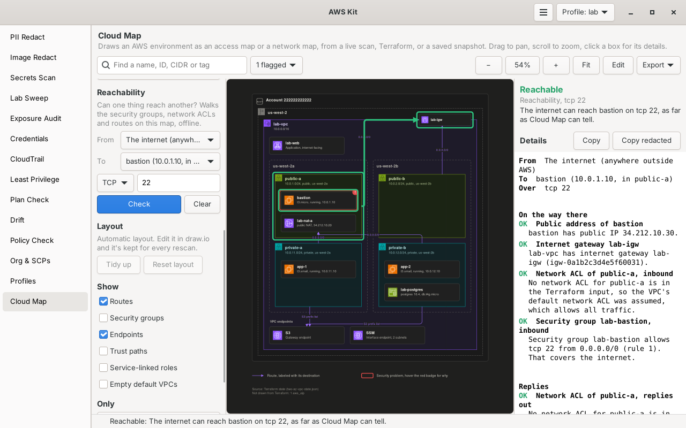

The **Reachability** section on the left of the Cloud Map page works on whatever map is loaded:

1. Pick **From** and **To**. Both lists hold every instance, load balancer, database and subnet on the map, plus the internet, and you can type to search them. Or click a box on the map and press **Reach from here** or **Reach to here** in the details panel.
2. Pick the protocol and type the port. Picking a database or a load balancer fills in its port.
3. Press **Check**.

The path lights up on the map in green, and the step that blocks it in red. When the blocking security group or network ACL isn't drawn (the Security groups layer is off, and network ACLs are never boxes of their own), the instance, database or subnet it guards gets the red outline instead. The details panel shows the verdict, then every step in order with its status and reason, the AWS CLI command that would allow a blocked step, and the notes. **Copy** gives the same text as the terminal. **Clear** takes the path off the map. A new layout, like turning a layer on, keeps the result and draws the path again on the new boxes.

### Using it in the terminal

```bash
awskit map reach lab.cloudmap.json internet bastion --port 22           # can I SSH in?
awskit map reach lab.cloudmap.json app-1 lab-postgres --port 5432        # app to database
awskit map reach lab.cloudmap.json app-1 internet                        # out through the NAT gateway, tcp 443
awskit map reach lab.cloudmap.json 10.0.11.0/24 lab-postgres --port 5432 # a whole range
awskit map reach lab.cloudmap.json app-1 10.1.1.10 --protocol icmp       # ping across a peering
awskit map reach ~/aws-platform/network internet lab-web                 # a Terraform folder's state
awskit map reach ~/aws-platform/network internet lab-web --plan          # what the plan would build
awskit map reach lab.cloudmap.json --list                                # what you can pick
```

| Option | What it does |
|---|---|
| `SOURCE` | A `.cloudmap.json` snapshot, `terraform show -json` output (state or plan), a `.tfstate`, a saved plan, or a Terraform folder, like `awskit map tf` takes |
| `FROM`, `TO` | An instance, load balancer, database or subnet by ID or name, an IP, a CIDR, `internet` or `internet-ipv6` |
| `--port PORT` | The destination port for tcp and udp (default 443) |
| `--protocol P` | `tcp` (default), `udp`, `icmp` (ping) or `all` |
| `--plan` | For a Terraform folder, check what `terraform plan` would build |
| `--json` | The result as JSON: the verdict, every step with its status and reason, the notes, and the IDs on the path |
| `--list` | List what can be checked from and to, and stop |

With the example VPC state:

```text
$ awskit map reach cloud-map/examples/two-az-vpc-state.json internet lab-postgres --port 5432
From  The internet (anywhere outside AWS)
To    lab-postgres (postgres in private-b)
Over  tcp 5432

Blocked  The internet can't reach lab-postgres on tcp 5432. lab-postgres isn't publicly accessible,
         so it only has a private address.

On the way there
  blocked   Public address of lab-postgres
            lab-postgres isn't publicly accessible, so it only has a private address.
  ok        Internet gateway lab-igw
            lab-vpc has internet gateway lab-igw (igw-0a1b2c3d4e5f60031).
  ok        Network ACL of private-b, inbound
            No network ACL for private-b is in the Terraform input, so the VPC's default network ACL
            was assumed, which allows all traffic.
  blocked   Security group lab-db, inbound
            No inbound rule in security group lab-db allows tcp 5432 from the internet. Its inbound
            rules allow: tcp 5432 from lab-app.
  ...
Replies
  ...
  blocked   Route table private for private-b, replies
            Route table private sends 0.0.0.0/0 to NAT gateway lab-nat-a (nat-0a1b2c3d4e5f60041).
            Replies leave through the NAT gateway with its address, not the one the client connected
            to, so the connection fails. private-b is a private subnet: use a public subnet, or put
            a load balancer in front.
```

The same check from the bastion's side, `internet bastion --port 22`, is reachable, since the bastion is in a public subnet with a public IP and its security group allows SSH from anywhere (which is also why the map flags it).

### What it reads

Everything comes from the snapshot, so a check costs nothing and needs no permissions. For it to have what it needs, the live scan records each network ACL's rules (`DescribeNetworkAcls`, which it already called), the security groups and port of each load balancer and database (`DescribeLoadBalancers` and `DescribeDBInstances`, the same), each load balancer's listeners (`DescribeListeners`, one call per load balancer), prefix lists in security group rules, IPv6 addresses of instances, and blackhole routes. The Terraform input reads the same from `aws_network_acl` (inline rules), `aws_network_acl_rule`, `aws_network_acl_association`, `aws_default_network_acl`, `aws_lb` and `aws_lb_listener`, and `aws_db_instance`. None of it changes how a map looks.

## Using it in the terminal

Scanning and drawing are separate steps. A scan makes a snapshot, and one snapshot can be drawn as many maps as you like without scanning again:

```bash
awskit map scan -o lab.cloudmap.json                       # the current profile, every enabled region
awskit map scan -p mgmt -p lab -r us-west-2 -o org.cloudmap.json
awskit map scan --profiles mgmt,lab --access -o org.cloudmap.json

awskit map tf ~/aws-platform/network -o network.cloudmap.json   # a Terraform folder's current state
awskit map tf ~/aws-platform/network --plan                     # what the plan would build
awskit map tf org.json network.json -o all.cloudmap.json        # several states as one map

awskit map export lab.cloudmap.json --type access -o access.drawio
awskit map export lab.cloudmap.json --type network --show all --theme light -o network.drawio
awskit map export lab.cloudmap.json --type combined --accounts lab --vpcs lab-vpc --redact -o share.drawio
awskit map export lab.cloudmap.json --type network -o network.svg   # SVG, from the file name
awskit map export lab.cloudmap.json --type access --format png      # lab-access.png, at 2x
```

Or scan and draw in one step:

```bash
awskit map --type network -o lab.drawio
awskit map --type access --save org.cloudmap.json -o org.drawio
```

### awskit map scan

| Option | What it does |
|---|---|
| `-p`, `--profile`, `--profiles NAME` | Profile to scan. Repeat it or use commas for several accounts. Defaults to the one picked in AWS Kit. |
| `--all-profiles` | Scan every profile in `~/.aws/config` |
| `-r`, `--region`, `--regions REGION` | Only these regions. Defaults to every enabled region, or `regions` in your settings. |
| `--access` | Only the access data (Organizations, Identity Center, IAM, CloudTrail, budgets) |
| `--network` | Only the network data |
| `-o`, `--output FILE` | Snapshot to write (default `cloud-map.cloudmap.json`) |
| `-q`, `--quiet` | No progress line |

### awskit map tf

| Option | What it does |
|---|---|
| `PATH...` | `terraform show -json` output (state or plan), a `.tfstate` file, a saved binary plan, or a folder. Several are drawn as one map. |
| `--plan` | For a folder, run `terraform plan` and draw what it would build, instead of the current state |
| `-o`, `--output FILE` | Snapshot to write (default: named after the first input) |

### awskit map export

| Option | What it does |
|---|---|
| `SNAPSHOT` | A `.cloudmap.json` file |
| `--type TYPE` | `access`, `network` or `combined` (default `access`) |
| `--format FORMAT` | `drawio`, `svg` or `png` (at 2x). Defaults to the `-o` file's extension, or `drawio` |
| `--theme THEME` | `dark` (default) or `light`. Light suits READMEs and printing. |
| `--show LAYERS` | Detail layers to include: `routes`, `sgs`, `endpoints`, `trust`, `all` or `none`. The default is `trust` for access maps, `routes,endpoints` for network maps, and all but `sgs` for combined. |
| `--accounts IDS` | Only these accounts, by ID or name |
| `--regions REGIONS` | Only these regions |
| `--vpcs IDS` | Only these VPCs, by ID or Name tag |
| `--redact` | See [Redaction](#redaction) |
| `--labels FILE` | Captions to use on top of your labels file, see [Captions](#captions) |
| `--service-linked` | Include service-linked roles, which are hidden by default |
| `--default-vpcs` | Include default VPCs that have nothing in them, which are hidden by default |
| `-o`, `--output FILE` | File to write (default `SNAPSHOT-TYPE.drawio`, or `.svg` or `.png` with `--format`) |
| `--no-memory` | Ignore the snapshot's saved layout and draw it fresh |

`export` uses the snapshot's [layout memory](#layout-memory) when there is one. `--no-memory` draws it fresh.

The one-step form takes `--type`, `--format`, `--theme`, `--show`, `--redact`, `-p`, `-r`, `--save SNAPSHOT` and `-o`.

### awskit map edit, remember and layout

| Command | What it does |
|---|---|
| `edit SNAPSHOT` | Opens the map in the offline draw.io editor in its own window and keeps the layout after every save, until the window closes or Ctrl+C. Takes `--type`, `--theme`, `--show`, `--labels`, `--accounts`, `--regions`, `--vpcs`, `--service-linked` and `--default-vpcs` like `export`, and `--open edge`, `browser`, `desktop` or `none` (just print the address). See [Editing in draw.io](#editing-in-drawio) |
| `remember DRAWIO` | Reads a `.drawio` AWS Kit drew, after you edited it anywhere, into the snapshot's layout memory. `--snapshot FILE` when the file doesn't name its snapshot, like a redacted one |
| `layout SNAPSHOT --type TYPE` | Shows what's kept. `--tidy` puts everything not moved by hand back where the automatic layout wants it, and `--reset` forgets the map's layout |

SVG and PNG need cairo for Python, which the window needs anyway (`python3-cairo` on Fedora and Debian).

Open the result in draw.io desktop or at app.diagrams.net. The files are uncompressed XML and come out byte-identical for the same input, so they diff cleanly in git.

## Icons

The `.drawio` export only names draw.io's built-in AWS shapes, and draw.io draws them. The page and the SVG and PNG exports have to draw the icons themselves, so I looked at three ways:

1. **AWS Architecture Icons**, the official pack of SVGs. AWS's [icons page](https://aws.amazon.com/architecture/icons/) allows using them "to create architecture diagrams", and says nothing about putting them in a public repo. Drawing SVGs also needs librsvg through GObject, which Fedora (`librsvg2`), Arch (`librsvg`) and the Windows GTK bundle all have, but Debian and Ubuntu split out into `gir1.2-rsvg-2.0`.
2. **draw.io's AWS stencils**. draw.io keeps each AWS icon as a short list of drawing steps (move, line, curve, arc, fill). The artwork is still AWS's, so the same question about the repo applies, but cairo can draw them directly, with no SVG library, and they're exactly what draw.io draws, so the window and the `.drawio` file can't drift apart.
3. **Simple glyphs drawn in code**, as a fallback.

Cloud Map uses the second, with the third as the fallback. Nothing from AWS is committed to this repo. The installers download the draw.io web app (Apache 2.0, a pinned release, checked against its SHA-256) and `mapicons.py` reads the AWS stencil set out of it. The [draw.io README](https://github.com/jgraph/drawio#license) says its third-party icons stay under their owners' terms, which for these is AWS's "use them in architecture diagrams", and that's what Cloud Map does with them. The editor runs from the same download.

The pinned version is `DRAWIO_VERSION` in `awskit/common.py` (32.0.2 right now), with its SHA-256 and download link next to it. draw.io 31.x and older ship the stencils as `stencils/aws4.xml`. From 32.0 they're packed into `js/stencils.min.js` in a compact binary form, and `mapicons.py` reads both. I checked that the two give identical shapes for all 1,050 AWS icons, and the tests check the decoder against an encoder of their own. The first time the icons are read takes about a second, and the result is cached as JSON next to the draw.io files.

Without the download, like on a network that blocks GitHub, every map still draws, with a short label like `VPC` or `EC2` in each icon square, but there's no editor. See [Install](../awskit/README.md#install) for `--drawio-zip`, which takes a file you downloaded another way.

## What it flags

Flags are drawn in red with the reason in the tooltip, and they're saved in the snapshot. The checks reuse [Policy Check](../policy-check/) for trust policies and [Exposure Audit](../exposure-audit/)'s port rules for security groups.

| Flag | Severity |
|---|---|
| A role trusts `"Principal": "*"` with no condition | critical |
| A GitHub OIDC trust with no repo check (no `token.actions.githubusercontent.com:sub` condition) | critical |
| A role trusts an AWS account outside the org, or outside `known_accounts` when the org can't be read | high, or medium with an `sts:ExternalId` condition |
| A GitHub OIDC trust that allows any repo in an owner, like `repo:me/*` | medium, high for `*` |
| A GitHub OIDC trust that allows any branch of a repo, like `repo:me/app:*` | medium |
| A federated or web identity trust with no conditions | medium |
| A GitHub OIDC trust with no `aud` check | low |
| A security group open to `0.0.0.0/0` or `::/0` on all traffic | critical |
| A security group open to the internet on a risky port (SSH, RDP, databases and so on) or 1,000 ports or more | high |
| A security group open to the internet on any other port. Just 80 or 443 isn't flagged. | medium |
| An instance allows IMDSv1 | medium, high with a public IP |
| An instance has a public IP and a security group that's flagged | high |

A subnet with a route to an internet gateway is labeled **public**. That's a fact about the subnet, not a problem.

## Captions

Each box gets a short caption, picked in this order:

1. Your labels file, `~/.config/awskit/cloud-map/labels.json` (`%APPDATA%\awskit\cloud-map\labels.json` on Windows)
2. The resource's `Description` tag
3. An automatic caption, like `10.0.1.0/24, public, us-west-2a` for a subnet, `SCPs: deny-leave-org, region-lock` for an OU, `trusted by GitHub, Snowblind019/aws-platform, main only, read-only` for a role, or `2 budgets, anomaly alerts` for the cost box

The labels file is keyed by node ID. A value can be the caption, or an object with a `caption` and a `title`:

```json
{
  "222222222222": "Every project deploys here",
  "arn:aws:s3:::snowy-lab-tfstate": {"title": "Terraform state bucket", "caption": "State for all three stacks"}
}
```

Node IDs are the AWS identifiers: account IDs, `o-` and `ou-` IDs, ARNs for roles, providers, trails, permission sets, buckets, load balancers and databases, and resource IDs like `vpc-...` for the network. Hover a box, or look at `aws_id` in Edit Data, to find one. `--labels FILE` adds another file on top for one export.

## Redaction

`--redact` makes a map you can share. Every title, caption, tooltip, line label and data attribute goes through [PII Redact](../pii-redact/) with your PII Redact settings, before the layout is worked out, so boxes are sized for the redacted text. Data attributes are redacted as `name: value`, so PII Redact's setting-name rules apply to them too, and every bucket name in the map is added to the always-redact list for that export, since a bucket name on its own looks like any other word.

Cell IDs would leak too, since they're ARNs and resource IDs. In a redacted export, each one is replaced with a keyed hash (HMAC-SHA256) using a random key made the first time and kept in `~/.config/awskit/cloud-map/redact.key`. A plain hash wouldn't be enough, because a 12-digit account ID can be guessed by hashing every possible one. Because the key stays the same, redacted IDs stay the same between exports.

Names PII Redact doesn't recognize, like an account's name or a role name, stay as they are. Add them to your always-redact list in PII Redact's settings if you want them gone.

A few things are left out of a redacted export rather than redacted: role trust policies (their conditions can hold values like an `sts:ExternalId`), pictures and links in shapes you drew, and the profile and file names in the footnote. The account and VPC filters the map was drawn with are kept as keyed hashes, so `remember` can still match them, and the export's suggested name doesn't use the snapshot's name. Tags are redacted one by one, each by its own key.

## Snapshots

A snapshot is the model saved as JSON, `<name>.cloudmap.json`. It has a format version, where it came from, when it was scanned, what it covered (profiles and regions, or Terraform inputs), the warnings, and every node and edge with all its details. Everything in it is sorted, so the same environment gives the same file.

A live scan records when it ran. A snapshot from Terraform records no time of its own, only the plan's timestamp when there is one, so the same state always gives a byte-identical snapshot and a byte-identical map.

## How the live scan works

It only reads. Each profile gets one task per account-wide part and one task per region for the network, and up to 12 run at once, the same way [Exposure Audit](../exposure-audit/) scans. Tasks only collect data. The map is built afterwards in a fixed order, so it doesn't matter which task finished first.

| Part | Calls | Becomes |
|---|---|---|
| Organizations | `DescribeOrganization`, `ListRoots`, `ListOrganizationalUnitsForParent`, `ListAccountsForParent`, `ListPoliciesForTarget`, `DescribePolicy`, `ListTagsForResource` | The org, OU and account boxes, SCP names in the captions, SCP summaries in the tooltips, and `Description` tags |
| IAM Identity Center | `ListInstances`, `ListPermissionSets`, `DescribePermissionSet`, `ListManagedPoliciesInPermissionSet`, `ListAccountsForProvisionedPermissionSet`, `ListAccountAssignments`, then identity store `ListUsers` and `ListGroups` | Identity Center with its permission sets, and lines from users and groups to the accounts they can reach |
| IAM | `ListRoles` (which includes trust policies), `ListAttachedRolePolicies` for roles with outside or federated trust, `ListOpenIDConnectProviders`, `GetOpenIDConnectProvider`, `ListSAMLProviders`, `ListAccountAliases` | Roles, OIDC and SAML providers, and trust lines |
| CloudTrail | `DescribeTrails` | The trail, and log lines into its bucket |
| S3 | `ListBuckets` | Only used to find which scanned account owns the trail's bucket |
| Cost | Budgets `DescribeBudgets`, Cost Explorer `GetAnomalyMonitors` | The cost guardrails box |
| EC2 | `DescribeVpcs`, `DescribeSubnets`, `DescribeRouteTables`, `DescribeInternetGateways`, `DescribeEgressOnlyInternetGateways`, `DescribeNatGateways`, `DescribeTransitGateways`, `DescribeTransitGatewayAttachments`, `DescribeVpcPeeringConnections`, `DescribeVpcEndpoints`, `DescribeSecurityGroups`, `DescribeNetworkAcls`, `DescribeInstances`, `DescribeVpnGateways`, `DescribeCustomerGateways`, `DescribeVpnConnections` | The network |
| ELB | `DescribeLoadBalancers`, `DescribeListeners` | Load balancers, in a row at the top of their VPC, and their listeners for [reachability](#reachability) |
| RDS | `DescribeDBInstances` | Databases, placed in the subnet from their subnet group that's in their zone |

How it reads things:

- **Organizations and Identity Center** only answer from the management account or a delegated admin. From a member account, the org can still be described but not listed, so those parts are skipped and the map gets a footnote saying "Organizations data isn't available from this account". Scan with the management account's profile alongside the others to get the full picture.
- **Anything a profile can't read** is skipped, and the rest of the scan carries on. What was skipped is listed at the end and in the map's footnote, like `lab-admin: no permission for Budgets`.
- **Trust policies** are read with Policy Check. Each principal is sorted into one of: this account, another account in the org, an account outside the org, an AWS service, OIDC, SAML, or Identity Center. For GitHub, the `sub` and `aud` conditions become the caption, like `Snowblind019/aws-platform, main only`.
- **Identity Center's roles** (`AWSReservedSSO_*`) are folded into their permission sets instead of filling every account. Their SAML provider is hidden too. Without Identity Center data, each account gets one **Identity Center roles** box listing them.
- **`OrganizationAccountAccessRole`** is drawn as the break-glass role, with a dashed line from the management account.
- **Service-linked roles** (path `/aws-service-role/`) are hidden unless you export with `--service-linked`.
- **Default VPCs** with nothing in them are left out unless you export with `--default-vpcs`. Otherwise a 17-region scan would draw 17 empty VPCs.
- **More than 12 of one kind** in one box, like 26 instances in a subnet, become 12 plus a "+14 more instances" box that lists the rest in its tooltip. If any of the hidden ones are flagged, the "+14 more" box is flagged too.

## How the Terraform input works

`awskit map tf` reads the same things from Terraform and builds the same model, so a map from Terraform and a map from a scan of what it built use the same IDs and look the same.

- **Inputs:** `terraform show -json` output for a state or a plan, a raw `.tfstate` (like from `terraform state pull`), a saved plan (it runs `terraform show -json` on it), or a folder. For a folder it runs `terraform show -json` to read the current state, or `terraform plan` to a temp file with `--plan`. It uses Plan Check's helpers, so `terraform` and `tofu` both work. It never runs apply.
- **Modules:** it walks the root module and every child module.
- **IDs:** the real ID from the state when there is one (an ARN for roles, providers, trails, permission sets, buckets, load balancers and databases), otherwise the Terraform address, like `module.network.aws_vpc.main`.
- **Accounts and regions:** from the resource's ARN when it has one, then the provider settings in a plan (`region`, `allowed_account_ids` or an `assume_role` ARN), then `data.aws_caller_identity` and `data.aws_region`, then the other resources in the same module. Anything still unknown goes in an **Unknown account** box.
- **Not known yet:** values that come from apply show as `(known after apply)` in captions. Links between new resources, like a new subnet in a new VPC, come from the plan's configuration references. That includes `for_each` references like `aws_subnet.this[each.value.subnet]`, worked out per instance when the `for_each` values are constants or variables, the way the designer writes them.
- **Break-glass:** an `aws_organizations_account` with `role_name` gets that role drawn in the new account.
- **Not drawn:** types Cloud Map doesn't map are counted and listed in the warnings and footnote, like `Not drawn from Terraform: 1 aws_eip`.

The full list of types it reads is the `TYPE_KINDS` table at the top of `maptf.py`. The main ones:

| Terraform type | Drawn as |
|---|---|
| `aws_vpc`, `aws_subnet` | VPC and subnet boxes |
| `aws_internet_gateway`, `aws_egress_only_internet_gateway`, `aws_vpn_gateway` | Gateways on the VPC border |
| `aws_nat_gateway` | NAT gateway in its subnet |
| `aws_route_table`, `aws_route`, `aws_route_table_association` | Route lines |
| `aws_ec2_transit_gateway`, `aws_ec2_transit_gateway_vpc_attachment` | Transit gateway and attachment |
| `aws_vpc_peering_connection` | Peering line |
| `aws_vpc_endpoint` | Endpoint, and its prefix-list route for gateway endpoints |
| `aws_security_group` and its rule types | Security group, flags and lines between groups |
| `aws_network_acl`, `aws_default_network_acl`, `aws_network_acl_rule`, `aws_network_acl_association` | Network ACL, with its rules for reachability |
| `aws_instance`, `aws_lb`, `aws_lb_listener`, `aws_db_instance` | Instances, load balancers and their listeners, databases |
| `aws_organizations_*` | The org, OUs, accounts and SCPs |
| `aws_iam_role`, `aws_iam_openid_connect_provider`, `aws_iam_saml_provider` | Roles, providers and trust lines |
| `aws_ssoadmin_permission_set`, `aws_ssoadmin_account_assignment`, `aws_identitystore_user`, `aws_identitystore_group` | Identity Center |
| `aws_cloudtrail`, `aws_s3_bucket`, `aws_budgets_budget`, `aws_ce_anomaly_monitor` | Trail, buckets and the cost box |

## Try it

From the root of the repo:

```bash
python3 -m awskit map tf cloud-map/examples/d1-org-state.json -o d1.cloudmap.json
python3 -m awskit map export d1.cloudmap.json --type access -o d1-access.drawio

python3 -m awskit map tf cloud-map/examples/two-az-vpc-state.json -o vpc.cloudmap.json
python3 -m awskit map export vpc.cloudmap.json --type network --show all -o vpc-network.drawio
```

`d1-org-state.json` is the org from my D1 diagram: a management account with Identity Center, the org trail and budgets, a Workloads OU with three SCPs, and a lab account with a GitHub OIDC role, a Terraform state bucket and the break-glass role. `two-az-vpc-state.json` is a VPC across two AZs with public and private subnets, an internet gateway, a NAT gateway, S3 and SSM endpoints, a load balancer, app servers, a database, and a bastion with SSH open to the world and IMDSv1 on, so the flags have something to show.

Give `map tf` both files to see them as one combined map. They share the lab account, so it's drawn once:

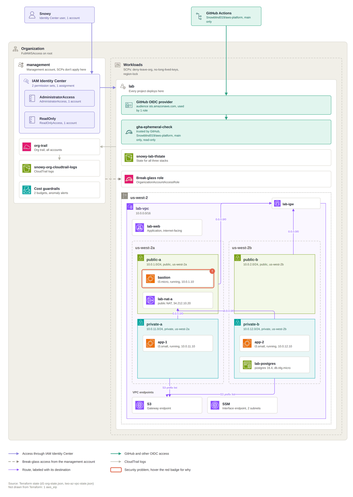

And the designer's example, a two-zone VPC drawn with the designer library:

```bash
python3 -m awskit map design check cloud-map/examples/design-two-az-vpc.drawio
python3 -m awskit map design build cloud-map/examples/design-two-az-vpc.drawio -o /tmp/two-az-vpc-tf
python3 -m awskit map design check cloud-map/examples/broken-designs/overlapping-subnets.drawio
```

## Permissions

The live scan only needs read access. I checked the actions against the AWS managed **SecurityAudit** policy (version v94, from September 30, 2026): it covers everything except the two calls for the cost box, `budgets:ViewBudget` and `ce:GetAnomalyMonitors`. With SecurityAudit alone the scan still runs, and the map just leaves the cost box out and notes that it couldn't read budgets.

Organizations and Identity Center also need the management account or a delegated admin, whatever the policy says.

| Part | Actions |
|---|---|
| Every scan | `sts:GetCallerIdentity`, `ec2:DescribeRegions` |
| Organizations | `organizations:DescribeOrganization`, `ListRoots`, `ListOrganizationalUnitsForParent`, `ListAccountsForParent`, `ListPoliciesForTarget`, `DescribePolicy`, `ListTagsForResource` |
| Identity Center | `sso:ListInstances`, `ListPermissionSets`, `DescribePermissionSet`, `ListManagedPoliciesInPermissionSet`, `ListAccountsForProvisionedPermissionSet`, `ListAccountAssignments`, `identitystore:ListUsers`, `ListGroups` |
| IAM | `iam:ListRoles`, `ListAttachedRolePolicies`, `ListOpenIDConnectProviders`, `GetOpenIDConnectProvider`, `ListSAMLProviders`, `ListAccountAliases` |
| CloudTrail and S3 | `cloudtrail:DescribeTrails`, `s3:ListAllMyBuckets` |
| Cost (not in SecurityAudit) | `budgets:ViewBudget`, `ce:GetAnomalyMonitors` |
| Network | `ec2:Describe*` for the calls in the table above, `elasticloadbalancing:DescribeLoadBalancers`, `DescribeListeners`, `rds:DescribeDBInstances` |

If the identity store's list calls are denied, it falls back to `identitystore:DescribeUser` and `DescribeGroup` for each user and group.

<details>
<summary>Cloud Map (read only)</summary>

```json
{
  "Version": "2012-10-17",
  "Statement": [
    {
      "Sid": "CloudMap",
      "Effect": "Allow",
      "Action": [
        "sts:GetCallerIdentity", "ec2:DescribeRegions",
        "organizations:DescribeOrganization", "organizations:ListRoots",
        "organizations:ListOrganizationalUnitsForParent", "organizations:ListAccountsForParent",
        "organizations:ListPoliciesForTarget", "organizations:DescribePolicy",
        "organizations:ListTagsForResource",
        "sso:ListInstances", "sso:ListPermissionSets", "sso:DescribePermissionSet",
        "sso:ListManagedPoliciesInPermissionSet", "sso:ListAccountsForProvisionedPermissionSet",
        "sso:ListAccountAssignments", "identitystore:ListUsers", "identitystore:ListGroups",
        "iam:ListRoles", "iam:ListAttachedRolePolicies", "iam:ListOpenIDConnectProviders",
        "iam:GetOpenIDConnectProvider", "iam:ListSAMLProviders", "iam:ListAccountAliases",
        "cloudtrail:DescribeTrails", "s3:ListAllMyBuckets",
        "budgets:ViewBudget", "ce:GetAnomalyMonitors",
        "ec2:DescribeVpcs", "ec2:DescribeSubnets", "ec2:DescribeRouteTables",
        "ec2:DescribeInternetGateways", "ec2:DescribeEgressOnlyInternetGateways",
        "ec2:DescribeNatGateways", "ec2:DescribeTransitGateways",
        "ec2:DescribeTransitGatewayAttachments", "ec2:DescribeVpcPeeringConnections",
        "ec2:DescribeVpcEndpoints", "ec2:DescribeSecurityGroups", "ec2:DescribeNetworkAcls",
        "ec2:DescribeInstances", "ec2:DescribeVpnGateways", "ec2:DescribeCustomerGateways",
        "ec2:DescribeVpnConnections",
        "elasticloadbalancing:DescribeLoadBalancers", "elasticloadbalancing:DescribeListeners",
        "rds:DescribeDBInstances"
      ],
      "Resource": "*"
    }
  ]
}
```

</details>

Reading Terraform needs nothing in AWS. Running `terraform show` or `terraform plan` on a folder needs whatever your Terraform needs.

## Settings

| Setting | Where | What it does |
|---|---|---|
| `known_accounts` | `config.json` in `~/.config/awskit/` | Account IDs that count as yours when the org can't be read, so a role trusted by one of them isn't flagged. Accounts you scan always count. |
| `cloud_map` | `config.json` | What the page showed last: the snapshot or design, map type, filters, layers and theme, and `editor`, what Open in draw.io uses (`edge`, `browser` or `desktop`). The page keeps it up to date. |
| Layout memory | `<name>.layout.json` next to each snapshot | Your arrangement, style changes and shapes, see [Layout memory](#layout-memory) |
| Working files | `<name>-<type>.drawio` next to each snapshot | The file Edit opens. AWS Kit writes it fresh each time |
| Labels file | `~/.config/awskit/cloud-map/labels.json` | Your captions, see [Captions](#captions) |
| Redaction key | `~/.config/awskit/cloud-map/redact.key` | Made by the first `--redact` export. Delete it to get new redacted IDs. |
| Page scans | `~/.config/awskit/cloud-map/scans/` and `terraform/` | Snapshots from the page's Scan now and Terraform buttons |
| draw.io | `~/.local/share/awskit/drawio/` | The downloaded draw.io web app the icons and the editor come from. `AWSKIT_DRAWIO` points somewhere else. |

On Windows these are in `%APPDATA%\awskit` instead, and draw.io is in `%LOCALAPPDATA%\AWSKit\drawio`.

## Limits

- Layout memory keeps what was edited through AWS Kit's editor, or read in with `awskit map remember`. A `.drawio` export edited somewhere else and never read back changes nothing.
- In draw.io, a box's red outline and badge are on the Flags layer, so they stay behind when you move the box. They catch up on the next save. The same goes for a detail card's section title, like "Security groups".
- draw.io doesn't grow a container when you drag a box past its edge. AWS Kit does on the next save, and moves what's below out of the way.
- Lines into a moved box are routed again on the next save, unless you moved their waypoints by hand.
- Dragging a resource into another subnet in draw.io doesn't move it in AWS, so the next save puts it back in its real subnet.
- Space for a detail layer stays inside the VPC when the layer is turned off (see [Layers](#layers)).
- An org trail's bucket is drawn in the account that owns it when that account is in the scan, and in the trail's account otherwise, with "owner not checked" in its caption. S3 doesn't say who owns a bucket in another account.
- Trust checks read trust policies. They don't work out what a role can do once assumed, or how SCPs change that. [Policy Check](../policy-check/) looks at the permission side.
- SCPs are summarized in tooltips, not evaluated.
- A transit gateway shared from an account that isn't in the scan shows as a stand-in box with "shared from" in its caption, and a peered VPC in another account shows as a stand-in VPC.
- Route tables are drawn as route lines, not as boxes. Each subnet's tooltip names its route table.
- Very large orgs make very wide maps. `--accounts`, `--regions` and `--vpcs` help, and so do separate access and network maps.
- The text sizes are estimated, since there's no font measuring outside draw.io. The estimates lean wide, so text fits, sometimes with a little room to spare.
- Lines the layout couldn't route are drawn by draw.io its own way, and by the page with a simple straight or Z-shaped line, so those few can look a little different between the two.
- The page shows one map at a time. To compare two, export one and open it next to the window.
- The designer only makes networks for now: VPCs, subnets, gateways, endpoints and security groups. No compute, IAM or transit gateways, and it doesn't read existing Terraform back into a design.
- A design's region and zone letters are checked against a table, not your account, and Plan is where the generated code first meets AWS.

## How shape names are checked

Every AWS icon name Cloud Map writes was checked against the AWS shape set inside draw.io desktop 31.7.0. That list is saved in `tests/drawio-aws4-shapes.txt`, and the tests check every shape in a generated map against it, so a renamed shape fails the tests instead of drawing a blank box. The layouts were checked by rendering the examples with draw.io desktop's own exporter.

## Files

| File | What it is |
|---|---|
| `mapmodel.py` | The model: nodes, edges and snapshots, plus the shared checks, trust parsing and captions both inputs use. No GTK. |
| `mapscan.py` | The live scan |
| `maptf.py` | The Terraform input, with the table of types it reads |
| `maplayout.py` | What each map type shows, filters, collapsing, text sizing, the layout and line routing |
| `mapthemes.py` | The dark and light themes, one table the page and the draw.io writer share |
| `mapdrawio.py` | The draw.io writer, with the table of AWS shapes |
| `maprender.py` | Draws a layout onto any cairo surface: the page's canvas, SVG and PNG. Hit testing and the pan and zoom math. No GTK |
| `mapicons.py` | Reads draw.io's AWS stencils and draws them with cairo, plus the stand-in glyphs. No GTK |
| `map_page.py` | The Cloud Map page in the AWS Kit window |
| `map_edit.py` | Edit on the page: the editor inside the page, the Open in draw.io panel, and the file watcher |
| `mapeditor.py` | The local server between draw.io and AWS Kit, its draw.io settings, and finding Edge, the browser and draw.io desktop. No GTK |
| `maplayoutmem.py` | Layout memory: reading a saved `.drawio` back, and putting it back on the next layout. No GTK |
| `editor/host.html`, `editor/host.js` | The page that hosts draw.io and speaks its embed protocol |
| `mapdesign.py` | The designer: reading designs, the checks, the Terraform it writes, and drawing a design. No GTK |
| `designer/awskit-designer.xml`, `awskit-designer-light.xml` | The AWS Kit Designer shape library, dark and light |
| `designer/make_designer_files.py` | Writes the libraries and the example designs |
| `examples/design-two-az-vpc.drawio` | An example design: two zones, public and private subnets, a NAT gateway per zone, an S3 endpoint, two security groups with an arrow |
| `examples/broken-designs/` | One design per check, for the tests |
| `mapreach.py` | Reachability: the walk through security groups, network ACLs and routes, and its text. No GTK |
| `cloudmap.py` | The `awskit map` command, redaction, the labels file, the export formats, and the working file for Edit |
| `examples/d1-org-state.json` | The org from my D1 diagram, as a Terraform state. All fake. |
| `examples/two-az-vpc-state.json` | A two-AZ VPC, as a Terraform state. All fake. |
| `docs/` | The screenshots in this README |
