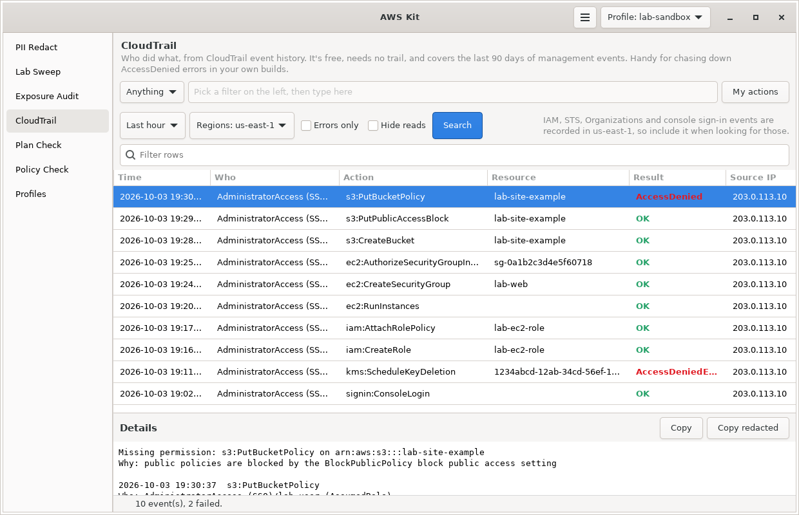

# CloudTrail

Shows who did what in your AWS account and when, as a clean timeline, from CloudTrail event history. It has an errors-only filter for tracking down AccessDenied, it pulls the missing permission and the reason out of the error message for you, and it flags the calls worth a second look from a security point of view, like root use, a sign-in without MFA or someone stopping CloudTrail.



Part of [AWS Kit](../awskit/). The screenshot uses test data.

## Why I made it

When something fails with AccessDenied in my own builds, the answer is usually in CloudTrail, but the console's Event history makes you open each event and read raw JSON to find it. I wanted to give it a user, role or resource and a time window, get a readable list back, and see right away which calls failed and why.

## What it uses

It reads CloudTrail **Event history** through the `LookupEvents` API:

- It's free and needs no trail set up. Every account has it.
- It covers **management events** (creating, changing and deleting things, sign-ins, role assumptions) for the **last 90 days**.
- It doesn't include data events like S3 object reads or Lambda invokes. Those need a trail with data events turned on.
- It's per region. IAM, STS, Organizations and console sign-in events are recorded in **us-east-1**, so include that region when looking for them.
- New events show up after about 5 minutes.

## Filters

Event history only allows **one** filter at a time, so you pick one of these, or none:

| Filter | Matches | Example |
|---|---|---|
| User or role session name | Who made the call. For an IAM user it's the user name. For a role or SSO session, it's the session name. | `lab-user` |
| Resource name or ID | Anything the call touched | `my-bucket`, `i-0abc123`, `sg-0abc123` |
| Event name | The API call | `PutBucketPolicy`, `ConsoleLogin` |
| Service | The service that recorded it | `s3.amazonaws.com`, `iam.amazonaws.com` |
| Access key ID | Calls made with a certain key | `AKIA...` or `ASIA...` |
| Resource type | A CloudFormation-style type | `AWS::S3::Bucket` |

Two more filters are applied after the events come back, so they work together with the one above:

- **Errors only:** only calls that failed, like `AccessDenied` or `UnauthorizedOperation`.
- **Hide reads:** hides Describe, List and Get calls, so you only see things that changed something. With no other filter, it uses Event history's own read-only filter, which is faster.

When one of those after-filters is on, it reads up to four times as many events so the filtered list still has enough in it.

**Security events** keeps only the calls worth a second look (see [Security events](#security-events) below). It's applied after the events come back too, and since most events aren't security events, it reads up to ten times as many.

**My actions** looks up the session name of the current profile (from `sts get-caller-identity`) and searches for that, which is the quickest way to see what your own role just tried to do.

## Reading the results

| Column | What it shows |
|---|---|
| Flag | A severity badge when the call is a security event worth a look, empty otherwise. Sort by it to see those first. |
| Time | Local time of the call |
| Who | Shortened identity. SSO roles show as `AdministratorAccess (SSO)/session` instead of `AWSReservedSSO_AdministratorAccess_0123456789abcdef/session`. Other roles show as `role/session`, IAM users by name, services by their service name, and `root` for the root user. |
| Action | `service:EventName`, like `s3:PutBucketPolicy` |
| Resource | What the call touched, from the event's resource list, or the most useful request parameter if the list is empty |
| Result | `OK`, or the error code in red |
| Source IP | Where the call came from. AWS services show their service name here. |
| Region | Where it was recorded |

Click an event to see the full record in the details pane: who, the full ARN, source IP, client, result, the error message, and the complete event JSON. **Copy redacted** runs it through [PII Redact](../pii-redact/) before copying, which is handy when you want to paste it somewhere to ask for help.

### AccessDenied explained

For failed calls, the top of the details pane pulls out the two things you actually need from AWS's long error message:

```text
Missing permission: s3:PutBucketPolicy on arn:aws:s3:::lab-site-example
Why: public policies are blocked by the BlockPublicPolicy block public access setting
```

The "why" part tells you which kind of policy blocked it: no identity-based policy allows it, an explicit deny in an identity policy, an SCP, a permissions boundary, a session policy, a resource policy, or a setting like Block Public Access. That tells you where to look.

## Security events

Some calls are worth a second look even when nothing failed. The list follows the monitoring section of the CIS AWS Foundations Benchmark (the alarms it asks every account to have), plus a few more that undo a protection. Every event that matches gets a badge in the Flag column, and the details pane starts with what it is and why it matters.

| Flag | What | Calls |
|---|---|---|
| critical | Snapshot or image shared with everyone | `ModifySnapshotAttribute` / `ModifyImageAttribute` adding the group `all` |
| high | Root user used | Anything done by the root user itself (not AWS acting on its behalf) |
| high | Console sign-in without MFA | A successful `ConsoleLogin` by an IAM user or root without MFA. Identity Center sign-ins are left out, since their MFA happens outside AWS's sign-in page. |
| high | CloudTrail changed | `CreateTrail`, `UpdateTrail`, `DeleteTrail`, `StartLogging`, `StopLogging`, `PutEventSelectors` |
| high | AWS Config recording changed | `StopConfigurationRecorder`, `DeleteDeliveryChannel`, `PutDeliveryChannel`, `PutConfigurationRecorder` |
| high | KMS key disabled or set to be deleted | `DisableKey`, `ScheduleKeyDeletion` |
| high | GuardDuty turned off | `DeleteDetector`, `UpdateDetector` with enable false, leaving the administrator account |
| high | S3 Block Public Access loosened | `DeletePublicAccessBlock`, or `PutPublicAccessBlock` with any setting off |
| medium | IAM policy changed | Creating, changing, attaching and detaching policies, trust policies and permissions boundaries |
| medium | New IAM user or credentials | `CreateUser`, `CreateAccessKey`, `CreateLoginProfile`, `UpdateLoginProfile`, removing an MFA device |
| medium | Organizations changed | Accounts, OUs, SCPs and handshakes |
| medium | Failed console sign-in | `ConsoleLogin` that failed |
| medium | S3 bucket policy or ACL changed | Bucket policies, ACLs, CORS, lifecycle and replication |
| medium | Call denied | Any call that failed with AccessDenied or UnauthorizedOperation |
| low | Security group, network ACL, gateway, route table or VPC changed | The network changes in the CIS list |

These are management events, so they're all in Event history. An organization trail with CloudWatch alarms or EventBridge rules is the way to be told about them as they happen; this is for looking back.

## Using it in the window

1. Pick a filter type, or leave it on **Anything**, and type the value.
2. Pick a time window, from **Last 15 minutes** to **Last 90 days**.
3. Pick **Regions**. It starts on your profile's region plus us-east-1.
4. Tick **Errors only**, **Hide reads** or **Security events** if you want.
5. Press **Search**, or Enter in the value box. One search runs at a time.

It shows up to 1,000 events, newest first. The filter box above the table narrows the results further without asking AWS again.

## Using it in the terminal

```bash
awskit trail                                   # everything in the last hour, profile's region
awskit trail --mine --errors --since 2h        # my own failed calls in the last 2 hours
awskit trail --user lab-user --since 1d
awskit trail --resource my-bucket --since 3d
awskit trail --event ConsoleLogin -r us-east-1 --since 7d
awskit trail --source iam.amazonaws.com -r us-east-1 --writes
awskit trail --since "2026-10-01 14:00" --until "2026-10-01 15:00"
awskit trail --all-regions --errors --since 6h
awskit trail --security --since 7d -r us-east-1   # root use, CloudTrail, IAM and network changes
awskit trail --mine --json > events.json
```

| Option | What it does |
|---|---|
| `--user`, `--resource`, `--event`, `--source`, `--key`, `--type VALUE` | The one Event history filter. Pick one. |
| `--mine` | Your own session, instead of one of the filters above |
| `-e`, `--errors` | Only failed calls |
| `-w`, `--writes` | Hide read-only calls |
| `-s`, `--security` | Only security events worth a look, with what each one is and why under the table |
| `--since WHEN` | How far back: `30m`, `2h`, `3d`, `1w`, or a date and time. Default `1h`. |
| `--until WHEN` | End time, same format. Default now. |
| `-r`, `--region REGION` | Region to search. Repeatable. Default is the profile's region. |
| `--all-regions` | Search every enabled region |
| `-n`, `--limit N` | Most events to show. Default 200. |
| `-p`, `--profile NAME` | Profile to use |
| `--json` | Print the raw events as JSON |

With `--errors`, it also prints the "Missing permission" and "Why" lines for the first 10 failed calls under the table.

Dates without a time zone are read as your local time.

## How it works

- Each region is read separately, up to 4 at once, 50 events per page.
- Event history allows about 2 requests per second per account and region. boto3's adaptive retries slow down by themselves if it's throttled, so long searches just take a bit longer.
- Each event's full record comes back as a JSON string, which it parses to get the identity, IP, error and resources.

## Permissions

```json
{
  "Version": "2012-10-17",
  "Statement": [
    {
      "Sid": "CloudTrailTimeline",
      "Effect": "Allow",
      "Action": ["cloudtrail:LookupEvents", "sts:GetCallerIdentity", "ec2:DescribeRegions"],
      "Resource": "*"
    }
  ]
}
```

`ec2:DescribeRegions` is only needed for `--all-regions`.

## Limits

- Management events only, last 90 days. For anything older, or for data events, you need a trail delivering to S3 and something like Athena or CloudTrail Lake to search it.
- One Event history filter at a time. Errors only and Hide reads are applied after, which means wide time windows with those turned on can take a while.
- It searches one account at a time. Switch profiles for another account. An organization trail in your log archive account can cover everything in one place.

## Files

| File | What it is |
|---|---|
| `trail.py` | Lookups, event parsing, the Who formatting, the AccessDenied explainer and the security event rules. No GTK. |
| `trail_page.py` | The CloudTrail page |
| `docs/screenshot.png` | The screenshot above |
