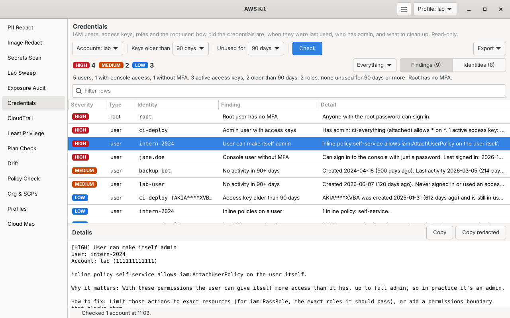

# Credentials

Lists every IAM user, access key and role, plus the root user, in each of your AWS accounts: how old the credentials are, when they were last used, who has admin, and what should be cleaned up. It only reads. Every fix comes with the exact AWS CLI command, for you to run yourself.



Part of [AWS Kit](../awskit/). The screenshot uses test data.

## Why I made it

In lab accounts, IAM users, access keys and roles pile up from Terraform exercises and tutorials, and nothing tells you when they stop being used. The IAM console shows them one at a time, and the credential report is a CSV with 22 columns. I wanted one list per account that says what each identity is, when it was last used, whether it has admin, and the command to clean it up.

## How it's different from Exposure Audit

[Exposure Audit](../exposure-audit/) looks outward, at what's open to the internet, and has a few quick IAM checks among many others. Credentials looks inward, at every identity in the account, and goes deeper: it works out who has admin or can give itself admin, follows group memberships, checks roles and the other kinds of credentials a user can have, and has an Identities view with one row per user, role and root user.

## What it reads, and what it costs

For each account:

- **The IAM credential report.** It asks IAM to make one (`GenerateCredentialReport`), waits up to 30 seconds for it, then reads it. That gives passwords, MFA, key use and certificates for every user and the root user in one go. IAM makes a new report at most every 4 hours.
- **The account summary and password policy.** Root MFA and root keys, and the password rules.
- **Every user, group, role and customer managed policy** in one paginated call (`GetAccountAuthorizationDetails`): group memberships, attached and inline policies, permissions boundaries, role paths, when roles were last used, and trust policies.
- **Each user's access keys** with their IDs and exact last use (`ListAccessKeys`, `GetAccessKeyLastUsed`), **SSH keys**, **service-specific credentials** (CodeCommit Git over HTTPS, Amazon Keyspaces, Amazon Bedrock API keys), **MFA devices** for users that have MFA, and **signing certificates** for users that have one.
- **AWS managed policies** attached to someone, so it can tell whether they grant admin. AdministratorAccess, IAMFullAccess, PowerUserAccess, ReadOnlyAccess, SecurityAudit and ViewOnlyAccess are built in. The rest are read once per check and shared between accounts.

IAM calls are free, so a check costs nothing. Profiles are checked side by side, and the calls for each user run a few at a time.

## What it checks

| Who | Finding | Severity |
|---|---|---|
| **Root user** | Has access keys | critical |
| | Has no MFA | high |
| | Signed in, or its keys were used, within the **Unused for** window (with the date) | medium |
| | Has a signing certificate | low |
| **IAM users** | Console password without MFA | high |
| | Admin, and has access keys | high |
| | Can make itself admin (see below) | high |
| | Admin, without access keys | medium |
| | No sign-in or key use for **Unused for** days or more: one finding that says delete the user, with every command to do it | medium |
| | Console password not used for **Unused for** days or more | medium |
| | Console password set more than a week ago and never used | medium |
| | Active access key that has never been used (after its first week) | medium |
| | Active access key not used for **Unused for** days or more | medium |
| | Active access key older than **Keys older than** days, still in use | low |
| | Two active access keys: the less recently used one should go | low |
| | Inline policies on the user | low |
| | Active SSH keys (used for CodeCommit over SSH) | low |
| | Active service-specific credentials | low |
| | Active signing certificates | low |
| | Inactive access keys left behind | info |
| **Roles** | Not used for **Unused for** days or more | low, or medium if it has admin or can make itself admin |
| | Never used, and created more than **Unused for** days ago | low, or medium the same way |
| **Account** | No password policy, while some users can sign in to the console | low |
| | Weak password policy, while some users can sign in to the console: minimum length under 14, old passwords can be reused, or users can't change their own (no expiry is fine, as current NIST advice says) | low |

When a user has had no activity at all for the whole window, the unused password and key findings for that user are folded into the one "No activity" finding, so the list doesn't repeat itself. Users with SSH keys or service-specific credentials don't get that finding, since IAM doesn't record when those are used, and neither do users whose SSH keys, service-specific credentials or key use couldn't be read, or who got a new key or password in the last week.

When a key's last use couldn't be read at all (no `iam:GetAccessKeyLastUsed` and no credential report), it's never called unused or never used. It's only flagged when it's older than **Keys older than**, with a command to look up its use first.

Service-linked roles (path `/aws-service-role/`) and IAM Identity Center roles (path `/aws-reserved/sso.amazonaws.com/`) are never flagged as unused, since AWS creates and removes them. They're still counted and listed, and Identity Center roles show whether they give admin, since those are the roles people use.

### Admin and "can make itself admin"

An identity has **admin** when a policy it has, directly or through a group, allows `*` on `*`, or allows everything except a list that leaves IAM alone (`NotAction` without `iam:`). AdministratorAccess is the usual one.

It **can make itself admin** when it doesn't have admin yet, but a policy allows IAM actions that hand out permissions on any IAM resource: `iam:*`, `iam:Attach*Policy`, `iam:Put*Policy`, `iam:CreatePolicyVersion`, `iam:AddUserToGroup`, `iam:UpdateAssumeRolePolicy`, `iam:CreateAccessKey` for other users, and the rest of the IAM list from [Policy Check](../policy-check/). A wildcard on another service's resources, like `*` on `arn:aws:s3:::*`, can't touch IAM, so it doesn't count. `iam:PutUserPolicy` or `iam:AttachUserPolicy` on its own user counts too, whether the policy says `user/${aws:username}` or spells out the user's ARN (or a pattern that matches it), but managing its own keys, password and MFA there doesn't. The same goes for a role with `iam:PutRolePolicy` or `iam:AttachRolePolicy` on its own ARN. `iam:PassRole` on any role together with a service that runs as a role, like `lambda:CreateFunction` or `ec2:RunInstances`, counts as well.

A permissions boundary on the identity is mentioned in the finding, since it may limit this.

### Thresholds

| Setting | Default | Used for |
|---|---|---|
| **Keys older than** | 90 days | Active keys older than this should be rotated |
| **Unused for** | 90 days | Passwords, keys, users and roles not used for this long, and how recent counts as "root used recently" |

In the window, changing either one updates the results right away, without asking AWS again. Changing one while a check runs counts for that check too.

## The Identities view

One row per identity, root first, then users, then roles:

| Column | What it shows |
|---|---|
| Type | root, user or role |
| Name | The user or role name |
| Console | `yes, MFA`, `yes, no MFA` or `no` |
| Password used | When the console password was last used, or `never` |
| Access keys | Like `1 active, 120 days old, used 3 days ago`, or `2 active, oldest 400 days, last used 1 day ago, 1 inactive` |
| Last activity | The newest of password use, key use and role use |
| Admin | `yes`, `can become` or `no` (`?` when a policy couldn't be read) |
| Worst | The worst finding's severity |
| Worst finding | What that finding is. Roles AWS manages are dimmed and say so. |

Click an identity to see everything known about it: dates, keys (masked like `AKIA****ABCD`), SSH keys, groups, policies, who a role trusts, why it has admin, and all its findings.

## Using it in the window

1. Pick **Accounts**, or leave it on the current profile.
2. Pick **Keys older than** and **Unused for**, or leave them at 90 days.
3. Press **Check**. The status bar shows how far each profile has got.
4. The line above the table sums it up, like *7 users, 3 with console access, 2 without MFA. 6 active access keys, 4 older than 90 days. 8 roles (3 managed by AWS), 2 unused for 90 days or more. Root has MFA and no access keys.*
5. Switch between **Findings** and **Identities**. The dropdown next to them hides lower severities in both. The filter box narrows the rows further.
6. Click a finding to see the detail, why it matters, how to fix it and the command. **Copy** copies all of it. Double-click a finding to jump to its identity, and double-click an identity to see only its findings.
7. **Notes** lists anything that couldn't be checked, like a missing permission.
8. **Export** saves the findings or the identities as Markdown, CSV or JSON, or a full Markdown report with every command.

Access key IDs are masked everywhere in the window except inside the commands, where you need them.

## Using it in the terminal

```bash
awskit creds                              # findings for the current profile
awskit creds -v                           # also print the fix and the command for each one
awskit creds --identities                 # one row per user, role and root user
awskit creds -p lab-admin -p lab-audit
awskit creds --all-profiles --key-age 180 --unused 60
awskit creds --markdown creds.md          # full report with every command
awskit creds --json
awskit creds --fail-on high               # exit code 2 if anything high or critical is found
```

| Option | What it does |
|---|---|
| `-p`, `--profile NAME` | Profile to check. Repeat for several. |
| `--all-profiles` | Check every profile |
| `--identities` | Print the identities instead of the findings |
| `--key-age DAYS` | Flag active keys older than this. Default 90. |
| `--unused DAYS` | Flag passwords, keys, users and roles not used for this long. Default 90. |
| `-v`, `--verbose` | Print the fix and the command for each finding |
| `--markdown FILE` | Write a Markdown report with the findings, the identities and every command |
| `--json` | Print JSON: summary, counts, findings (with commands) and identities (keys masked) |
| `--fail-on SEVERITY` | Exit with code 2 if anything at this level or worse is found |
| `-q`, `--quiet` | No progress line |

The tables show masked key IDs. The commands printed by `-v`, in the Markdown report and in the JSON have the full key ID, since the command needs it.

## Permissions

The AWS managed `SecurityAudit` policy covers all of it (so does `ReadOnlyAccess`). The exact actions:

```json
{
  "Version": "2012-10-17",
  "Statement": [
    {
      "Sid": "Credentials",
      "Effect": "Allow",
      "Action": [
        "sts:GetCallerIdentity",
        "iam:GenerateCredentialReport", "iam:GetCredentialReport",
        "iam:GetAccountSummary", "iam:GetAccountPasswordPolicy",
        "iam:GetAccountAuthorizationDetails",
        "iam:ListAccessKeys", "iam:GetAccessKeyLastUsed",
        "iam:ListSSHPublicKeys", "iam:ListServiceSpecificCredentials",
        "iam:ListMFADevices", "iam:ListSigningCertificates",
        "iam:GetPolicy", "iam:GetPolicyVersion"
      ],
      "Resource": "*"
    }
  ]
}
```

`iam:GenerateCredentialReport` is the one call that isn't a get or a list. It only asks IAM to build the report so it can be read, and changes nothing.

If something is missing, the check still runs the rest and says what it couldn't do, like "no permission for iam:ListSSHPublicKeys, so SSH keys weren't checked". Without the credential report or the authorization details, an info finding says so too, so the result never looks clean by mistake. Without `iam:GenerateCredentialReport`, it reads the last report IAM made, if there is one. Without `iam:ListAccessKeys`, keys come from the credential report without their IDs, and the commands tell you how to look them up, by the date the key was created. With `--fail-on`, a profile that couldn't be read at all makes the exit code 1.

## Limits

- The admin check reads identity policies only. Conditions, Deny statements, permissions boundaries, SCPs and resource policies aren't applied, so something marked admin may be limited by those. A boundary is mentioned when there is one.
- "Can make itself admin" covers IAM actions and `iam:PassRole` with a service that runs as a role. Other indirect paths, like running commands on an instance that has an admin role, are left to [Policy Check](../policy-check/).
- IAM makes a new credential report at most every 4 hours, so a password removed or MFA added in the last few hours may still show as it was. Users created since the last report are listed with a note, and their passwords and MFA aren't checked until the next one. The root user's MFA and keys come from the live account summary, so those are always current.
- IAM tracks when a role was last used for the last 400 days, and not in every region. A role marked as never used may have been used before that, so check CloudTrail before deleting it.
- IAM doesn't record when SSH keys, service-specific credentials or signing certificates are used.
- People who sign in through IAM Identity Center aren't IAM users. Their permission sets show up as `AWSReservedSSO_` roles here, but the people themselves are in Identity Center.
- In an organization with centralized root access and no root password, the root user still shows as having no MFA. That's expected there.

## Files

| File | What it is |
|---|---|
| `creds.py` | Reading IAM, the checks, the admin logic, the text and the command line. No GTK. |
| `creds_page.py` | The Credentials page |
| `docs/screenshot.png` | The screenshot above |
