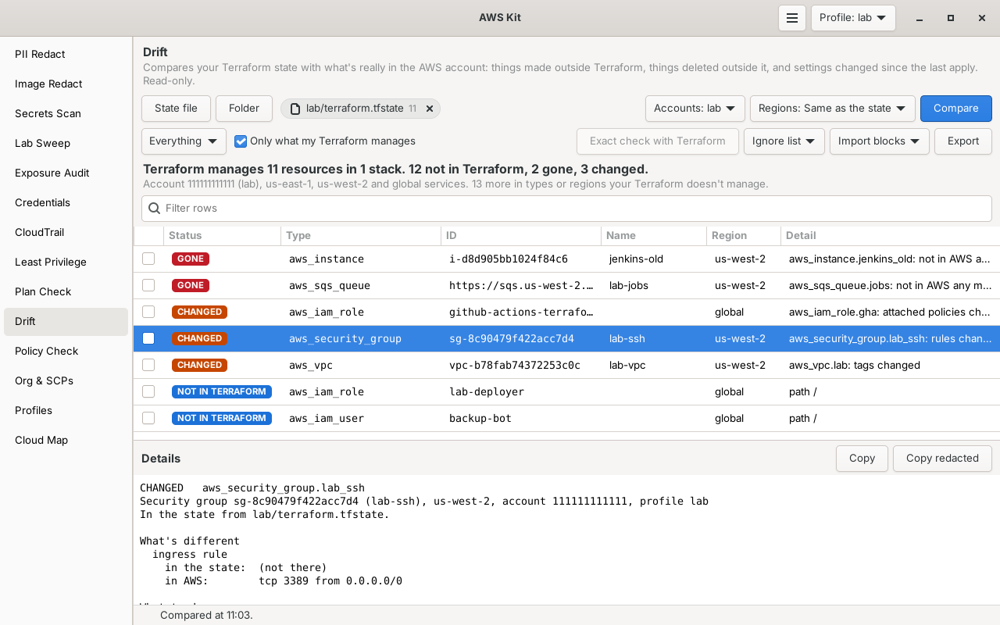

# Drift

Compares your Terraform state with what's really in the AWS account, and lists three things: what's in the account but not in Terraform (like something made by hand in the console), what's in the state but gone from AWS, and settings that were changed outside Terraform. For each one it says what to do, including a ready import block for things you want to bring under Terraform. It only reads.



Part of [AWS Kit](../awskit/). The screenshot uses test data.

## Why I made it

In labs I build most things with Terraform, but now and then I fix something quickly in the console, or make a test bucket or queue by hand and forget about it. `terraform plan` only tells me about the resources Terraform already knows, so the hand-made ones never show up anywhere. I wanted one list of what my Terraform doesn't know about, what was deleted behind its back, and what was changed since the last apply.

## The three statuses

| Status | What it means | What to do |
|---|---|---|
| **Not in Terraform** | In the account, but none of the states you added know about it | Import it with the import block Drift gives you, or delete it if it's a leftover |
| **Gone** | In the state, but not in the account any more. The next apply makes it again. | `terraform apply` if you want it back. If it was deleted on purpose, take it out of the code, or drop it from the state with `terraform state rm 'ADDRESS'` |
| **Changed** | In both, but a setting that matters is different now | `terraform apply` puts it back the way the code says, or change the code to match |

There's a fourth, quieter one: **Managed by CloudFormation** (or Elastic Beanstalk, EKS, Auto Scaling, and so on). Those aren't in Terraform either, but another tool owns them, so they aren't counted as drift. See [What it leaves out](#what-it-leaves-out).

In the table, gone shows as a red badge, changed as orange, not in Terraform as blue, and the other tools in grey.

## What it reads

### Terraform

You can give it any number of stacks at once:

| Input | How it's read |
|---|---|
| `terraform.tfstate` (state version 4, like `terraform state pull` prints) | Read straight from the file |
| `terraform show -json` output | Read straight from the file |
| Plan JSON (`terraform show -json tfplan`) | Read straight from the file. It uses the plan's prior state, and its `resource_drift` (Terraform's own view of what changed) is shown as "from Terraform's refresh". |
| A Terraform folder | Runs `terraform show -json` there to read its current state |

Running Terraform in a folder runs that folder's code: Terraform starts the providers it names, and some data sources run programs, all with your AWS credentials. So the window asks once per folder each session first, and the terminal only does it when you give the folder yourself. Reading a file never runs anything.

Only managed resources from the AWS provider are read, not data sources and not other providers like `random` or `tls`. For each one Drift works out its type, address, region and account (from the ARN, the `region` attribute, the availability zone, or the resources it points at), and the ID AWS uses for it: the instance ID, bucket name, role name, queue URL, load balancer ARN, and so on.

**State files hold secrets**, like database passwords and private keys. Drift only reads the few settings it compares out of each resource and drops everything else right away. Anything Terraform marks as sensitive (`sensitive_values` in `terraform show -json`, `sensitive_attributes` in a raw state) is never shown, logged or written: a sensitive tag that changed shows as `(sensitive, not shown)`. If a resource's sensitive markings are missing or in a shape Terraform doesn't write, all its values are treated as sensitive. Terraform before 0.15 didn't record these markings at all, so for its files only attributes named like secrets (password, token, private_key and so on) are hidden.

Names, tags and IDs from AWS or a state can hold any character, so newlines and terminal control codes in them show as `?`, and import blocks escape them (see [Import blocks](#import-blocks)).

Drift also learns what a managed resource brings with it, so those don't show as not in Terraform:

- A managed VPC's default security group, default network ACL and main route table
- An instance's root and extra volumes
- Routes from `aws_route` and inline `route` blocks, which together are what the route table should have
- Rules from `aws_security_group_rule`, `aws_vpc_security_group_ingress_rule` and `aws_vpc_security_group_egress_rule`, together with the group's inline rules
- Attachments from `aws_iam_role_policy_attachment` and `aws_iam_policy_attachment`
- Versioning from `aws_s3_bucket_versioning`

### The account

It reads these types in the regions you pick (by default, the regions your states use) plus the account-wide ones:

| AWS | Terraform type | Changed means |
|---|---|---|
| VPCs | `aws_vpc` | tags |
| Subnets | `aws_subnet` | tags, `map_public_ip_on_launch` |
| Route tables | `aws_route_table` | tags, routes added, removed or pointing somewhere else |
| Internet gateways | `aws_internet_gateway` | tags |
| NAT gateways | `aws_nat_gateway` | tags |
| Elastic IPs | `aws_eip` | tags |
| Security groups | `aws_security_group` | tags, rules added or removed |
| Network ACLs | `aws_network_acl` | tags |
| VPC endpoints | `aws_vpc_endpoint` | tags |
| EC2 instances | `aws_instance` | tags, instance type, security groups |
| EBS volumes | `aws_ebs_volume` | tags |
| Load balancers | `aws_lb` (and `aws_alb`) | tags |
| RDS instances | `aws_db_instance`, `aws_rds_cluster_instance` | tags |
| S3 buckets | `aws_s3_bucket` | tags, versioning |
| IAM roles | `aws_iam_role` | tags, trust policy, attached managed policies |
| IAM users | `aws_iam_user` | tags |
| IAM policies (customer managed) | `aws_iam_policy` | tags |
| Lambda functions | `aws_lambda_function` | tags |
| DynamoDB tables | `aws_dynamodb_table` | tags |
| SNS topics | `aws_sns_topic` | tags |
| SQS queues | `aws_sqs_queue` | tags |
| KMS keys (customer managed) | `aws_kms_key` | tags. A key scheduled for deletion counts as gone. |
| Secrets Manager secrets | `aws_secretsmanager_secret` | tags |
| CloudWatch log groups | `aws_cloudwatch_log_group` | tags |
| ECR repositories | `aws_ecr_repository` | tags |

`aws_default_vpc`, `aws_default_subnet`, `aws_default_security_group`, `aws_default_network_acl` and `aws_default_route_table` are matched too.

How things are compared:

- **Tags:** added, removed and changed tags, with the old and new value. AWS's own `aws:` tags are ignored. It compares with `tags_all`, so tags from the provider's `default_tags` count.
- **Security group rules:** each rule is split into protocol, ports and one source (a CIDR, a prefix list or another group), so the same rule written two ways still matches. Descriptions are ignored.
- **Trust policies:** compared as normalized JSON, so key order, one-item lists and an account ID written as `123456789012` or as its root ARN don't count as changes.
- Old and new values are always shown, except sensitive ones.

Matching goes by ID within each type, and by region too, since names like log groups, functions and tables can repeat from one region to the next. Something is only called gone when its type was read without errors in its account and region. If a listing failed, it says so in the notes instead.

## What it leaves out

Things AWS makes by itself, which you couldn't have made in Terraform anyway and which would bury the useful lines:

- The default VPC and the parts AWS makes with it: its default subnets and its internet gateway. Things you make inside the default VPC yourself, like an instance or a security group, still show.
- Default security groups, default network ACLs and main route tables of every VPC. They're left out even if someone changed their rules. Manage them with `aws_default_security_group` and friends if that matters to you, and then they're compared like everything else.
- Service-linked roles (path `/aws-service-role/`) and IAM Identity Center roles (path `/aws-reserved/`)
- AWS managed KMS keys, and keys whose key policy doesn't let you read them (a note says how many)
- Network interfaces, which always belong to something else
- Volumes that are deleted with their instance (they go with the instance)

Things another tool manages are marked as **Managed by ...** instead of not in Terraform, when a tag or the service says so:

| Tag or field | Shown as |
|---|---|
| `aws:cloudformation:stack-name` | CloudFormation (this covers CDK, SAM and Amplify too) |
| `elasticbeanstalk:environment-name` | Elastic Beanstalk |
| `eks:cluster-name`, `eks:nodegroup-name`, `aws:eks:cluster-name` | EKS |
| `kubernetes.io/cluster/NAME` | Kubernetes |
| `karpenter.sh/nodepool` | Karpenter |
| `elbv2.k8s.aws/cluster` | EKS load balancer controller |
| `aws:autoscaling:groupName` | Auto Scaling |
| `aws:elasticmapreduce:job-flow-id` | EMR |
| `aws:ec2spot:fleet-request-id`, `aws:ec2:fleet-id` | Spot Fleet, EC2 Fleet |
| `aws:servicecatalog:provisionedProductArn` | Service Catalog |
| `aws:cloud9:environment`, `opsworks:stack`, `AmazonECSManaged` | Cloud9, OpsWorks, ECS |
| A secret's `OwningService`, an Elastic IP's `ServiceManaged` | That service, like RDS |
| The role `OrganizationAccountAccessRole` | AWS Organizations |
| Roles named `stacksets-exec-...` or `AWSCloudFormationStackSetExecutionRole` | CloudFormation StackSets |
| Roles named `AWSControlTower...` or with the path `/aws-controltower/` | Control Tower |

These are hints, not proof. Only AWS can set tags that start with `aws:`, but anyone who can tag a resource can add the others, and anyone who can make roles can pick these role names. A resource marked like this still shows in the list, but it isn't counted as drift, so `--fail-on-drift` doesn't fail on it. The same goes for the `awskit:drift-ignore` tag below: anyone who can tag something can hide it, and the summary only says how many rows the ignore list hid.

A few hints show up in the details too: a log group named `/aws/lambda/...` was probably made by Lambda the first time the function ran, and a resource tagged something like `ManagedBy = terraform` is probably in a stack you didn't add.

### The ignore list

To hide something for good, put it in the ignore list (**Ignore list** in the window). One entry per line:

```text
i-0abc123def4567890
arn:aws:sns:us-east-1:123456789012:billing-alerts
aws_instance.bastion
tag:awskit:drift-ignore
tag:Owner=sandbox
```

An entry can be an ID, ARN, name or Terraform address, or `tag:KEY` (any value) or `tag:KEY=VALUE`. Resources tagged `awskit:drift-ignore` are hidden by default. The list is saved in the AWS Kit settings file under the `drift` key, and the summary says how many rows it hid.

## Only what my Terraform manages

A fresh lab account is often full of console experiments, so by default Drift only lists things not in Terraform for the **types and regions your states manage at least once**. If your states manage VPCs, instances and buckets in us-east-1, an unmanaged instance in us-east-1 shows up, but an unmanaged SNS topic, or an instance in another region you picked, doesn't. The summary says how many more there are.

Untick **Only what my Terraform manages** in the window (or add `--all` in the terminal) to see those too. They show dimmed. Gone and changed always show.

## The exact check with Terraform

Drift's own comparison covers a short list of settings. For everything Terraform knows about a resource, use **Exact check with Terraform** (`--exact` in the terminal). It runs this in each folder you added:

```bash
terraform plan -refresh-only -input=false -out=<temp file>
terraform show -json <temp file>
```

and reads the plan's `resource_drift`, which is Terraform's own list of what changed outside it. Those rows show as **Changed (from Terraform's refresh)** or **Gone (from Terraform's refresh)**, with every attribute that changed. For a folder where the exact check worked, Terraform's view replaces Drift's own comparison for the resources it manages, and it also covers types Drift doesn't read itself, like `aws_route` or `aws_lambda_permission`. Things not in Terraform still come from Drift, since Terraform can't see those.

What it needs and does:

- `terraform` or `tofu` in your PATH, the folder already initialized (`terraform init`), the backend reachable, and credentials that can read everything the folder manages. It uses the profile picked in the header.
- A refresh-only plan that isn't applied doesn't change the state or anything in AWS. Like any plan, it takes the state lock while it runs.
- The saved plan goes in a private temp folder and is deleted right after, since plans can hold secrets. Values Terraform marks as sensitive are hidden, and so are attributes that often hold secrets without being marked, like Lambda `environment`, `user_data` or container definitions: those only say `(changed, value not shown)`.
- If the plan fails, the notes say why and Drift's own comparison is shown instead.

## Using it in the window

1. Press **State file** to add a state file or plan JSON, or **Folder** to add a Terraform folder (it asks before running `terraform show` there). You can also drop files or folders onto the page. Each one shows as a small chip with how many managed resources it has. Press the x on a chip to take it out.
2. Pick **Accounts** and **Regions**, or leave them on the current profile and **Same as the state**.
3. Press **Compare**. Progress shows at the bottom, and **Stop** cancels.
4. The summary line says how much Terraform manages and how much drift there is, like `Terraform manages 46 resources in 2 stacks. 3 not in Terraform, 1 gone, 2 changed.` The line under it says which account and regions were read, and how many rows are elsewhere, managed by other tools, or hidden by the ignore list.
5. Use the dropdown to show **Everything**, **Not in Terraform**, **Gone** or **Changed**, and the filter box to narrow it further.
6. Click a row to see what's different (old and new values) and what to do. **Copy import block** or **Copy state rm** copies just the command.
7. Tick rows that aren't in Terraform and use **Import blocks** to copy their import blocks or save them as `imports.tf`.
8. **Exact check with Terraform** runs Terraform's refresh-only plan in the folders you added. **Export** saves the list as Markdown, CSV or JSON.

Adding or removing a stack, or saving the ignore list, matches the states again against the last read of AWS straight away, without calling AWS. Press **Compare** to read AWS again. When nothing is selected, the details pane shows the notes: what couldn't be read and why.

## Import blocks

For each thing not in Terraform, Drift writes a Terraform 1.5 import block with a suggested resource name, made from the Name tag (or the name) in lower case with underscores. Names are always valid Terraform identifiers, unique per type, and never the same as a name your states already use. The ID is escaped the way HCL wants (quotes, backslashes, newlines, and `${` and `%{` doubled so they're never read as a template), and the comment above each block is kept to one line, so nothing in a name or ID can add Terraform code to the file:

```hcl
# EC2 instance web-test (us-east-1, account 123456789012)
import {
  to = aws_instance.web_test
  id = "i-0abc123def4567890"
}
```

Put them in a `.tf` file in your Terraform folder and run:

```bash
terraform plan -generate-config-out=generated.tf
```

Terraform writes the resource code for you into `generated.tf`. Check it, tidy it up, then `terraform apply` brings the resources under Terraform without changing them. If the resource is in another region than the provider's, add the right `provider = aws.ALIAS` line to the block first.

## Using it in the terminal

```bash
awskit drift terraform.tfstate                   # one state, current profile, the state's regions
awskit drift network.json app.json -p lab-admin  # two stacks
terraform show -json | awskit drift -            # from stdin
awskit drift ~/code/network                      # runs terraform show -json in that folder
awskit drift ~/code/network --exact              # also terraform plan -refresh-only
awskit drift state.json -r us-east-1 -r us-west-2 --all
awskit drift state.json -v                       # what changed and what to do, for each one
awskit drift state.json --imports imports.tf     # import blocks for everything not in Terraform
awskit drift state.json --markdown drift.md
awskit drift state.json --json
awskit drift state.json --fail-on-drift          # exit code 2 when anything is found
```

| Option | What it does |
|---|---|
| `SOURCE ...` | State files, `terraform show -json` output, plan JSON, Terraform folders, or `-` for stdin. Several stacks can be given. A folder only runs Terraform because you named it. |
| `-p`, `--profile NAME` | Profile to read. Repeat for several accounts. |
| `--all-profiles` | Read every profile |
| `-r`, `--region REGION` | Region to read. Repeatable. Default: the regions the states use. |
| `--all` | Also list what's not in Terraform in types and regions your Terraform doesn't manage |
| `--exact` | For folders, also run `terraform plan -refresh-only` and use Terraform's own view |
| `-v`, `--verbose` | Print the details for each row |
| `--json` | Print JSON, with the changes, import blocks and notes |
| `--markdown FILE` | Write a Markdown report |
| `--imports FILE` | Write import blocks for everything not in Terraform that's listed |
| `--fail-on-drift` | Exit with code 2 if anything is not in Terraform, gone or changed |
| `-q`, `--quiet` | No progress line |

Exit codes: 0 when it ran (and, with `--fail-on-drift`, found nothing), 1 when a source couldn't be read or no profile could sign in, 2 when `--fail-on-drift` found drift. Notes about what couldn't be checked go to stderr.

## Using it in CI

`--fail-on-drift` makes a nightly drift check easy. In a GitHub Actions job with an OIDC role that has `ReadOnlyAccess`, pinned to a commit you've looked at (put its full SHA in place of `COMMIT_SHA`):

```yaml
- name: Drift
  run: |
    git clone --filter=blob:none https://github.com/Snowblind019/cloud-tools.git /tmp/cloud-tools
    git -C /tmp/cloud-tools checkout --quiet COMMIT_SHA
    pip install boto3
    terraform state pull > state.json
    PYTHONPATH=/tmp/cloud-tools python3 -m awskit drift state.json --markdown drift.md --fail-on-drift || status=$?
    cat drift.md >> "$GITHUB_STEP_SUMMARY"
    exit ${status:-0}
```

Don't upload `state.json` as an artifact: it holds the same secrets your state does. The Markdown report never includes them.

## What it costs

Nothing. Every call is a free describe, list or get call:

- One listing per type in each region (and one for the account-wide types), with pagination.
- For the types whose listing doesn't include tags (IAM roles, users and policies, Lambda, DynamoDB, SNS, SQS, KMS, log groups, ECR, S3), one tag call per item, at most 400 per type and region. Past that, the notes say how many weren't read.
- For S3, a location call per bucket when the listing doesn't say its region, and a versioning call for buckets in your states.
- For IAM roles in your states, one call for their attached policies.
- For KMS, one describe call per key, to tell customer keys from AWS managed ones.

Up to 12 listings run at once.

## Permissions

The AWS managed `ReadOnlyAccess` policy covers all of it. The exact actions:

<details>
<summary>Drift (read only)</summary>

```json
{
  "Version": "2012-10-17",
  "Statement": [
    {
      "Sid": "Drift",
      "Effect": "Allow",
      "Action": [
        "sts:GetCallerIdentity",
        "ec2:DescribeVpcs", "ec2:DescribeSubnets", "ec2:DescribeRouteTables",
        "ec2:DescribeInternetGateways", "ec2:DescribeNatGateways", "ec2:DescribeAddresses",
        "ec2:DescribeSecurityGroups", "ec2:DescribeNetworkAcls", "ec2:DescribeVpcEndpoints",
        "ec2:DescribeInstances", "ec2:DescribeVolumes",
        "elasticloadbalancing:DescribeLoadBalancers", "elasticloadbalancing:DescribeTags",
        "rds:DescribeDBInstances",
        "s3:ListAllMyBuckets", "s3:GetBucketLocation", "s3:GetBucketTagging",
        "s3:GetBucketVersioning",
        "iam:ListRoles", "iam:ListRoleTags", "iam:ListAttachedRolePolicies",
        "iam:ListUsers", "iam:ListUserTags", "iam:ListPolicies", "iam:ListPolicyTags",
        "lambda:ListFunctions", "lambda:ListTags",
        "dynamodb:ListTables", "dynamodb:ListTagsOfResource",
        "sns:ListTopics", "sns:ListTagsForResource",
        "sqs:ListQueues", "sqs:ListQueueTags",
        "kms:ListKeys", "kms:ListAliases", "kms:DescribeKey", "kms:ListResourceTags",
        "secretsmanager:ListSecrets",
        "logs:DescribeLogGroups", "logs:ListTagsForResource", "logs:ListTagsLogGroup",
        "ecr:DescribeRepositories", "ecr:ListTagsForResource"
      ],
      "Resource": "*"
    }
  ]
}
```

</details>

It never reads secret values (`secretsmanager:ListSecrets` only lists names and tags). If a role is missing some of these, Drift still compares the rest and lists what it couldn't read, like "no permission to list SQS queues (us-east-1), so they weren't checked". Resources of a type it couldn't list are never called gone, and the summary says how many couldn't be checked.

The exact check uses Terraform with your profile, so it needs whatever `terraform plan` needs for that folder: the backend (for example the S3 bucket and lock table) and read access to everything the folder manages.

## Limits

- It compares the **state** with AWS, not your code with AWS. A change in the code that isn't applied yet isn't drift here: that's what `terraform plan` and [Plan Check](../plan-check/) are for. And if someone ran `terraform apply -refresh-only` after changing something by hand, the state already matches AWS.
- Its own comparison covers the types and settings in the tables above. Other managed types are counted and named in the notes, but not checked on their own (routes, rules, attachments and versioning are still compared through their parent). The exact check covers everything Terraform manages.
- Only accounts that a picked profile reaches. A state that manages resources in several accounts (provider aliases with `assume_role`) needs a profile for each account, or the notes list what wasn't checked.
- No data sources. They aren't managed, so there's nothing to drift.
- A folder is read in its current workspace only.
- Tags left out with the provider's `ignore_tags`, or changes hidden with `lifecycle { ignore_changes }`, still show as changed, since the state doesn't say which ones you meant to ignore. Add them to the ignore list, or rely on the exact check's view.
- Rules on default security groups and routes in main route tables aren't checked unless your Terraform manages them with the `aws_default_*` types.
- Classic load balancers, Aurora clusters, ElastiCache, EKS, ECS and many other types aren't read yet, so things made by hand in those don't show up.

## Files

| File | What it is |
|---|---|
| `drift.py` | Reading states, reading the account, the comparison, the exact check, and the command line. No GTK. |
| `drift_page.py` | The Drift page |
| `docs/screenshot.png` | The screenshot above |
