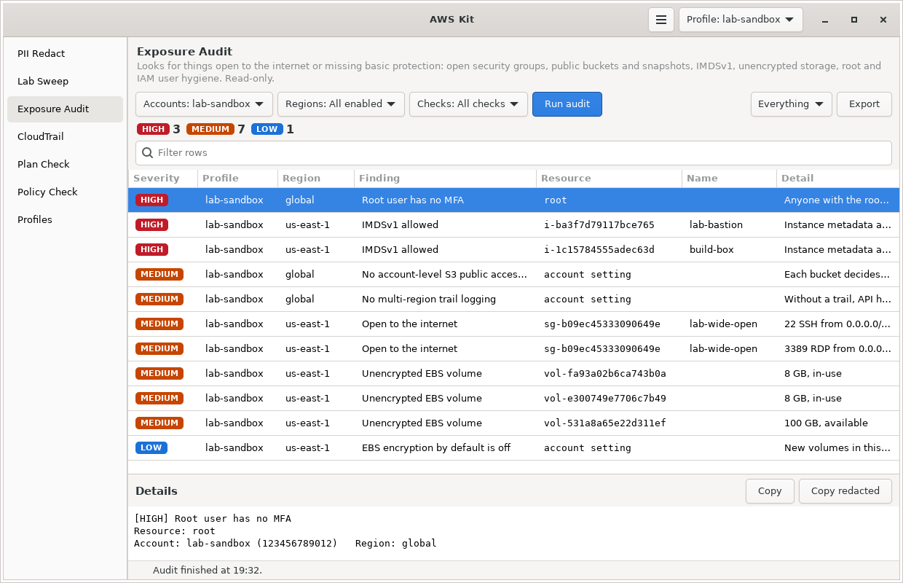

# Exposure Audit

Looks for things open to the internet or missing basic protection across your AWS accounts: open security groups, public buckets and snapshots, instances that allow IMDSv1, unencrypted storage, and root and IAM user problems. It only reads.



Part of [AWS Kit](../awskit/). The screenshot uses test data.

## Why I made it

Tools like Prowler and Security Hub run hundreds of checks, which is great, but I wanted something small that I understand line by line. These are the checks that matter most for a personal or lab account, the mistakes that actually get accounts into trouble: SSH open to the world, a public snapshot, root without MFA, an old access key. Building it also made me learn exactly where each of those settings lives in the API.

## What it checks

| Check | Finding | Severity |
|---|---|---|
| **Security groups** | Inbound from `0.0.0.0/0` or `::/0` on all traffic | critical |
| | Inbound from the internet on a risky port (see below) or a range of 1,000 ports or more | high |
| | Inbound from the internet on any other port | medium |
| | Inbound from the internet on just port 80 or 443 | info |
| | Any of the above on a group that isn't attached to anything right now | one step lower (critical and high become medium, medium becomes low) |
| | A default security group that's in use and still has inbound rules | low |
| **EC2** | Instance allows IMDSv1 and has a public IP | high |
| | Instance allows IMDSv1 | medium |
| **Snapshots and AMIs** | EBS snapshot anyone can copy | critical |
| | AMI anyone can launch | high |
| | Snapshot public sharing isn't blocked in the region | low |
| **EBS** | Unencrypted volume | medium |
| | Encryption by default turned off in the region | low |
| **S3** | Bucket policy makes the bucket public | critical |
| | Bucket ACL grants everyone or any AWS account | high, or low if the bucket's public access block overrides it |
| | No account-level Block Public Access, or some of it turned off | medium |
| **RDS** | Manual snapshot anyone can restore | critical |
| | Database is publicly accessible | high |
| | Database storage isn't encrypted | medium |
| **Lambda** | Function URL with no auth | high |
| | Function policy lets anyone invoke it, with no narrowing condition | high |
| **IAM** | Root user has access keys | critical |
| | Root user has no MFA | high |
| | Console user without MFA | high |
| | Access key that's never been used | medium |
| | Access key unused for more than 90 days | medium |
| | Access key older than 90 days | low |
| | No password policy (only when the account has IAM users) | low |
| **CloudTrail** | No multi-region trail that's logging | medium |
| | Trail with log file validation turned off | low |
| **Access Analyzer** | An active external access finding (something shared outside the account) | high |
| | No analyzer in your home region | low |

Risky ports: 20 and 21 (FTP), 22 (SSH), 23 (Telnet), 135 (RPC), 139 (NetBIOS), 161 (SNMP), 389 (LDAP), 445 (SMB), 1433 (SQL Server), 1521 (Oracle), 2049 (NFS), 2375 and 2376 (Docker API), 2379 (etcd), 3306 (MySQL), 3389 (RDP), 5432 (PostgreSQL), 5601 (Kibana), 5900 (VNC), 5984 (CouchDB), 5985 and 5986 (WinRM), 6379 (Redis), 6443 (Kubernetes API), 7001 (WebLogic), 8086 (InfluxDB), 9092 (Kafka), 9200 and 9300 (Elasticsearch), 10250 (Kubelet), 11211 (Memcached), 27017 (MongoDB).

Every finding comes with a short explanation and a fix, often the exact CLI command to run.

### What the severities mean

| Severity | Meaning |
|---|---|
| critical | Exposed to the internet right now, or the root user can be abused. Fix it today. |
| high | One mistake away from a real problem, like an admin port open to the world |
| medium | Missing protection that should be there |
| low | Hygiene and good defaults |
| info | Worth knowing, probably fine |

## Using it in the window

1. Pick **Accounts** and **Regions**, or leave them on the current profile and every enabled region.
2. Pick **Checks** to run only some of them, or leave it on **All checks**.
3. Press **Run audit**. The counts at the top show how many findings there are at each level.
4. Use the dropdown on the right to show **Critical and high**, **Medium and worse**, **Low and worse**, or **Everything**. The filter box narrows it further.
5. Click a finding to see the details and how to fix it.
6. **Export** saves the findings, with fixes, as Markdown, CSV or JSON.

## Using it in the terminal

```bash
awskit audit                         # current profile, every enabled region
awskit audit -v                      # also print how to fix each finding
awskit audit -p lab-admin -p lab-audit
awskit audit --all-profiles
awskit audit -c open_sg -c s3        # only some checks
awskit audit --markdown report.md    # write a Markdown report
awskit audit --json
awskit audit --fail-on high          # exit code 2 if anything high or critical is found
```

| Option | What it does |
|---|---|
| `-p`, `--profile NAME` | Profile to audit. Repeat for several. |
| `--all-profiles` | Audit every profile |
| `-r`, `--region REGION` | Only this region. Repeatable. |
| `-c`, `--check CHECK` | Only this check. Repeatable. |
| `-v`, `--verbose` | Print the fix for each finding |
| `--markdown FILE` | Write a Markdown report to FILE |
| `--json` | Print JSON |
| `--fail-on SEVERITY` | Exit with code 2 if anything at this level or worse is found |

Check names for `-c`:

| Name | Check |
|---|---|
| `open_sg` | Security groups |
| `imds` | EC2 IMDSv1 |
| `public_snapshots` | Public EBS snapshots, AMIs, snapshot sharing setting |
| `ebs_encryption` | Unencrypted volumes, encryption by default |
| `s3` | S3 public access |
| `rds` | RDS public access, encryption, public snapshots |
| `lambda` | Lambda function URLs and policies |
| `iam` | Root user, password policy, console users, access keys |
| `cloudtrail` | CloudTrail coverage |
| `access_analyzer` | Access Analyzer findings |

## How it works

- Regional checks run in every enabled region (or the ones in your settings). S3, IAM and CloudTrail are account-wide and run once per account.
- Up to 12 checks run at once.
- **Security groups:** it reads every network interface first to learn which groups are actually attached to something, then grades each open rule.
- **Snapshots:** it asks EC2 for your snapshots that are restorable by `all`, which is one call per region instead of one per snapshot.
- **S3:** it checks the account's Block Public Access, then for each bucket its own Block Public Access, AWS's own "is this policy public" verdict (`GetBucketPolicyStatus`), and its ACL. Each bucket is checked in its own region.
- **Lambda policies:** they're graded with the same rules as [Policy Check](../policy-check/).
- **IAM users and keys:** it generates the IAM credential report and reads it, which covers every user in one go. Generating it can take a few seconds the first time.
- **Access Analyzer:** it uses the first active account or organization analyzer it finds in each region.

## Permissions

The AWS managed `SecurityAudit` policy covers all of it. The exact actions:

<details>
<summary>Exposure Audit (read only)</summary>

```json
{
  "Version": "2012-10-17",
  "Statement": [
    {
      "Sid": "ExposureAudit",
      "Effect": "Allow",
      "Action": [
        "sts:GetCallerIdentity", "ec2:DescribeRegions",
        "ec2:DescribeNetworkInterfaces", "ec2:DescribeSecurityGroups", "ec2:DescribeInstances",
        "ec2:DescribeSnapshots", "ec2:DescribeImages", "ec2:GetSnapshotBlockPublicAccessState",
        "ec2:DescribeVolumes", "ec2:GetEbsEncryptionByDefault",
        "s3:GetAccountPublicAccessBlock", "s3:ListAllMyBuckets", "s3:GetBucketLocation",
        "s3:GetBucketPublicAccessBlock", "s3:GetBucketPolicyStatus", "s3:GetBucketAcl",
        "rds:DescribeDBInstances", "rds:DescribeDBSnapshots", "rds:DescribeDBSnapshotAttributes",
        "lambda:ListFunctions", "lambda:ListFunctionUrlConfigs", "lambda:GetPolicy",
        "iam:GetAccountSummary", "iam:GetAccountPasswordPolicy",
        "iam:GenerateCredentialReport", "iam:GetCredentialReport",
        "cloudtrail:DescribeTrails", "cloudtrail:GetTrailStatus",
        "access-analyzer:ListAnalyzers", "access-analyzer:ListFindingsV2"
      ],
      "Resource": "*"
    }
  ]
}
```

</details>

If a role is missing some of these, the audit still runs the rest and lists what it couldn't check, like "no permission for Public Lambda functions (17 regions)".

## Using it in CI

`--fail-on` makes it easy to run on a schedule, for example in a GitHub Actions workflow with an OIDC role that has `SecurityAudit`:

```yaml
- name: Exposure audit
  run: |
    git clone --depth 1 https://github.com/Snowblind019/cloud-tools.git /tmp/cloud-tools
    pip install boto3
    PYTHONPATH=/tmp/cloud-tools python3 -m awskit audit --markdown audit.md --fail-on high || status=$?
    cat audit.md >> "$GITHUB_STEP_SUMMARY"
    exit ${status:-0}
```

## Limits

- It's a focused set of checks, not a full benchmark like CIS. Use Security Hub or Prowler for full coverage.
- Resource policies on SQS, SNS, KMS, ECR and others aren't read directly. Access Analyzer covers those if you have an analyzer turned on, and the audit reports its findings.
- A security group open to the internet on a port nothing listens on still gets flagged. It's still worth closing.
- IAM checks are about IAM users. If you use IAM Identity Center for people, most of the user checks won't find anything, which is the goal.

## Files

| File | What it is |
|---|---|
| `audit.py` | The checks and the runner. No GTK. |
| `audit_page.py` | The Exposure Audit page |
| `docs/screenshot.png` | The screenshot above |
