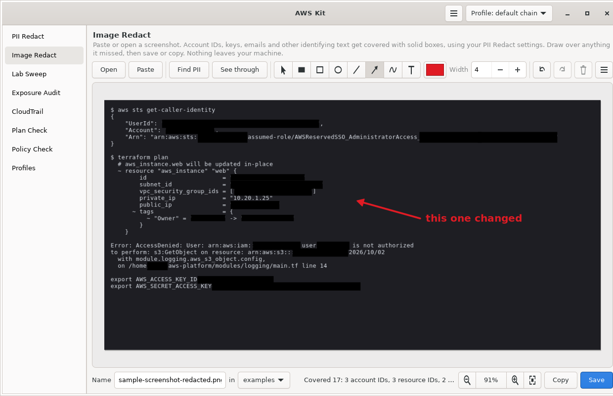

# Image Redact

I made this because I was covering things in screenshots by hand. Before I could share a screenshot of a terminal or the AWS console while troubleshooting, I had to open it in Gradia and draw filled boxes over account IDs, ARNs, emails and anything else that pointed back to me or my accounts. [PII Redact](../pii-redact/) already did that for text, so I wanted the same thing for images.

It reads the text in a screenshot, finds the same things PII Redact does, and covers each one with a solid box. Then you get a toolbar to fix it up by hand: cover anything it missed, draw boxes, ovals, lines, arrows, freehand and text, change colors and widths, and save, rename, move or copy the result. It's one of the tools in [AWS Kit](../awskit/), so it's a page in the AWS Kit window, a window of its own for a keybind or Open With, and a terminal command.



Part of [AWS Kit](../awskit/). The screenshot uses the fake data in `examples/sample-screenshot.png`, which is the same text as PII Redact's sample.

## Features

- **Covers things on its own.** Paste or open a screenshot and the account IDs, keys, ARNs, resource IDs, emails, public IPs and the rest get covered right away. It uses your PII Redact settings, so the categories you turned off, your always-redact list and your never-redact list all apply here too.
- **Covers only the part that matters.** In `arn:aws:iam::123456789012:user/jane`, only the account ID and the user name get boxed. Regions, resource types, private IPs and Terraform addresses stay readable, the same as with PII Redact.
- **Drawing tools.** Select, Cover, Box, Oval, Line, Arrow, Pen and Text, with a color picker, a Fill toggle, line width and text size. Everything stays editable until you save: move it, resize it, recolor it or delete it.
- **Cover tool.** One click-and-drag draws a solid box in the same color text detection uses, so covering something it missed doesn't mean switching to Box, turning on Fill and changing the color every time.
- **See through.** Shows what's under every solid box, with an outline around each one, so you can check they cover the right thing before you share. Saved and copied images are always solid.
- **Rename and move from inside the app.** The name box and the folder button at the bottom say where Save writes. Once it's saved, changing the name renames the file and picking a folder moves it. Typing `.jpg` instead of `.png` converts it.
- **Paste and copy.** Ctrl+V pastes a screenshot and Copy puts the finished image on the clipboard. On WSL that's the Windows clipboard, so Win+Shift+S, Ctrl+V, Copy, and paste into Teams or a browser works.
- **Undo and redo** for everything, including text detection.
- **Saves a fresh image.** The saved or copied file is a new render with the boxes painted into the pixels. Nothing from the original comes along: no layers, no metadata, nothing hidden under the boxes.
- **Local only.** Text detection runs on your machine with tesseract. No network calls.

## Install

Image Redact installs with the rest of AWS Kit. On Fedora:

```bash
sudo dnf install python3-gobject gtk4 wl-clipboard tesseract tesseract-langpack-eng python3-boto3
git clone https://github.com/Snowblind019/cloud-tools.git
cd cloud-tools
./install.sh
```

| Distro | Command |
|---|---|
| Fedora | `sudo dnf install python3-gobject gtk4 wl-clipboard tesseract tesseract-langpack-eng` |
| Debian / Ubuntu | `sudo apt install python3-gi python3-gi-cairo gir1.2-gtk-4.0 wl-clipboard tesseract-ocr` |
| Arch | `sudo pacman -S python-gobject python-cairo gtk4 wl-clipboard tesseract tesseract-data-eng` |

On X11, install `xclip` instead of `wl-clipboard`. On WSL, neither is needed for copying and pasting images, since that goes through the Windows clipboard.

Tesseract is what reads the text. Without it the editor still works, you just cover everything by hand. To check that it's set up, run `awskit image check`.

The installer adds an **Image Redact** launcher entry. It also registers it for PNG, JPEG, WebP and BMP files, so it shows up under **Open With** in your file manager. In GNOME and KDE, right-clicking the launcher entry gives you **Open clipboard image** and **Redact clipboard image**.

Want to try it before installing? From the root of the repo, run `python3 -m awskit image image-redact/examples/sample-screenshot.png`.

## Quick start

1. Open it with `awskit image`, from your launcher, or from the **Image Redact** page in AWS Kit.
2. Paste a screenshot with Ctrl+V, drop an image file on it, or click **Open**.
3. Give it a few seconds. The status bar says what got covered, like `Covered 17: 3 account IDs, 3 resource IDs, 2 names...`
4. Look it over. Use **See through** if you want to check what's under the boxes. Cover anything it missed with the Cover tool (C), and delete any box it shouldn't have drawn.
5. Click **Save** (Ctrl+S) or **Copy** (Ctrl+C).

Text detection can miss things, especially small or blurry text. Always look the image over before you share it.

## The editor

### Tools

| Tool | Key | What it does |
|---|---|---|
| Select | V | Click a shape to select it. Drag to move it, drag a corner to resize it. Delete removes it, arrow keys nudge it one pixel (Shift for ten). Double-click text to change it. |
| Cover | C | Solid box in the cover color, the same as what text detection draws |
| Box | R | Box outline, or a filled box with **Fill** on |
| Oval | O | Oval outline, or filled with **Fill** on |
| Line | L | Straight line. Hold Shift for 45 degree steps. |
| Arrow | A | Arrow pointing where you let go. Hold Shift for 45 degree steps. |
| Pen | P | Freehand |
| Text | T | Click where the text goes, type, then press Enter. Esc cancels. |

The controls next to the tools change with the tool:

- **Color** applies to the tool you're on. Cover has its own color, black by default, and the drawing tools share another one, red by default. Both are remembered.
- **Fill** shows for Box and Oval.
- **Width** shows for the shapes that have a line.
- **Size** shows for Text.

With a shape selected, changing any of them changes that shape.

Holding Shift while drawing a Cover, Box or Oval makes it square or round.

### Text detection

**Find PII** (Ctrl+F) reads the text and covers what it finds. It runs by itself when an image opens, which you can turn off in the menu at the top right.

Running it again replaces the boxes it drew before, but leaves alone any box you moved, resized or recolored, plus everything you drew yourself.

The menu also has **Choose what gets covered**, which opens the PII Redact settings. Image Redact uses the same categories and word lists, so turning off bucket names or adding your name to the always-redact list works for both. Changes apply to the open image right away, without reading the text again.

Hovering over a box with the Select tool shows what it covered in the status bar, like `Found by text detection: account ID`.

### Saving, renaming and moving

The bottom bar shows where the image goes: a **Name** box, and a folder button.

| You do this | Before it's saved | After it's saved |
|---|---|---|
| Change the name and press Enter (or click away) | Save will use the new name | The file gets renamed |
| Type `.jpg` or `.png` at the end of the name | Save will use that format | The file gets converted and renamed |
| Pick a folder from the folder button | Save will write there | The file gets moved there |
| Click **Save** | Writes the file | Writes over the file with your latest changes |

The folder button lists the folder you're in, the last folders you saved or moved to, the folder the screenshot came from, and your Pictures folder. **Choose another folder** opens a folder picker, and **Open this folder** opens it in your file manager.

If a file with that name is already there, it asks before replacing it.

The name starts out as the original file's name with `-redacted` on the end, in the same folder, like `Screenshot from 2026-10-03-redacted.png`. Pasted images start as `redacted-2026-10-03-142205.png` in the last folder you used, or Pictures. The original screenshot is never changed, unless you name the redacted copy the same and say yes to replacing it.

F2 jumps to the name box with the name selected, and Ctrl+M opens the folder button.

### Viewing

The image fits the window when it opens. Ctrl+scroll zooms around the pointer, Ctrl++ and Ctrl+- zoom in and out, Ctrl+0 fits it again, and clicking the zoom percentage goes to actual size. Drag with the middle mouse button to move around.

### Unsaved changes

If you drew or changed something by hand and haven't saved or copied it, it asks before opening another image or closing the window. Boxes text detection drew on their own don't count, since there's nothing to lose.

## Commands

| Command | What it does |
|---|---|
| `awskit image` | Open the Image Redact window |
| `awskit image FILE` | Open FILE in the window |
| `awskit image FILE -o OUT` | Cover what it finds and save to OUT, without a window. OUT can be a file or a folder ending in `/`. |
| `awskit image FILE --list` | Print what it would cover and where. Add `--json` for JSON. |
| `awskit image clip` | Cover what it finds in the clipboard image and put it back, with a notification |
| `awskit image clip -g` | Open the clipboard image in the window instead |
| `awskit image check` | Check that tesseract and its language data are installed |
| `awskit gui image` | Open AWS Kit on the Image Redact page |

`awskit image clip` is the image version of `pii-redact clip`: take a screenshot to the clipboard, press a key, paste. Since it can't show you what it missed, `awskit image clip -g` is usually the better keybind.

On WSL, `awskit image` also takes Windows paths, like `awskit image 'C:\Users\me\Pictures\Screenshots\shot.png'`.

## How it finds things

1. **Reads the text with tesseract.** Screenshot text is small, so it's enlarged first. Tesseract reads dark text on a light background best, so dark screenshots like terminals get flipped, and screenshots with both get read both ways. It gets the box of every character, not just every word.
2. **Cleans up common OCR mistakes.** OCR reads `1` as `l`, `0` as `O`, `i-` as `1-`, `_` as a space, and adds spaces inside IDs. A cleaned-up copy of the text gets checked as well as the raw text, so `i-0alb2c3d` and `iam: :1234` still count.
3. **Runs PII Redact's rules on it.** The same patterns, with your settings.
4. **Covers each match.** For a whole word, the box covers the word plus a little padding. For part of a word, like the account ID inside an ARN, it uses the character boxes. Those can be off by a few pixels, so the edge moves out half a character, and a quote, colon or slash next to the match gets covered too. Hiding one of those gives nothing away, and it means the match never shows at the edge.

Everything runs on your machine, and the temporary files tesseract reads go in a private folder that gets deleted right after.

## Things to know

- **It can miss things.** OCR has trouble with tiny text, low contrast, unusual fonts, and text over pictures. Check every image before you share it.
- **Solid boxes only.** There's no blur or pixelate tool on purpose, since blurred text can sometimes be read back. Solid boxes can't.
- **Lots of text takes longer.** A terminal screenshot takes a few seconds. A full screen packed with text, especially with both light and dark parts, can take 10 to 20 seconds on a slower machine. You can start drawing while it reads.
- **Other languages.** It reads English by default. For other languages, install the language data and set `language` in the settings, like `"eng+ron"`.

## Keybinds

[AWS Kit's README](../awskit/README.md#keybinds) has keybinds for Niri, Hyprland, Sway, i3, GNOME and KDE. For Image Redact:

| Keys in the examples | Command | What it does |
|---|---|---|
| Super+Alt+I | `awskit image clip -g` | Open the clipboard screenshot in Image Redact |

For Niri, that's:

```kdl
Mod+Alt+I { spawn-sh "~/.local/bin/awskit image clip -g"; }
```

The window's app ID is `io.github.Snowblind019.AwsKit.ImageRedact`.

## Settings

Image Redact keeps its own settings in `~/.config/awskit/image.json`. The editor saves them as you go, so there's no need to edit it by hand.

| Key | Default | What it does |
|---|---|---|
| `find_on_open` | `true` | Run text detection when an image opens |
| `box_color` | black | Color of the boxes from text detection and the Cover tool |
| `draw_color` | red | Color for the other drawing tools |
| `width` | `4` | Line width |
| `fill` | `false` | Fill for Box and Oval |
| `text_size` | `28` | Text size in pixels |
| `recent_folders` | `[]` | Folders you saved or moved to lately, shown in the folder button |
| `language` | `"eng"` | Tesseract languages, joined with `+` |

What gets covered comes from PII Redact's settings in `~/.config/awskit/redact.json`. See [pii-redact/](../pii-redact/).

## Troubleshooting

| Problem | Fix |
|---|---|
| `Text detection needs tesseract` | Fedora: `sudo dnf install tesseract tesseract-langpack-eng` |
| `Tesseract doesn't have the language data for 'eng'` | Fedora: `sudo dnf install tesseract-langpack-eng`. Debian/Ubuntu: `sudo apt install tesseract-ocr-eng` |
| It missed something | Cover it with the Cover tool (C). If it's a word you always want hidden, add it to PII Redact's always-redact list. |
| It covered something it shouldn't have | Select the box and press Delete. If it happens a lot, add the word to PII Redact's never-redact list or turn the category off. |
| The window crashes with `Couldn't find foreign struct converter for 'cairo.Context'` | Debian/Ubuntu: `sudo apt install python3-gi-cairo` |
| Paste says there's no image | Copy the screenshot again. Copying an image file in a file manager copies the file, not the image, so drop the file on the window or use Open instead. |
| On WSL, paste or copy doesn't work | PowerShell is missing or blocked. Installing `wl-clipboard` gives a fallback through WSLg. |
| Image Redact isn't under Open With | Run `update-desktop-database ~/.local/share/applications`, or log out and back in |

## License

MIT. See [LICENSE](../LICENSE).
