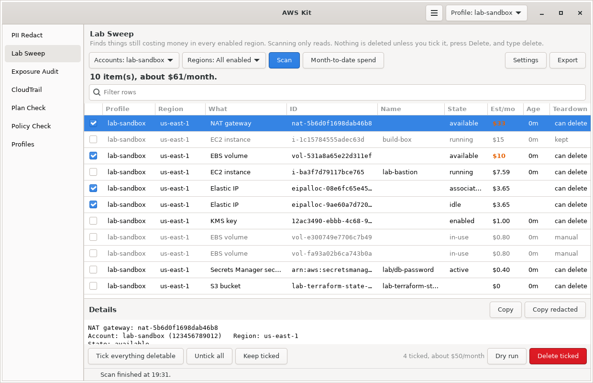

# Lab Sweep

Finds anything still costing money in every enabled region, across one or more AWS accounts, and tears it down after you confirm. It can also check every evening and send a desktop notification if something got left running.



Part of [AWS Kit](../awskit/). The screenshot uses test data.

## Why I made it

Labs leave things behind. A NAT gateway or an Elastic IP is easy to forget, and they bill by the hour whether you use them or not. Checking every region by hand in the console after each lab gets old fast, and I also had leftover lab accounts from my old AWS Organization that needed a proper cleanup. I wanted one list of everything still running across all my accounts, with a rough monthly cost, and a safe way to get rid of it.

## What it does

1. **Scan.** Reads every enabled region in each account you pick and lists anything that bills by the hour or month. Scanning only reads.
2. **Review.** Each row shows the account, region, type, ID, name, state, a rough monthly cost, how old it is, and whether teardown can delete it. Rows sort by cost, most expensive first.
3. **Tear down.** Tick what you want gone, press **Delete ticked**, and type `delete` to confirm. It deletes things in a safe order and shows the result of each one.
4. **Check daily.** Optional. A systemd user timer, or a scheduled task on Windows, runs a scan every evening and notifies you if anything is still costing money.

## What it finds

| Type | What counts | Rough monthly cost used | Teardown |
|---|---|---|---|
| EC2 instance | Running, pending, stopping or stopped | By instance type (t2, t3, t3a, t4g and common m, c, r sizes). Stopped instances show $0. | Terminate |
| NAT gateway | Public or private, pending or available | $32.85 plus data | Delete |
| Elastic IP | Attached or idle | $3.65 (public IPv4 is $0.005 an hour) | Disassociate if needed, then release |
| Load balancer | ALB, NLB, Gateway LB | $16.43 (ALB, NLB), $9.13 (GWLB), plus capacity units | Delete |
| Classic load balancer | Any | $18.25 | Delete |
| EBS volume | Any | Per GB by type (gp3 $0.08, gp2 $0.10, io1 and io2 $0.125, st1 $0.045, sc1 $0.015), plus extra IOPS and throughput | Delete, unattached only |
| EBS snapshot | Owned by you | $0.05 per GB of volume size ($0.0125 archive). This is the most it could be. | Delete |
| AMI | Owned by you | $0 (its snapshots are listed separately) | Deregister |
| VPC interface endpoint | Interface and Gateway Load Balancer endpoints. Gateway endpoints for S3 and DynamoDB are free and skipped. | $7.30 per AZ plus data | Delete |
| Site-to-site VPN | Pending or available | $36.50 | Delete |
| Transit gateway attachment | Available, pending or modifying | $36.50 plus data | Manual |
| Client VPN endpoint | Not deleted | Usage based | Manual |
| Network Firewall | Any | $288 per endpoint plus data | Delete, unless delete protection is on |
| WAF web ACL | Regional, plus CloudFront ones in us-east-1 | $5 plus $1 per rule | Delete, unless still attached to something |
| RDS instance | Any | By instance class, doubled for Multi-AZ, plus $0.115 per GB storage. Stopped ones show storage only. | Delete with no final snapshot, unless deletion protection is on |
| Aurora / DocumentDB cluster | Any | Usage based (its instances are listed separately) | Delete with no final snapshot, after its instances are gone |
| RDS manual snapshot | Instance and cluster snapshots you made | $0.095 per GB (instance), $0.021 per GB (cluster) | Delete |
| ElastiCache | Replication groups, standalone clusters, serverless caches | By node type times nodes | Delete |
| OpenSearch domain | Any | By instance type times count, plus storage | Delete |
| OpenSearch Serverless collection | Active | At least about $175 | Delete |
| EKS cluster | Any | $73 (nodes show as EC2 instances) | Manual |
| KMS key | Customer managed, enabled or disabled | $1 | Schedule deletion in 7 days |
| Secrets Manager secret | Any | $0.40 | Schedule deletion in 7 days |
| Private CA | Anything not deleted or failed | $400, or $50 in short-lived certificate mode | Disable, then schedule deletion in 7 days |
| CloudHSM cluster | Any not being deleted | $1,058 per HSM | Manual |
| GuardDuty | Detector enabled | Usage based | Turn off (deletes the detector) |
| Security Hub | Enabled | Usage based | Turn off |
| AWS Config recorder | Recording | Usage based | Stop recording (keeps history) |
| Inspector | Any scan type enabled | Usage based | Turn off those scan types |
| Macie | Enabled | Usage based | Turn off |
| S3 bucket | Every bucket in the account | $0.023 per GB, from CloudWatch's daily size metric | Delete, only if already empty |
| Route 53 hosted zone | Public or private | $0.50 | Manual |
| Shield Advanced | Subscription active | $3,000 | Manual |

Prices are rough us-east-1 on-demand numbers. They're there so you can tell a $3 leftover from a $300 one, not to match your bill. Usage-based items show `?` and the summary line counts them separately. **Month-to-date spend** gives you the real number from Cost Explorer.

Items marked **manual** need several steps to delete properly, so teardown leaves them alone. The note on each row says what to do.

## Using it in the window

1. Pick **Accounts**. It starts on the current profile. Tick more profiles to scan several accounts at once.
2. Pick **Regions**, or leave it on **All enabled**.
3. Press **Scan**. Progress shows at the bottom, and **Stop** cancels. Checks that couldn't run (sign-in expired, no permission, no connection) are listed in the details pane, and when nothing else was found the summary says some checks couldn't run instead of looking clean.
4. Click a row to see everything about it in the details pane, including tags, notes, and why it can't be deleted if that's the case.
5. Tick rows to delete, or press **Tick everything deletable**. Kept and manual rows can't be ticked. **Tick everything deletable** only ticks the rows the filter is showing. If some ticked rows are hidden by the filter, the count next to **Delete ticked** and the confirm window both say how many, and the confirm window marks them.
6. Press **Dry run** to see the order teardown would go in, without touching anything.
7. Press **Delete ticked**. A window lists everything that will be deleted. Type `delete` and press Delete.
8. Each row's Teardown column changes to **deleted**, **kept** or **failed**, and the details pane shows what happened to each one. While a teardown runs, **Scan**, **Month-to-date spend** and **Delete ticked** stay off, and **Stop** stops the teardown after the item it's on.
9. Scan again in a few minutes. Some things take a while to go away, and some only free up what depended on them once they're gone.

Other buttons:

- **Keep ticked** adds the ticked rows to the keep list, so they're never offered for deletion again.
- **Month-to-date spend** asks Cost Explorer what each picked account has spent this month, by service. Each request costs $0.01, and the numbers can lag up to a day.
- **Settings** edits the keep list, keep tag, regions, daily check and SNS topic.
- **Export** saves the list as Markdown, CSV or JSON.

## Using it in the terminal

```bash
awskit sweep                              # scan the current profile, every enabled region
awskit sweep -p lab-admin -p lab-audit    # scan two accounts
awskit sweep --all-profiles               # scan every profile in ~/.aws/config
awskit sweep -r us-east-1 -r us-west-2    # only these regions
awskit sweep -k nat_gateway -k elastic_ip # only these types
awskit sweep --teardown --dry-run         # show what teardown would do
awskit sweep --teardown                   # scan, then delete after you type delete
awskit sweep --spend                      # month-to-date spend from Cost Explorer
awskit sweep --json                       # JSON for scripts
```

| Option | What it does |
|---|---|
| `-p`, `--profile NAME` | Profile to scan. Repeat for several. |
| `--all-profiles` | Scan every profile |
| `-r`, `--region REGION` | Only this region. Repeatable. |
| `-k`, `--kind KIND` | Only this type. Repeatable. Run `awskit sweep --help` for the list. |
| `--teardown` | After scanning, offer to delete everything deletable that was found |
| `--dry-run` | With `--teardown`, only show the plan |
| `--spend` | Month-to-date spend by service ($0.01 per request) |
| `--json` | Print JSON |
| `--notify` | Desktop notification if anything is running. This is what the daily check uses. |
| `-q`, `--quiet` | No progress line |
| `--install-timer [HH:MM]` | Turn on the daily check (21:00 if no time is given) |
| `--remove-timer` | Turn off the daily check |

Teardown in the terminal always asks you to type `delete`, and it refuses to run without a keyboard (in a pipe or a script). There's no option to skip that on purpose.

## Daily check

Turn it on from **Settings** (pick a time and press **Turn on**) or with:

```bash
awskit sweep --install-timer 21:00
```

That writes two systemd user units, `~/.config/systemd/user/awskit-sweep.service` and `awskit-sweep.timer`, and enables the timer. On Windows it adds a task called **AWS Kit Lab Sweep** to Task Scheduler instead, for your user only, which also runs a missed check once the PC is back on. Every day at that time it runs `awskit sweep --notify --quiet`, which:

- sends a desktop notification listing the five most expensive items, if the estimated monthly total is above `notify_threshold` (default $1) or anything usage-based is running
- marks the notification urgent above $20 a month
- publishes the full list to `sns_topic` if you set one, which is handy for an email copy
- sends a "couldn't run" notification instead if sign-in has expired, or if nothing was found but some checks couldn't run (no connection, or AWS turned the credentials away in a region)

It checks the profiles in `timer_profiles`, or the current profile if that's empty. SSO sign-ins usually last 8 to 12 hours, so the check only works if you signed in that day. A profile with long-lived keys or a role works any time.

`Persistent=true` is set, so if your computer was off at that time, it runs the next time you log in.

Check on it with `systemctl --user list-timers awskit-sweep.timer`, and turn it off with `awskit sweep --remove-timer`.

## Keeping things safe

- **Scanning never changes anything.** It only uses describe, list and get calls.
- **Nothing is deleted unless you tick it** and type `delete`. Teardown in the terminal works the same way.
- **Keep tag.** Anything tagged `awskit:keep` (any value) shows as kept and can't be ticked. Change the tag key in Settings. The tag is read where AWS returns tags with the listing: EC2 instances, NAT gateways, Elastic IPs, volumes, snapshots, AMIs, VPC endpoints, VPNs, transit gateway attachments, Client VPN, Network Firewall, RDS instances, clusters and snapshots, secrets, CloudHSM and GuardDuty. For anything else, use the keep list.
- **Keep list.** IDs, ARNs or names listed in Settings are always kept.
- **Keep rules are checked again.** Saving Settings works out which rows are kept again, and teardown reads the keep list and keep tag key again right before each item, so something you keep after the scan is still skipped.
- **Checks the account.** Right before deleting, teardown checks that each item's profile still points at the account the scan found it in. If the profile was changed to another account since the scan (config edited, SSO set up again), those items are skipped and you're asked to scan again. That matters because deletes go by name or ID, and turning off Security Hub, Macie or Inspector applies to the whole account.
- **Safe order.** Teardown goes: security services, then instances, databases and caches, then load balancers, NAT gateways, endpoints, VPNs and firewalls, then database clusters, then Elastic IPs, then AMIs, then volumes and snapshots, then keys, secrets, Private CAs and buckets. That way a NAT gateway is gone before its Elastic IP, and an AMI before its snapshots.
- **Waits where it has to.** An Elastic IP held by a NAT gateway that's being deleted can't be released right away, so teardown retries for up to 6 minutes.
- **Respects protection settings.** It won't turn off termination protection, deletion protection or delete protection. Those rows either can't be ticked or fail with a message telling you to turn it off yourself.
- **7 day wait for keys, secrets and CAs.** KMS keys, Secrets Manager secrets and Private CAs are scheduled for deletion instead of deleted right away, so you can cancel in the console.
- **Doesn't empty buckets.** S3 buckets are only deleted if they're already empty, including old versions.

Two things to know before your first real teardown:

- **RDS is deleted without a final snapshot**, and its automated backups go with it. That's on purpose for labs, but snapshot anything you want to keep first.
- **Turning off Macie removes its findings**, and turning off GuardDuty deletes the detector and its findings. Export them first if you need them.

## How it works

- It asks EC2 which regions are turned on in the account (`DescribeRegions`), unless you set `regions` in the settings.
- It only calls a service in regions where that service exists, so it doesn't waste time on endpoints that aren't there.
- Each type in each region is one task, and 16 tasks run at once. A full scan of one account is a few hundred API calls, and with adaptive retries it slows down by itself if AWS starts throttling.
- Credentials are read once per account and shared between the threads, so SSO profiles only read their token once.
- Services that aren't offered in a region, or aren't turned on for the account, are skipped quietly. Access denied errors are grouped into one note per type, like "no permission to list EKS cluster (17 regions)", and the rest of the scan still counts.
- Checks that couldn't run at all, because AWS couldn't be reached or turned the credentials away (which is also what happens in a region that isn't turned on), show as notes too, grouped the same way. That way a scan that couldn't look doesn't pass for a clean one.
- S3 sizes come from CloudWatch's `BucketSizeBytes` metric for standard storage, which AWS updates once a day.
- Month-to-date spend uses Cost Explorer's `GetCostAndUsage`, grouped by service, from the 1st of the month to today.

## Permissions

The AWS managed `SecurityAudit` policy covers almost all of the scan. Here are the exact actions if you'd rather write your own policy.

<details>
<summary>Scan (read only)</summary>

```json
{
  "Version": "2012-10-17",
  "Statement": [
    {
      "Sid": "LabSweepScan",
      "Effect": "Allow",
      "Action": [
        "sts:GetCallerIdentity",
        "ec2:DescribeRegions", "ec2:DescribeInstances", "ec2:DescribeNatGateways",
        "ec2:DescribeAddresses", "ec2:DescribeVolumes", "ec2:DescribeSnapshots",
        "ec2:DescribeImages", "ec2:DescribeVpcEndpoints", "ec2:DescribeVpnConnections",
        "ec2:DescribeTransitGatewayAttachments", "ec2:DescribeClientVpnEndpoints",
        "elasticloadbalancing:DescribeLoadBalancers",
        "network-firewall:ListFirewalls", "network-firewall:DescribeFirewall",
        "wafv2:ListWebACLs",
        "rds:DescribeDBInstances", "rds:DescribeDBClusters", "rds:DescribeDBSnapshots",
        "rds:DescribeDBClusterSnapshots",
        "elasticache:DescribeReplicationGroups", "elasticache:DescribeCacheClusters",
        "elasticache:DescribeServerlessCaches",
        "es:ListDomainNames", "es:DescribeDomains", "aoss:ListCollections",
        "eks:ListClusters",
        "kms:ListKeys", "kms:ListAliases", "kms:DescribeKey",
        "secretsmanager:ListSecrets",
        "acm-pca:ListCertificateAuthorities", "cloudhsm:DescribeClusters",
        "guardduty:ListDetectors", "guardduty:GetDetector", "securityhub:DescribeHub",
        "config:DescribeConfigurationRecorderStatus", "inspector2:BatchGetAccountStatus",
        "macie2:GetMacieSession",
        "s3:ListAllMyBuckets", "s3:GetBucketLocation", "cloudwatch:GetMetricStatistics",
        "route53:ListHostedZones", "shield:GetSubscriptionState"
      ],
      "Resource": "*"
    },
    {
      "Sid": "MonthToDateSpendAndDailyCheck",
      "Effect": "Allow",
      "Action": ["ce:GetCostAndUsage", "sns:Publish"],
      "Resource": "*"
    }
  ]
}
```

</details>

<details>
<summary>Teardown</summary>

```json
{
  "Version": "2012-10-17",
  "Statement": [
    {
      "Sid": "LabSweepTeardown",
      "Effect": "Allow",
      "Action": [
        "ec2:TerminateInstances", "ec2:DeleteNatGateway", "ec2:DisassociateAddress",
        "ec2:ReleaseAddress", "ec2:DeleteVolume", "ec2:DeleteSnapshot", "ec2:DeregisterImage",
        "ec2:DeleteVpcEndpoints", "ec2:DeleteVpnConnection",
        "elasticloadbalancing:DeleteLoadBalancer",
        "network-firewall:DeleteFirewall", "wafv2:GetWebACL", "wafv2:DeleteWebACL",
        "rds:DeleteDBInstance", "rds:DeleteDBCluster", "rds:DeleteDBSnapshot",
        "rds:DeleteDBClusterSnapshot",
        "elasticache:DeleteReplicationGroup", "elasticache:DeleteCacheCluster",
        "elasticache:DeleteServerlessCache",
        "es:DeleteDomain", "aoss:DeleteCollection",
        "kms:ScheduleKeyDeletion", "secretsmanager:DeleteSecret",
        "acm-pca:UpdateCertificateAuthority", "acm-pca:DeleteCertificateAuthority",
        "guardduty:DeleteDetector", "securityhub:DisableSecurityHub",
        "config:StopConfigurationRecorder", "inspector2:Disable", "macie2:DisableMacie",
        "s3:ListBucketVersions", "s3:DeleteBucket"
      ],
      "Resource": "*"
    }
  ]
}
```

Some deletes need more than one permission behind the scenes (for example, deleting an OpenSearch Serverless collection or turning off Inspector). In a lab account, an admin role is the easy answer.

</details>

## Limits

- It doesn't cover everything AWS bills for. Lambda, DynamoDB, ECS on Fargate, SageMaker, CloudWatch logs and data transfer aren't listed. The ones it does cover are the usual lab leftovers that bill while idle.
- Prices are us-east-1 numbers for every region. Other regions can be a bit higher.
- Instance types outside the built-in price list show `?`.
- Snapshot costs are the most it could be, since snapshots only bill for changed blocks.
- An attached EBS volume can't be ticked. It goes away with its instance if delete-on-termination is set. Otherwise it shows up as unattached on the next scan.
- Cost Explorer can lag up to a day behind.

## Files

| File | What it is |
|---|---|
| `sweep.py` | Resource types, prices, scanning, teardown and Cost Explorer. No GTK. |
| `sweep_page.py` | The Lab Sweep page and its Settings window |
| `docs/screenshot.png` | The screenshot above |
