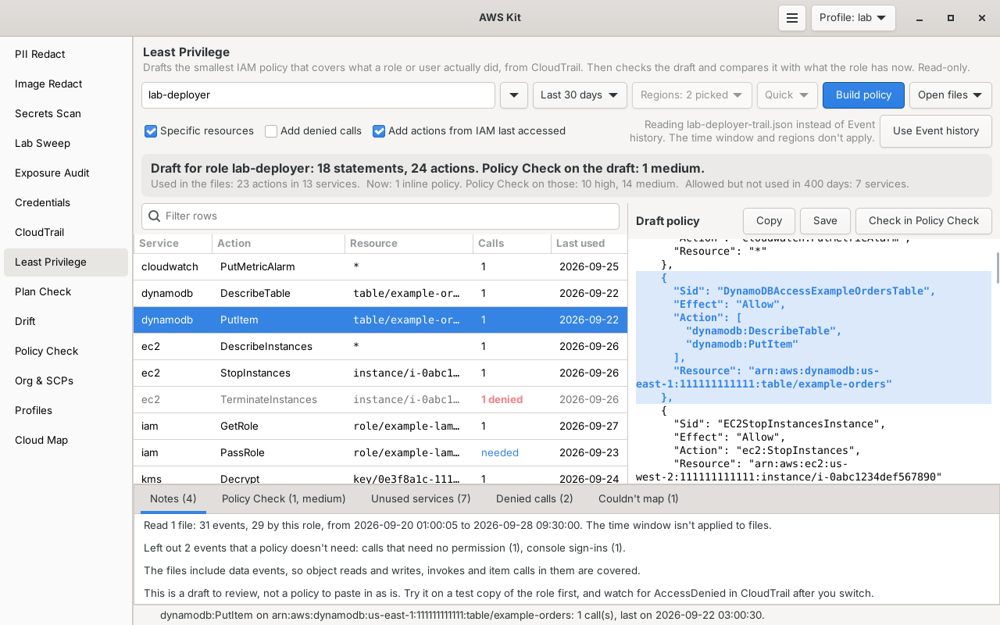

# Least Privilege

Takes what a role or IAM user actually did, from CloudTrail, and drafts the smallest IAM policy that covers it. Then it runs the draft through [Policy Check](../policy-check/) and compares it with what the role has now, so you go from "this role has AdministratorAccess" to a policy you can review and test. It only reads.



Part of [AWS Kit](../awskit/). The screenshot uses test data.

## Why I made it

My lab roles usually start with far too much access, because I don't know yet what a Terraform run or a Lambda function will need. Afterwards, writing the tight policy by hand means digging through CloudTrail one event at a time and remembering that `ListObjectsV2` is really `s3:ListBucket`. I wanted the tool to do that part and hand me a draft with the buckets, tables and functions filled in, plus a clear list of what it couldn't work out.

## What it reads, and what it costs

Everything it uses is free.

| Source | What it gives | Notes |
|---|---|---|
| CloudTrail **Event history** (`LookupEvents`) | Every management API call the role or user made | Last 90 days, one region at a time. IAM calls, and STS calls through the global endpoint, are recorded in us-east-1. New events show up after about 5 minutes. |
| CloudTrail **files** you open | The same, plus data events if your trail records them | `aws cloudtrail lookup-events` output, trail log files (`{"Records": [...]}`), `.json.gz` files straight from the trail's S3 bucket, or a folder of them |
| IAM **last accessed** data | Which services the role's policies allow, and when it last used each one | Covers the last 400 days. For services where IAM tracks single actions, it also says which actions and when. Recent activity usually shows up within 4 hours. |
| The role's **current policies** | Attached managed policies (their default version) and inline policies. For an IAM user, its groups' policies too. | Used for the comparison and to tell you which data events the draft can't see |

### What Event history can and can't see

- It has **management events**: creating, changing, describing and listing things, `AssumeRole`, `GetSecretValue`, `kms:Decrypt` and so on.
- It does **not** have **data events**: S3 object reads and writes, Lambda invokes, DynamoDB item reads and writes, SQS messages and SNS publishes. If the role's current policies allow those, the notes say so: the draft won't include them unless IAM last accessed data shows them, or you open trail files from a trail that records data events.
- It keeps **90 days**. For anything older, read the trail's files from S3.

### Quick and Thorough

Event history can only filter by one thing at a time, and a role's calls are recorded under the **session name** each time it's assumed, not the role's name. So there are two ways to find them:

- **Quick** (the default) looks up the role's own `AssumeRole`, `AssumeRoleWithWebIdentity` and `AssumeRoleWithSAML` events (the role's ARN is a resource of those), collects the session names, then looks up each session's calls in every region you picked. It reads the newest 100 session names at most.
- **Thorough** reads every event in the window and keeps the role's. It finds sessions Quick can miss, like ones assumed before the window started, or in a region you didn't pick, but it's much slower in a busy account.
- An **IAM user** is always looked up by its user name, which is exact.

Whichever way the events come in, each one is checked against the role itself (the session issuer in the event), so another role whose session happens to have the same name never gets mixed in. With files, a bare name can match roles of that name in several accounts (an organization trail often has one in each), or a role and an IAM user. It doesn't mix them: it stops and asks you to give the ARN, or `role/NAME` or `user/NAME`.

### How long it takes

`LookupEvents` allows **2 calls a second** per account and region, and each call returns up to 50 events. That's about 100 events a second in each region. It keeps its own calls half a second apart, reads up to 4 regions at once, and boto3's adaptive retries slow it down further if AWS asks.

| Read | Rough time per region |
|---|---|
| Quick, a lab role with a few sessions | a few seconds |
| The 20,000 event cap | about 3 to 4 minutes |
| Thorough, 90 days in an account with a million events | close to 3 hours, which is why there's a cap |

It stops at **20,000 events** by default and says so in the notes. Event history returns the newest events first, so when the cap is hit, it's the oldest part of the window that's missing. The status bar shows how many events it has read, and **Stop** keeps what was read so far.

## How a call becomes a permission

### Actions

The service prefix comes from the event's source (the part before `.amazonaws.com`), and the action from the event name. A few well-known names differ from their IAM action:

| Event | IAM action |
|---|---|
| `monitoring.amazonaws.com` | `cloudwatch:...` |
| `email.amazonaws.com` | `ses:...` |
| `tagging.amazonaws.com` | `tag:...` |
| S3 `ListObjects`, `ListObjectsV2`, `HeadBucket` | `s3:ListBucket` |
| S3 `ListObjectVersions` | `s3:ListBucketVersions` |
| S3 `HeadObject`, `SelectObjectContent` | `s3:GetObject` |
| S3 `ListBuckets` | `s3:ListAllMyBuckets` |
| S3 `CreateMultipartUpload`, `UploadPart`, `CompleteMultipartUpload` | `s3:PutObject` |
| S3 `CopyObject` | `s3:PutObject` on the target, `s3:GetObject` on the source |
| S3 `DeleteObjects` | `s3:DeleteObject` |
| S3 `ListMultipartUploads`, `ListParts` | `s3:ListBucketMultipartUploads`, `s3:ListMultipartUploadParts` |
| S3 bucket settings, like `GetBucketEncryption`, `DeleteBucketLifecycle`, `GetBucketCors`, `PutObjectLockConfiguration` | `s3:GetEncryptionConfiguration`, `s3:PutLifecycleConfiguration`, `s3:GetBucketCORS`, `s3:PutBucketObjectLockConfiguration` and the rest of that family |
| Lambda names with an API version, like `GetFunction20150331v2` | `lambda:GetFunction` |
| Lambda `Invoke`, `InvokeWithResponseStream` | `lambda:InvokeFunction` |
| KMS `ReEncrypt` | `kms:ReEncryptFrom` and `kms:ReEncryptTo` |
| DynamoDB `TransactGetItems` | `dynamodb:GetItem` |

Some calls need a permission that never shows up as its own event, so it's added and marked **needed** in the table:

- `iam:PassRole` for calls that hand a role to a service, like `lambda:CreateFunction`, `ecs:RegisterTaskDefinition`, `cloudformation:CreateStack`, `states:CreateStateMachine`, `codebuild:CreateProject` and `events:PutTargets`. It's scoped to the role ARN in the call, with an `iam:PassedToService` condition where the service is clear.
- `ec2:RunInstances` with an instance profile also needs `iam:PassRole`, but the event names the profile, not the role, so that one gets Resource `"*"` and a note asking you to fill in the role. The draft's findings list it as high (iam:PassRole on any role), since any role, admin ones too, could be handed to EC2 that way.
- Only the request parameter that actually passes the role counts (like `role` for Lambda, or `roleArn` in each of an EventBridge rule's targets), so a tag or other value that happens to be called "role" never adds a role to the draft.
- `sts:TagSession` and `sts:SetSourceIdentity` when the role assumes another role with session tags or a source identity.

### What's left out

- **Not API calls a policy controls**: AWS service events, console sign-ins, console actions, Insights events, and `sts:GetCallerIdentity`, which needs no permission. The notes count them.
- **Being assumed**: an `AssumeRole` event where someone else assumed this role is how its sessions are found, not a call the role made. When the role itself assumes another role, that is a call, and it's kept.
- **Denied calls** (`AccessDenied`, `UnauthorizedOperation`, `AccessDeniedException` and the like) go to their own list: it tried these and wasn't allowed. They're shown in red in the table and in the **Denied calls** tab, with the missing permission pulled out of the error message. Tick **Add denied calls** (or `--include-denied`) to put them in the draft.
- **Couldn't map**: anything it isn't sure about goes to the **Couldn't map** list instead of being guessed. That includes services not in its table, API Gateway (its permissions are HTTP methods on paths, not API names), and DynamoDB `TransactWriteItems` and PartiQL, where the permission depends on what's inside the request.
- Calls that failed with bad or expired credentials never got as far as a permission check, so they're skipped. Calls that failed for other reasons, like `NoSuchEntity`, still count, since the permission was needed.

### Resources

Where the event says what was touched, the draft names it, using the account and region from the event:

| Service | Resource in the draft |
|---|---|
| S3 | `arn:aws:s3:::BUCKET` for bucket actions, `arn:aws:s3:::BUCKET/*` for object actions |
| DynamoDB | `table/NAME`, plus `table/NAME/index/INDEX` for index queries |
| Lambda | `function:NAME`, plus `function:NAME:*` when a version or alias was used |
| SQS | The queue's ARN, worked out from the queue URL |
| SNS | The topic's ARN |
| KMS | `key/KEY-ID`, from the event's resource list or the key ID |
| Secrets Manager | `secret:NAME-??????`, since secret ARNs end in 6 random characters |
| SSM | `parameter/NAME`, and the path plus `/*` for `GetParametersByPath`. `SendCommand` and `StartSession` get the document and the instances. |
| CloudWatch Logs | `log-group:NAME:*` |
| IAM | `role/NAME`, `user/NAME`, `group/NAME`, `instance-profile/NAME`, or the policy ARN |
| EC2 | `instance/ID` for start, stop, reboot, terminate and similar, `security-group/ID` for rule changes, `volume/ID`, and tagged resources by their ID |
| ECR, CloudFormation, Step Functions | `repository/NAME`, `stack/NAME/*`, the state machine or execution ARN |

List and describe calls, and anything it can't scope, get `"*"`.

Names from events never become wildcards by accident. In a policy, `*` and `?` are wildcards and `${...}` is a policy variable, so a call made with the name `*` (it fails, but CloudTrail still records it) or a crafted file could otherwise widen the draft. Those characters are written as `${*}`, `${?}` and `${$}`, which IAM reads as the plain characters, and the notes say when that happened.

When one action touched **more than 10** resources of one type in one account and region, they become one wildcard, like `table/*`. If the names share a prefix of 4 characters or more, it keeps it, like `table/orders-*` or `log-group:/aws/lambda/*`. The notes list every wildcard made that way. S3 bucket ARNs have no account or region in them, so for S3 that wildcard (`arn:aws:s3:::*`) covers every bucket the role can reach: all of them in its own account, plus any bucket elsewhere whose bucket policy lets it in.

**Specific resources** (on by default) can be turned off for a draft with `"Resource": "*"` everywhere, which is handy as a first step when the scoped one is too tight.

### Statements

Actions that touched the same resources share a statement. Each statement gets a readable `Sid` built from the service, the actions and the resource, like `S3ReadExampleLabSiteBucket`, `DynamoDBAccessExampleOrdersTable` or `IAMPassRoleToLambda`. Statements that hold denied calls start with `PreviouslyDenied`, and ones from IAM last accessed data start with `LastAccessed`. Everything is sorted, so the same events always give the same policy, byte for byte.

## Comparing with what it has now

After reading the events, it reads the role's current policies and asks IAM for its last accessed report (`GenerateServiceLastAccessedDetails` at action level, then `GetServiceLastAccessedDetails` until it's ready, for up to a minute). The summary at the top puts the two side by side:

```text
Draft for role lab-deployer: 19 statements, 25 actions. Policy Check on the draft: 2 medium.
Used in the last 30 days: 23 actions in 13 services, plus 1 more from IAM last accessed data.
Now: AdministratorAccess plus 1 inline policy. Policy Check on those: 1 critical, 2 high.
Allowed but not used in 400 days: 37 services.
```

- **Unused services** lists every service the policies allow that it hasn't used in 400 days, then the ones it used before the window but not in it, so you can widen the window if those still matter.
- Actions that IAM last accessed data says were used in the window, but that no event showed (often data events), are added to the draft in `LastAccessed...` statements with Resource `"*"`, since IAM doesn't say on what. Untick **Add actions from IAM last accessed** (or `--no-last-accessed`) to leave them out.
- When IAM says a service was used in the window but no calls to it were read, the notes say which service and the region IAM last saw it in, which is usually a region you didn't pick.

## Using it in the window

1. Type a role or IAM user name, or its ARN, or pick a role with the arrow next to the box. The list leaves out service-linked roles.
2. Pick a window: **Last day**, **Last 7 days**, **Last 30 days** (the default) or **Last 90 days**.
3. Pick **Regions**. It starts on your profile's region plus us-east-1, where IAM calls (and STS calls through the global endpoint) are recorded.
4. Leave it on **Quick**, or pick **Thorough** to read every event in the window.
5. Press **Build policy**.

The table on the left lists every action: the service, the action, the resources, how many calls, and the day it was last used. Denied calls show in red, permissions a call needed on top of its own say **needed**, and actions from IAM last accessed data say **last accessed**. Rows that aren't in the draft are greyed out. Click a row to highlight its statement in the draft, and the status bar says where the action came from.

On the right is the draft. **Copy** copies it, **Save** saves it as a `.json` file, and **Check in Policy Check** opens it in Policy Check, where you can edit it and ask IAM Access Analyzer about it too.

The check boxes change the draft straight away, without reading CloudTrail again: **Specific resources**, **Add denied calls** and **Add actions from IAM last accessed**.

The tabs at the bottom hold the **Notes** (what was read, what couldn't be, what the draft can't see), the **Policy Check** findings for the draft, **Unused services**, **Denied calls** and what it **Couldn't map**.

**Open files** reads CloudTrail files or a whole folder instead of Event history. The time window and regions don't apply to files, every event in them is used. If you typed a role or user, it also compares with what that role has now in the current profile's account, and if you didn't and the files only hold one, it picks that one. **Use Event history** goes back.

## Using it in the terminal

```bash
awskit least-priv lab-deployer > policy.json        # policy on stdout, summary on stderr
awskit least-priv lab-deployer --days 90 -r us-east-1 -r us-west-2
awskit least-priv arn:aws:iam::111111111111:role/ci-runner --thorough -o ci-runner.json
awskit least-priv lab-user --include-denied          # an IAM user, denied calls added
awskit least-priv lab-deployer --no-resources        # Resource "*" everywhere
awskit least-priv lab-deployer --json > report.json  # everything, as JSON
awskit least-priv lab-deployer --files ~/trail-logs/ --compare
awskit least-priv --files events.json                # the files hold only one role
```

| Option | What it does |
|---|---|
| `ROLE_OR_USER` | Role or IAM user name, `role/NAME`, `user/NAME`, or an ARN |
| `-p`, `--profile NAME` | Profile to use |
| `--days N` | How many days of Event history to read, 1 to 90. Default 30. |
| `-r`, `--region REGION` | Region to read. Repeatable. Default: the profile's region plus us-east-1. |
| `--thorough` | Read every event in the window and keep the role's |
| `--files PATH ...` | Read CloudTrail files or folders instead of Event history. Put the role name before it, since it takes every path after it. |
| `--no-resources` | Resource `"*"` everywhere |
| `--include-denied` | Also add the calls that were denied |
| `--no-last-accessed` | Leave out actions known only from IAM last accessed data |
| `--compare` | With `--files`, also compare with the role's current policies (off by default for files) |
| `--no-compare` | Skip the current policies and IAM last accessed data |
| `--cap N` | Most events to read from Event history. Default 20,000. |
| `--json` | Print the whole report as JSON: the policy, every action, denied calls, couldn't map, unused services, Policy Check findings and the notes |
| `-o`, `--output FILE` | Write the policy (or the `--json` report) to FILE instead of stdout |
| `-q`, `--quiet` | No progress line and no notes, just the summary |

The policy is the only thing on stdout, so `> policy.json` gives a clean file. The summary, Policy Check findings, denied calls, couldn't map list and notes go to stderr. It exits with 1 when it couldn't read anything or found no calls (with `--json` it still prints the report, and exits with 0 if it could read).

## Try it

From the root of the repo, with the fake events in `examples/`:

```bash
python3 -m awskit least-priv lab-deployer --files least-privilege/examples/lab-deployer-trail.json
```

| Example | What it shows |
|---|---|
| `lab-deployer-trail.json` | A trail log file for a made-up role in account 111111111111: S3, DynamoDB, Lambda (with a role passed to `CreateFunction`), SQS, SNS, KMS, Secrets Manager, SSM, CloudWatch, EC2, two denied calls, an API Gateway call it can't map, a console sign-in, someone assuming the role, and another role's call that has to be left out |

## Permissions

```json
{
  "Version": "2012-10-17",
  "Statement": [
    {
      "Sid": "LeastPrivilege",
      "Effect": "Allow",
      "Action": [
        "cloudtrail:LookupEvents",
        "sts:GetCallerIdentity",
        "iam:GetRole", "iam:GetUser", "iam:ListRoles",
        "iam:ListAttachedRolePolicies", "iam:ListRolePolicies", "iam:GetRolePolicy",
        "iam:ListAttachedUserPolicies", "iam:ListUserPolicies", "iam:GetUserPolicy",
        "iam:ListGroupsForUser", "iam:ListAttachedGroupPolicies", "iam:ListGroupPolicies",
        "iam:GetGroupPolicy",
        "iam:GetPolicy", "iam:GetPolicyVersion",
        "iam:GenerateServiceLastAccessedDetails", "iam:GetServiceLastAccessedDetails"
      ],
      "Resource": "*"
    }
  ]
}
```

The user and group actions are only needed for IAM users, and `iam:ListRoles` only for the role picker. `iam:GenerateServiceLastAccessedDetails` is the one call that isn't a get or a list: it only asks IAM to build the report so it can be read, and changes nothing.

Missing permissions don't stop it. A region it can't read, a policy it can't open, or last accessed data it can't get each become a note, so a gap never looks like a clean result. Only when no region at all could be read does it stop with an error.

## Limits

- **It's a draft.** Review it, try it on a test copy of the role, and keep an eye on CloudTrail for `AccessDenied` after you switch. Code paths that didn't run in the window (a yearly job, an error handler, a disaster recovery step) aren't in it.
- **Data events** aren't in Event history. S3 object access, Lambda invokes and DynamoDB item calls only show up from IAM last accessed data (without resources) or trail files that record data events.
- **Conditions** aren't drafted, apart from `iam:PassedToService` on `iam:PassRole`. Add things like `aws:SourceVpc` or tag conditions yourself.
- **Paths**: roles, users and policies are named without their path (`role/NAME`) unless the event shows the full ARN. If yours have a path, like `service-role/`, add it.
- **Resource-level support** varies by action. Where it isn't sure an action supports a resource type, it uses `"*"`. Policy Check then flags the risky ones, like `iam:PassRole` on any role.
- **Other policies still apply.** A permissions boundary, an SCP or a resource policy can allow or deny things the draft doesn't show.
- **Large drafts**: a managed policy can be at most 6,144 characters without spaces. The notes warn when the draft is bigger.
- **Files** are read with limits, since they're untrusted: up to 100 MB per file once unpacked (a gzip file that unpacks to more is refused without unpacking the rest), 1 GB in all, and 20,000 files. Events are counted as they're read, not all kept in memory. Anything that isn't JSON, or isn't CloudTrail events, is skipped with a note, and so is a single record that can't be read. Inside a folder, links and anything that isn't a plain file (like a named pipe, which would wait forever) are skipped too; a file you name directly is read as given.

## Files

| File | What it is |
|---|---|
| `leastpriv.py` | Reading Event history and files, the event to action table, resource scoping, the draft, the comparison and the `least-priv` command. No GTK. |
| `leastpriv_page.py` | The Least Privilege page |
| `examples/` | A fake CloudTrail log file to try it on |
| `docs/screenshot.png` | The screenshot above |
