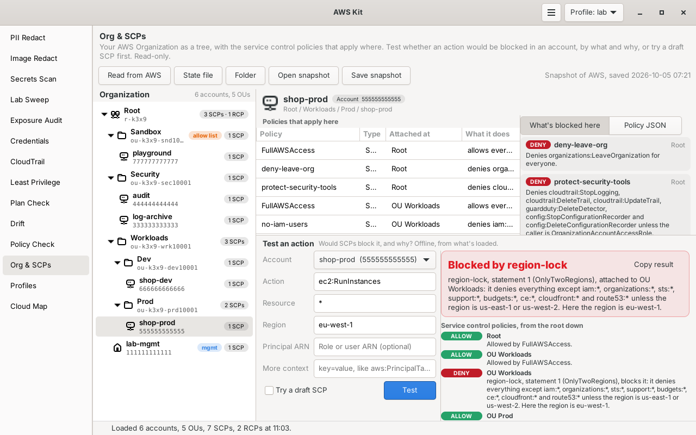

# Org & SCPs

Shows your AWS Organization as a tree (root, OUs, accounts) with the service control policies, and resource control policies if you use them, that apply at each level. Then it answers "would this action be blocked in this account, and by what?" offline, with a plain explanation, and lets you try a draft SCP before you attach it. It reads the org live, from Terraform state, or from a saved snapshot. Read-only.



Part of [AWS Kit](../awskit/). The screenshot uses test data.

## Why I made it

When a call fails with AccessDenied in a member account of my lab org, I want to know quickly whether an SCP is the reason. Working that out by hand means walking from the root down through each OU, reading every policy, and remembering that a deny anywhere wins while an allow is needed at every level. I wanted that done for me, offline from my Terraform state, with a way to try a new SCP before it goes into the org.

## How SCPs decide, in plain words

- **They only limit.** An SCP never grants anything. It sets the most that IAM policies in an account can allow. "Allowed by SCPs" means the SCPs don't stand in the way. IAM policies still have to allow the action.
- **Allow at every level.** For a principal in an account, AWS looks at the root, each OU on the way down, and the account itself. At every one of those levels, at least one attached SCP has to have an Allow statement that covers the request. An SCP with only Deny statements allows nothing on its own.
- **Deny anywhere.** If any Deny statement at any of those levels matches, the request is blocked, whatever the allows say.
- **FullAWSAccess** is the AWS managed SCP that allows everything. AWS attaches it to the root, every OU and every account when SCPs are turned on. Detach it from an OU and only what that OU's other SCPs allow gets through. That's an allow list, and the tree marks it.
- **Exemptions.** SCPs never apply to the management account, and they don't apply to service-linked roles (the ones under `/aws-service-role/`, named `AWSServiceRoleFor...`). Give a service-linked role's ARN as the principal, with its `/aws-service-role/` path, and the test says so. A role session ARN (`assumed-role/...`) doesn't show the path, so for one named `AWSServiceRoleFor...` the test only notes that it looks like a service-linked role.

### Resource control policies

RCPs work the same way (allow at every level, deny anywhere), but they limit what can be done **to resources** in your member accounts, whoever is asking, even principals outside the org. They only apply to some services: S3, STS, KMS, SQS and Secrets Manager from the start, and about sixty by October 2026, like DynamoDB, CloudWatch Logs, ECR, EventBridge, CodeBuild and CloudFront. The list lives in one place, `RCP_SERVICES` in `policyeval.py`, copied from "List of AWS services that support RCPs" in the AWS Organizations user guide. RCPFullAWSAccess is attached everywhere and can't be detached, so the tree doesn't list it at every node. RCPs don't apply to resources in the management account, to service-linked roles, or to `kms:RetireGrant`.

When an action is in one of those services and RCPs are turned on, the test checks both: SCPs from the principal's account up, and RCPs from the resource's account up. Both have to pass.

## What it reads

### Live, from AWS

**Read from AWS** (or `awskit scp tree` with no file) uses the profile picked in the header. It has to run from the **management account** or a **delegated administrator** for AWS Organizations, since member accounts can't list the org. If you run it from a member account, it says which account it needs.

| Call | What for |
|---|---|
| `organizations:DescribeOrganization` | The org ID, the management account, and the feature set |
| `organizations:ListRoots` | The root, and which policy types are turned on there |
| `organizations:ListOrganizationalUnitsForParent`, `ListAccountsForParent` | The tree, one level at a time |
| `organizations:ListPolicies` | SCPs, and RCPs when they're turned on |
| `organizations:DescribePolicy` | Each policy's JSON |
| `organizations:ListTargetsForPolicy` or `ListPoliciesForTarget` | Where each policy is attached. It uses whichever needs fewer calls: one per policy, or one per root, OU and account. |

Organizations API calls are free. Calls run four at a time with progress in the status bar, and **Stop** cancels. If it can't list the tree or the policies, it stops and says why. Anything else it isn't allowed to read is noted at the top of the page instead, and never turns into an Allowed: a policy whose text couldn't be read makes any test that reaches it say **Depends**. A policy whose attachments couldn't be listed is named, and a test it has a matching Deny for says Depends. A root, OU or account whose attached policies couldn't be listed makes tests that pass through it say Depends. If listing RCPs fails because an older SDK or a partition doesn't know about them, it says RCPs weren't checked, and tests of actions RCPs cover say Depends.

### Terraform

**State file** opens a `.tfstate` file or the output of `terraform show -json` (a plan's JSON works too, showing the org as it will be after apply). **Folder** runs `terraform show -json` in a Terraform folder, after asking, because that starts the folder's providers with your AWS credentials. It reads:

- `aws_organizations_organization`: the root ID, the management account, which policy types are turned on, and the account list
- `aws_organizations_organizational_unit` and `aws_organizations_account`: the tree
- `aws_organizations_policy`: each policy's name, type and JSON
- `aws_organizations_policy_attachment`: where each one is attached

**The FullAWSAccess assumption.** Terraform state usually doesn't show FullAWSAccess, because AWS attached it, not Terraform. So by default it's **assumed attached to the root and every OU and account**, and the page and every test result say so (the terminal tree marks it with `*`, and the policy list and test lines say "assumed"). If the state manages FullAWSAccess attachments itself (any `aws_organizations_policy_attachment` with `p-FullAWSAccess`), it only counts where the state attaches it, plus anywhere the state shows no SCP at all, since AWS never leaves a root, OU or account with none. A detach done outside Terraform can't be seen in state, so read the org live if you're not sure. On the command line, `--full-access everywhere` or `--full-access state` overrides this.

Accounts that the organization resource lists but the state doesn't place in an OU are shown under the root, with a note.

### Snapshots

**Save snapshot** (or `awskit scp save FILE`) writes the org to one JSON file, format `awskit-org-scps` version 1: the tree, the policy JSON and where it's attached, which policy types are on, and the notes. **Open snapshot** reads it back, so you can test offline later or on another machine. Account emails aren't saved. Snapshots, states and plans are checked before use: files over 64 MB, bad JSON and damaged snapshots are turned away with a message.

## Testing an action

Pick the account, type one action like `s3:DeleteBucket`, and press **Test** (or Enter in any box).

| Box | What it's for |
|---|---|
| Account | Whose SCPs apply. The accounts in the tree. |
| Action | One action, no wildcards |
| Resource | `*` for any, or an ARN. Statements that only cover some resources make the answer depend on it. An ARN with `*` or `?` in it, like `arn:aws:s3:::prod-*`, is taken as a pattern: a statement counts when it covers all of it, and one that covers only part of it makes the answer depend on the resource. |
| Region | `aws:RequestedRegion`, like `us-east-1` |
| Principal ARN | Optional: the role or user, for statements that check `aws:PrincipalArn`. A role session ARN (`assumed-role/...`) is turned into its role ARN. |
| More context | Other condition keys as `key=value`, separated by spaces, like `aws:PrincipalTag/team=data ec2:InstanceType=m5.large`. A key given twice gets both values. `!key` means the key isn't set. |

Some context is filled in for you, and the result lists what was used and where it came from: `aws:PrincipalAccount` and `aws:PrincipalOrgID` (the account and its org), `aws:PrincipalOrgPaths`, `aws:SecureTransport=true` (the CLI and SDKs always use HTTPS), the current time, `aws:RequestedRegion=us-east-1` for global services like IAM and Organizations when you leave the region empty, and `aws:ResourceAccount` from the resource ARN (or the same account, when the ARN has none, like S3's). Anything you type under More context wins.

### The answer

| Result | Meaning | Exit code |
|---|---|---|
| **Allowed by SCPs** (green) | Every level allows it and nothing denies it. IAM still has to allow it. | 0 |
| **Blocked by** a policy (red) | A Deny matched: "region-lock, statement 1 (OnlyTwoRegions), attached to OU Workloads: it denies everything except iam:\* ... unless the region is us-east-1 or us-west-2. Here the region is eu-west-1." | 3 |
| **Blocked: nothing allows it at** a level (red) | That level has no SCP whose Allow covers the action: "OU Sandbox has no SCP that allows sqs:SendMessage; FullAWSAccess was removed there." | 3 |
| **Depends on** a key (orange) | The answer turns on context you didn't give, like the region, the principal or the resource, or on a policy or attachment that couldn't be read. It names the statements and what to fill in. For keys a request might really not have (like `aws:MultiFactorAuthPresent`), it also says what happens if they aren't set. | 4 |

Under the answer, one line per level from the root down says what allowed it there and what denied it, then the same for RCPs when they apply.

Conditions are evaluated the way IAM does it: every operator (String, Numeric, Date, Bool, Binary, IpAddress, Arn, Null, the Not forms, `...IfExists`, `ForAllValues:` and `ForAnyValue:`), with AWS's rules for missing keys, case-insensitive key names and case-sensitive values. Policy variables like `${aws:PrincipalTag/team}` are filled in from the context. In the Resource element, a `*` that ends a part of the ARN can run on past the colon, as AWS documents; `ArnLike` and `ArnEquals` check each part of the ARN on its own. A statement that can't be read (like an unknown condition operator in a damaged snapshot) never counts as not matching: a Deny like that makes the answer Depends.

### Try a draft SCP

Tick **Try a draft SCP**, paste the policy (or **Open file**) and pick where to **Attach at**: the root, an OU or an account. It's checked as you type: bad JSON, a missing Effect or Action, a Principal (SCPs can't have one), an unknown condition operator, and Policy Check's warnings like no Version or over the 5,120 character limit. While it's valid, the tree marks where it would go, the policy list and "What's blocked here" include it, and the next Test includes it too, marked as the draft, with a last line saying what the answer would be without it.

## What's blocked here

Select the root, an OU or an account to see every SCP and RCP that applies there, attached right there or inherited, and a summary of what's blocked:

- **Allow lists**: levels where FullAWSAccess isn't attached, with what they do allow, like "Only allows ec2:\*, s3:\*, lambda:\* ..."
- **Denies**: every inherited Deny statement in plain words, like "Denies cloudtrail:StopLogging ... unless the caller is OrganizationAccountAccessRole" or "Denies everything except iam:\* ... unless the region is us-east-1 or us-west-2"

Select a policy in the list to see its JSON. **Copy redacted** runs it through [PII Redact](../pii-redact/) first.

## Using it in the window

1. Press **Read from AWS**, or open a **State file**, a **Folder** or a snapshot. You can also drop a file on the page.
2. Pick something in the tree. The policies and "What's blocked here" fill in on the right. Picking an account also picks it for the test.
3. Fill in the test and press **Test**. **Copy result** copies the answer and the explanation as text.
4. **Save snapshot** keeps the org for later.

## Using it in the terminal

`SOURCE` is a state file, `terraform show -json` output, a Terraform folder (it runs `terraform show` there), or a snapshot. Leave it out to read the org from AWS with the profile.

```bash
awskit scp tree                                    # the org from AWS, with the current profile
awskit scp tree terraform.tfstate.json             # from Terraform state
awskit scp tree ~/lab/org-terraform                # runs terraform show in that folder
awskit scp show Workloads org.json                 # one OU: its policies and what's blocked
awskit scp show 222222222222 org.json --json
awskit scp test lab ec2:RunInstances --region eu-west-1 org.json
awskit scp test lab s3:DeleteBucket --principal arn:aws:iam::222222222222:role/deploy org.json
awskit scp test lab ec2:RunInstances --region us-east-1 \
    --resource 'arn:aws:ec2:us-east-1:222222222222:instance/*' \
    --context ec2:InstanceType=m5.large \
    --draft draft-scp.json --attach Workloads org.json
awskit scp save org.json -p lab-mgmt               # save a snapshot to test offline later
awskit scp                                         # no command: opens the window on this page
```

| Option | What it does |
|---|---|
| `TARGET`, `ACCOUNT` | An account, OU or `root`, by name or ID |
| `--resource ARN` | The resource (default any) |
| `-r`, `--region REGION` | `aws:RequestedRegion` |
| `--principal ARN` | The caller's role or user ARN |
| `--context KEY=VALUE` | Another condition key. Repeat it for more. `!KEY` means not set. |
| `--draft FILE` | A draft SCP to include |
| `--attach TARGET` | Where the draft goes (default: the account being tested) |
| `--full-access auto\|everywhere\|state` | For Terraform input: where FullAWSAccess counts as attached |
| `-p`, `--profile NAME` | Profile for reading from AWS |
| `--json` | JSON output |
| `-q`, `--quiet` | No progress line |

**Exit codes for `test`:** 0 allowed by SCPs, 3 blocked, 4 depends on context you didn't give, 1 for errors (bad input, an account that isn't there, no permission). 2 is left for argparse's own errors, like a missing argument. So a script can check one call before a deploy:

```bash
awskit scp test lab cloudformation:CreateStack -r eu-west-1 org.json --quiet >/dev/null
case $? in
  0) echo "SCPs allow it" ;;
  3) echo "an SCP blocks it" ;;
  4) echo "give more context" ;;
  *) echo "couldn't check" ;;
esac
```

Example output:

```text
Blocked by region-lock
region-lock, statement 1, attached to OU Workloads: it denies everything except iam:*, organizations:*, sts:*, support:*, budgets:* and ce:* unless the region is us-west-2 or us-east-1. Here the region is eu-west-1.

Service control policies
  ALLOW     Root          Allowed by FullAWSAccess (assumed).
  ALLOW     OU Workloads  Allowed by FullAWSAccess (assumed).
  DENY      OU Workloads  region-lock, statement 1, blocks it: it denies everything except iam:*, organizations:*, sts:*, support:*, budgets:* and ce:* unless the region is us-west-2 or us-east-1. Here the region is eu-west-1.
  ALLOW     Account lab   Allowed by FullAWSAccess (assumed).

Context: aws:RequestedRegion=eu-west-1 (you gave it)
Note: FullAWSAccess is assumed to be attached to the root and every OU and account. AWS attaches it when SCPs are turned on, and Terraform state usually doesn't show it.
Note: The state doesn't say which OU management is in, so it shows under the root.
```

## Try it

From the root of the repo:

```bash
python3 -m awskit scp tree org-scps/examples/demo-org.json
python3 -m awskit scp test playground sqs:SendMessage org-scps/examples/demo-org.json
python3 -m awskit scp test shop-dev ec2:RunInstances -r us-east-1 \
    --resource 'arn:aws:ec2:us-east-1:666666666666:instance/*' \
    --context ec2:InstanceType=m5.4xlarge \
    --draft org-scps/examples/draft-small-instances-only.json --attach Workloads \
    org-scps/examples/demo-org.json
python3 -m awskit scp test lab ec2:RunInstances -r eu-west-1 cloud-map/examples/d1-org-state.json
```

| Example | What it shows |
|---|---|
| `examples/demo-org.json` | A snapshot of a made-up org: Security, Workloads (Prod and Dev) and a Sandbox OU with an allow list and FullAWSAccess removed. SCPs for leaving the org, protecting security tools (except for OrganizationAccountAccessRole), a region lock, no IAM users, no deletes in prod (except break-glass), and an RCP that requires HTTPS for S3. |
| `examples/draft-small-instances-only.json` | A draft SCP that denies EC2 instances other than t3 and t4g |
| `../cloud-map/examples/d1-org-state.json` | Terraform state with three SCPs on one OU, and no FullAWSAccess in it, so the assumption shows |

## Permissions

None for Terraform state and snapshots. To read the org from AWS, from the management account or a delegated administrator:

```json
{
  "Version": "2012-10-17",
  "Statement": [
    {
      "Sid": "OrgAndScps",
      "Effect": "Allow",
      "Action": ["organizations:Describe*", "organizations:List*"],
      "Resource": "*"
    }
  ]
}
```

It also calls `sts:GetCallerIdentity`, which needs no permission, to say which account a profile is in when it can't read the org. The AWS managed policy `AWSOrganizationsReadOnlyAccess` covers the rest.

## Limits

- It answers the SCP and RCP part of an AccessDenied, nothing else. It doesn't evaluate IAM identity policies, permission boundaries, session policies, resource policies like bucket or key policies, or VPC endpoint policies. Allowed by SCPs doesn't mean allowed.
- It knows condition keys from what you give it and the few it fills in. It doesn't know which keys a service really sends for an action, so a test can say Depends on a key the real request never has. Give it with `!key` to say it isn't set.
- Wildcards in the action you test aren't allowed: it tests one action at a time.
- Terraform state can't show a FullAWSAccess detach done outside Terraform, and an account the org lists but no `aws_organizations_account` places in an OU is shown under the root. Read the org live when that matters.
- Other policy types (tag, backup and AI opt-out policies and the rest) aren't checked. A Terraform state that has them gets a note saying so.
- AWS keeps adding services to RCPs. If a newer one isn't in `RCP_SERVICES`, its RCPs aren't checked, but the test says so when an RCP above the resource has a Deny that covers the action.
- RCPs don't apply to AWS managed KMS keys. A key ARN doesn't say whether it's AWS managed, so a test on one still checks RCPs.

## Files

| File | What it is |
|---|---|
| `scpcheck.py` | The org model, reading it from AWS, Terraform and snapshots, SCP and RCP inheritance, the summaries, and the `awskit scp` command. No GTK. |
| `policyeval.py` | The policy evaluator: actions, resources, principals, every condition operator, policy variables, and the plain-words descriptions. No GTK, no AWS calls. |
| `scp_page.py` | The Org & SCPs page |
| `examples/` | A demo org snapshot and a draft SCP. All made up. |
| `docs/screenshot.png` | The screenshot above |
