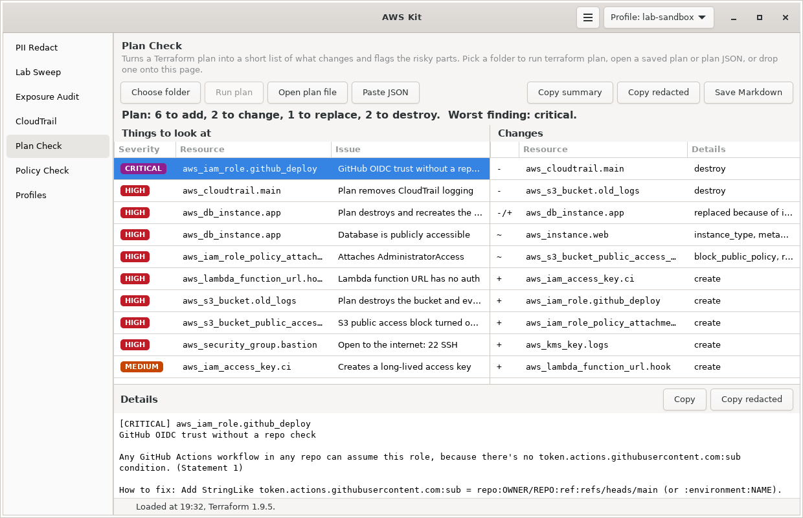

# Plan Check

Turns a Terraform plan into a short, readable list of what gets destroyed, replaced, changed and created, and flags the changes that deserve a second look before you apply: destroyed data, ports opened to the internet, public buckets, admin permissions, security logging turned off.



Part of [AWS Kit](../awskit/). The screenshot shows `examples/sample-plan.json`.

## Why I made it

`terraform plan` output gets long fast, and it's easy to skim past the one line that matters, like a bucket being destroyed because a name changed, or a security group rule opening SSH to the world. I wanted the summary I'd write by hand: what's being destroyed first, then replaced, then changed, then created, with the risky parts called out at the top. It also pairs with [PII Redact](../pii-redact/), so I can share a plan summary without leaking account details.

## Giving it a plan

Any of these work:

| Input | How |
|---|---|
| A Terraform folder | **Choose folder**, then **Run plan**. It asks first, then runs `terraform plan` for you. |
| A saved plan | **Open plan file** with the file from `terraform plan -out tfplan`. It asks first, then runs `terraform show -json` on it in the plan's folder. |
| Plan JSON | **Open plan file** with the output of `terraform show -json tfplan` |
| The clipboard | **Paste JSON**. It only takes JSON, never a path. |
| Drag and drop | Drop a plan file, JSON file, or folder onto the page. A folder gets picked, and it asks before planning. |
| Terminal | `awskit plan` in a folder, `awskit plan FILE`, or pipe JSON in |

Running plans needs `terraform` or `tofu` in your PATH. Reading plan JSON doesn't need either, and it doesn't need AWS credentials. It has to be a plan: `terraform show -json` of the state (no plan file) is turned away, since it would look like a plan with no changes.

Running `terraform plan` or `terraform show` in a folder runs that folder's code: Terraform downloads and starts the providers it names, and some data sources run programs, all with your AWS credentials. So the window asks once per folder each session before doing either. Reading plan JSON doesn't run anything, so it doesn't ask.

When it runs a plan for you, it uses `terraform plan -input=false -out=<temp file>`, reads it with `terraform show -json`, and deletes the temp file afterwards. The temp file goes in a private temp folder, not in your Terraform folder, because a saved plan holds variable values and often secrets. It uses the profile picked in the header (as `AWS_PROFILE`), or the default credential chain if none is picked. Your backend and variables work the same as when you run plan yourself. If it runs longer than 15 minutes, Terraform and the providers it started are stopped.

On Windows it only runs `terraform.exe` or `tofu.exe` from a folder in your PATH. It skips `.cmd` and `.bat` wrappers, which run through `cmd.exe` and can misread paths, and it doesn't look in the current folder.

## What it shows

- **Headline:** the same counts Terraform prints, like `Plan: 6 to add, 2 to change, 1 to replace, 2 to destroy.`, plus the worst finding.
- **Things to look at:** the risks, worst first. Click one for the details and how to fix it.
- **Changes:** every resource that changes, grouped as destroy (`-`), replace (`-/+`), update (`~`), create (`+`) and forget. Replacements show which argument forced them. Updates show which attributes change, and which ones won't be known until apply.
- **Outputs** that change, and whether they're marked sensitive.
- **Changed outside Terraform:** drift Terraform noticed while refreshing, with the attributes that changed.
- Data source reads and no-op resources are left out.

## What it flags

| Resource | Flagged when | Severity |
|---|---|---|
| Stateful resources: S3 buckets, RDS instances, Aurora clusters, DynamoDB tables, KMS keys, EFS, EBS volumes, Secrets Manager secrets, ElastiCache, OpenSearch, ECR repositories, Backup vaults, log groups, Cognito user pools | Destroyed or replaced | high |
| Security services: CloudTrail, GuardDuty, Security Hub, Config recorder, Access Analyzer, flow logs, Macie, Inspector | Destroyed or replaced | high |
| Anything else | Replaced | info |
| `aws_security_group`, `aws_security_group_rule`, `aws_vpc_security_group_ingress_rule` | Ingress from `0.0.0.0/0` or `::/0`. Graded like [Exposure Audit](../exposure-audit/): all traffic is critical, risky ports and big ranges are high, other ports medium, 80 and 443 info. | critical to info |
| `aws_s3_bucket_public_access_block`, `aws_s3_account_public_access_block` | Any of the four settings set to false | high |
| `aws_s3_bucket_acl` | `public-read`, `public-read-write`, `authenticated-read`, or a grant to everyone | high |
| `aws_s3_bucket` | The older inline `acl` set to `public-read`, `public-read-write` or `authenticated-read` | high |
| `aws_s3_bucket` | `force_destroy = true` | low |
| `aws_iam_*_policy_attachment`, and new `managed_policy_arns` on `aws_iam_role` | Attaches AdministratorAccess, IAMFullAccess or AWSOrganizationsFullAccess (high), or PowerUserAccess (medium) | high, medium |
| `aws_iam_access_key` | Created | medium |
| `aws_iam_user_login_profile` | Created | low |
| `aws_instance`, `aws_launch_template` | `http_tokens = "optional"` (IMDSv1 allowed) | medium |
| `aws_instance` | No `metadata_options` set on a new instance | low |
| `aws_instance` | Root volume not encrypted | low |
| `aws_instance` | Gets a public IP | info |
| `aws_ebs_volume` | Not encrypted | medium |
| `aws_ebs_encryption_by_default` | Turned off | medium |
| `aws_db_instance`, `aws_rds_cluster_instance` | `publicly_accessible = true` | high |
| `aws_db_instance`, `aws_rds_cluster` | Storage not encrypted | medium |
| `aws_kms_key` | Rotation off on a symmetric key | low |
| `aws_lambda_function_url` | `authorization_type = "NONE"` | high |
| `aws_lambda_permission` | `principal = "*"` with no `source_arn` or `source_account` | high |
| `aws_eks_cluster` | Public API endpoint open to `0.0.0.0/0` | medium |
| `aws_lb_listener` | Plain HTTP with no redirect | low |
| `aws_cloudtrail` | Logging off (high), single region (low), log file validation off (low) | high, low |
| `aws_guardduty_detector` | `enable = false` | high |
| `aws_config_configuration_recorder_status` | `is_enabled = false` | high |
| Outputs | Name looks secret (password, secret, token, private_key, access_key) but isn't marked sensitive | low |
| Security group rules and policies | The CIDRs or the policy are only known after apply, so they couldn't be checked: "Couldn't check ingress, it's only known after apply" | info |

### Policies inside the plan

Policy documents in the plan get checked with the same rules as [Policy Check](../policy-check/), and anything medium or worse shows up as a risk on that resource:

| Resource | Attribute | Checked as |
|---|---|---|
| `aws_iam_policy`, `aws_iam_role_policy`, `aws_iam_user_policy`, `aws_iam_group_policy` | `policy` | Identity policy |
| `aws_iam_role` | `inline_policy` blocks | Identity policy |
| `aws_iam_role` | `assume_role_policy` | Trust policy |
| `aws_s3_bucket_policy`, `aws_sqs_queue_policy`, `aws_sns_topic_policy`, `aws_kms_key`, `aws_ecr_repository_policy`, `aws_secretsmanager_secret_policy`, `aws_glacier_vault` | `policy` or `access_policy` | Resource policy |
| `aws_s3_bucket`, `aws_sqs_queue`, `aws_sns_topic` | The inline `policy` | Resource policy |
| `aws_organizations_policy` | `content` | Service control policy |

A policy is only checked when it's new or changed in this plan, so an existing policy doesn't get flagged again on every run.

## Sharing the summary

- **Copy summary** copies the plain text summary.
- **Copy redacted** runs it through [PII Redact](../pii-redact/) first, using your PII Redact settings.
- **Save Markdown** writes a Markdown version, which reads well in a pull request or a GitHub issue.

The text version looks like this:

```text
Plan: 6 to add, 2 to change, 1 to replace, 2 to destroy.

Things to look at (14)
[CRITICAL] aws_iam_role.github_deploy: GitHub OIDC trust without a repo check
    Any GitHub Actions workflow in any repo can assume this role, ...
[HIGH] aws_cloudtrail.main: Plan removes CloudTrail logging
...

Destroy (2)
- aws_cloudtrail.main
- aws_s3_bucket.old_logs

Replace (1)
-/+ aws_db_instance.app  (forced by: identifier)
...
```

## Using it in the terminal

```bash
awskit plan                                  # run terraform plan in this folder
awskit plan ~/code/my-terraform               # run it in another folder
awskit plan tfplan                           # a saved plan
terraform show -json tfplan | awskit plan    # plan JSON on stdin
awskit plan plan.json --markdown             # Markdown, for a PR
awskit plan --redact -c                      # redact with PII Redact and copy
awskit plan plan.json --json                 # JSON for scripts
awskit plan plan.json --fail-on high         # exit code 2 on high or critical risks
```

| Option | What it does |
|---|---|
| `SOURCE` | Plan JSON, saved plan, or Terraform folder. Without it, reads stdin if something is piped in, or runs plan in the current folder. |
| `--markdown` | Markdown output |
| `--json` | JSON with the headline, counts, risks, changes, outputs and drift |
| `-c`, `--copy` | Copy the summary to the clipboard |
| `--redact` | Run the summary through PII Redact |
| `--fail-on SEVERITY` | Exit with code 2 if a risk at this level or worse is found |

In a terminal, the summary is colored: destroys in red, replaces and updates in yellow, creates in green.

## Using it in CI

Plan Check doesn't need boto3 or AWS credentials of its own, only the plan JSON. In GitHub Actions:

```yaml
- name: Plan
  run: |
    terraform plan -input=false -out tfplan
    terraform show -json tfplan > plan.json

- name: Plan Check
  shell: bash
  run: |
    git clone --filter=blob:none https://github.com/Snowblind019/cloud-tools.git /tmp/cloud-tools
    git -C /tmp/cloud-tools checkout --quiet COMMIT_SHA
    PYTHONPATH=/tmp/cloud-tools python3 -m awskit plan plan.json --markdown --fail-on high \
      | tee -a "$GITHUB_STEP_SUMMARY"
```

Put the full SHA of the commit you've looked at in place of `COMMIT_SHA`, so the job always runs that code and not whatever the default branch holds that day. The job fails on high or critical risks, and the summary shows up on the workflow run page. `shell: bash` matters there, because it turns on `pipefail`, so the exit code from Plan Check isn't lost in the pipe.

## Try it

```bash
python3 -m awskit plan plan-check/examples/sample-plan.json
```

Run that from the root of the repo. The sample has a bit of everything: a destroyed bucket and trail, a replaced database, SSH open to the world, an admin policy attachment, a GitHub OIDC role with no repo check, and some drift.

## Limits

- Values that aren't known until apply can't be checked. A security group whose CIDR comes from another resource's output can't be graded at plan time, so it shows up as an info risk saying it couldn't be checked. Some arguments, like a security group's `ingress` when its rules are separate resources, or a bucket's `policy`, are filled in by AWS when left out, so they always look unknown. Those only get the note when the plan's configuration shows your code sets them, and values set with a `dynamic` block don't show up there.
- The rules are for the AWS provider. Other providers' resources still show up in the change list, just without risk checks.
- It reads what Terraform says will change. If a module hides a risky setting behind a default, it only sees the final value, which is usually what you want.
- It's a second pair of eyes, not a policy engine. For enforced rules across a team, look at tools like OPA, Checkov or Sentinel.

## Files

| File | What it is |
|---|---|
| `tfplan.py` | Loading and running plans, the summary, the risk rules and the text output. No GTK. |
| `plan_page.py` | The Plan Check page |
| `examples/sample-plan.json` | A sample plan to try it on. All fake. |
| `docs/screenshot.png` | The screenshot above |
