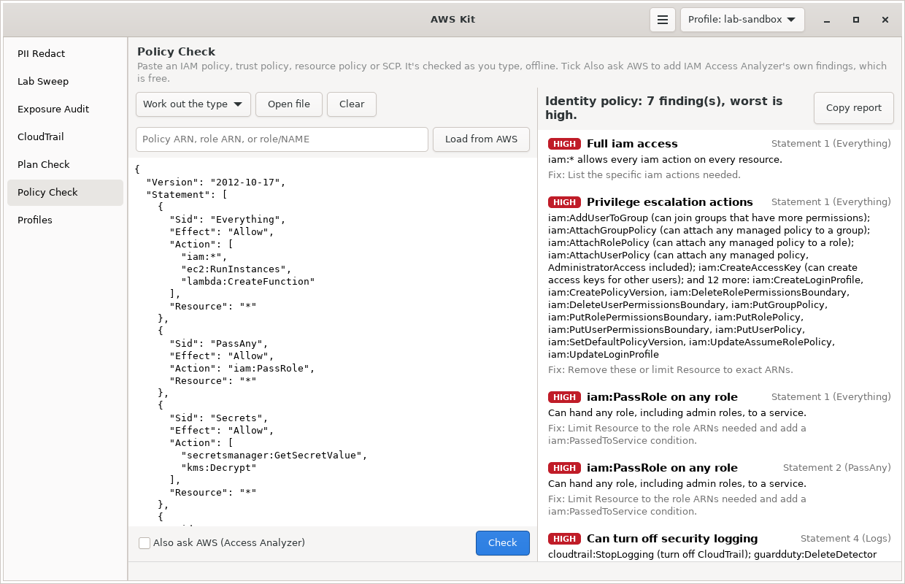

# Policy Check

Paste an IAM policy and it tells you what's risky about it: wildcards, privilege escalation paths, `iam:PassRole` on any role, public principals, and GitHub OIDC trust that any repo could use. It works offline as you type, and it can also ask IAM Access Analyzer for AWS's own findings.



Part of [AWS Kit](../awskit/). The screenshot shows `examples/risky-policy.json`.

## Why I made it

Writing least-privilege policies is a big part of AWS security, and there are a lot of ways a policy can quietly hand out more than you meant to: `iam:PassRole` paired with `ec2:RunInstances`, a trust policy with no condition on the GitHub repo, `NotAction` in an Allow. I wanted a quick way to check a policy before it goes into Terraform, with a plain explanation of why something is risky and how to fix it.

## What you can paste

- A policy document, as JSON
- Full AWS CLI output, like `aws iam get-policy-version`, `aws iam get-role` (it checks the trust policy), `aws iam get-role-policy` or `aws s3api get-bucket-policy`. It finds the policy inside.
- A printed boto3 dict, with single quotes and `True`/`False`
- URL-encoded policy JSON, the way some IAM API responses return it
- A JSON string that holds the policy

If it can't read what you pasted, it says why, with the line number for JSON errors.

## Policy types

It works out the type from the policy itself, or you can pick:

| Type | How it's detected |
|---|---|
| Identity policy | No `Principal` anywhere. Attached to users, groups and roles. |
| Trust policy | Has a `Principal`, only allows `sts:AssumeRole*` and related actions, and has no `Resource` |
| Resource policy | Has a `Principal` otherwise. Bucket, key, queue, topic and similar policies. |
| Service control policy | Can't be told apart from an identity policy, so pick it yourself |

The type matters, because some checks only make sense for some types. Privilege escalation is about what an identity can do, and public principals are about who a resource or role lets in.

## What it checks

### Every policy

| Finding | Severity | Why |
|---|---|---|
| No `Version` | low | Without `"Version": "2012-10-17"`, policy variables like `${aws:username}` are treated as plain text |
| Old `2008-10-17` version | low | Doesn't support policy variables |
| No statements | high | The policy does nothing, which is usually a mistake |
| Duplicate `Sid` | low | IAM rejects duplicate statement IDs |
| `Effect` isn't Allow or Deny | high | IAM will reject the policy |

### Allow statements

| Finding | Severity | Why |
|---|---|---|
| `"Action": "*"` on `"Resource": "*"` | critical | Full admin. It can do anything in the account. |
| `"Action": "*"` on limited resources | high | Every action on those resources |
| `service:*`, like `iam:*` or `s3:*` | high for sensitive services, medium for others | Every action in the service, including ones AWS adds later. Sensitive services: IAM, STS, KMS, Organizations, CloudTrail, GuardDuty, Config, Security Hub, Secrets Manager, SSM, Lambda, EC2, S3, Account, SSO and Identity Store. |
| `NotAction` in an Allow | high | Allows everything except the listed actions, including new ones |
| `NotResource` in an Allow | medium | Applies to every resource except the listed ones |
| Privilege escalation actions | high on any resource, medium on limited resources | Actions that let someone give themselves more access (list below) |
| `iam:PassRole` on any role, with no `iam:PassedToService` condition | high | Can hand any role, admin roles included, to a service |
| `iam:PassRole` on any role plus a service that runs as a role | high | Together they're a path to admin: launch something that runs as a more powerful role (list below) |
| Actions that turn off security logging | high | Can switch off CloudTrail, GuardDuty, Config, Security Hub, Access Analyzer or flow logs, or leave the organization |
| Reads sensitive data on any resource | medium | Like `s3:GetObject`, `kms:Decrypt` or `secretsmanager:GetSecretValue` on `*` |
| Destructive actions on any resource | medium | Like `s3:DeleteBucket`, `kms:ScheduleKeyDeletion` or `rds:DeleteDBInstance` on `*` |

Wildcards in actions are expanded, so `iam:Put*` counts as `iam:PutRolePolicy`, `iam:PutUserPolicy` and so on. A resource counts as "any" when it's `*` or a wildcard ARN like `arn:aws:s3:::*` or `arn:aws:iam::111111111111:role/*`.

<details>
<summary>Privilege escalation actions it knows</summary>

| Action | Why it's risky |
|---|---|
| `iam:CreatePolicyVersion` | Write a new version of a policy and make it the default |
| `iam:SetDefaultPolicyVersion` | Switch a policy back to an older, broader version |
| `iam:CreateAccessKey` | Create access keys for other users |
| `iam:CreateLoginProfile`, `iam:UpdateLoginProfile` | Set or change other users' console passwords |
| `iam:AttachUserPolicy`, `iam:AttachGroupPolicy`, `iam:AttachRolePolicy` | Attach any managed policy, AdministratorAccess included |
| `iam:PutUserPolicy`, `iam:PutGroupPolicy`, `iam:PutRolePolicy` | Write inline policies with any permissions |
| `iam:AddUserToGroup` | Join groups that have more permissions |
| `iam:UpdateAssumeRolePolicy` | Change who can assume a role |
| `iam:DeleteUserPermissionsBoundary`, `iam:DeleteRolePermissionsBoundary` | Remove a permissions boundary |
| `iam:PutUserPermissionsBoundary`, `iam:PutRolePermissionsBoundary` | Swap a boundary for a looser one |
| `lambda:UpdateFunctionCode` | Replace the code of a function that runs with its own role |
| `ssm:SendCommand`, `ssm:StartSession` | Run commands on instances and use their roles |
| `ec2-instance-connect:SendSSHPublicKey` | Push an SSH key and log in to instances |
| `glue:UpdateDevEndpoint` | Add an SSH key to a Glue endpoint that has a role |

Services that run as a role when paired with `iam:PassRole`: `ec2:RunInstances`, `lambda:CreateFunction`, `cloudformation:CreateStack`, `glue:CreateDevEndpoint`, `glue:CreateJob`, `ecs:RunTask`, `ecs:RegisterTaskDefinition`, `sagemaker:CreateNotebookInstance`, `codebuild:CreateProject`, `datapipeline:CreatePipeline`, `states:CreateStateMachine`.

</details>

### Principals (resource and trust policies)

| Finding | Severity | Why |
|---|---|---|
| `"Principal": "*"` with no condition | critical | Anyone gets in. For a trust policy, any AWS account in the world can assume the role. |
| `"Principal": "*"` with a condition that doesn't limit who | high | The condition doesn't use a key like `aws:PrincipalOrgID`, `aws:SourceAccount` or `aws:SourceArn` |
| `"Principal": "*"` narrowed by a limiting condition | info | Probably fine. Check the values are yours. |
| `NotPrincipal` in an Allow | high | Everyone except the listed principals gets in |
| Cross-account principal | info | Lists the other accounts. For a trust policy that names a whole account with no `sts:ExternalId`, it notes that anyone in that account with `sts:AssumeRole` can get in. |
| GitHub OIDC trust with no `sub` condition | critical | Any GitHub Actions workflow in any repo can assume the role |
| GitHub OIDC `sub` that's `*`, `repo:*`, or starts with `*` | high | Close to any repo |
| GitHub OIDC `sub` like `repo:my-org/*` | medium | Any repo in the org, any branch |
| GitHub OIDC trust with no `aud` condition | low | Should require `sts.amazonaws.com` |
| Another federated provider with no conditions | medium | Any identity from that provider may get in |
| Service principal in a resource policy with no source check | low | The confused deputy problem. Add `aws:SourceArn` or `aws:SourceAccount`. |
| `sts:AssumeRoleWithWebIdentity` with no federated principal | medium | Doesn't make sense, usually a typo |

Condition keys that count as limiting who: `aws:SourceArn`, `aws:SourceAccount`, `aws:SourceOwner`, `aws:SourceOrgID`, `aws:SourceOrgPaths`, `aws:PrincipalOrgID`, `aws:PrincipalOrgPaths`, `aws:PrincipalAccount`, `aws:PrincipalArn`, `aws:PrincipalServiceName`, `aws:SourceVpce`, `aws:SourceVpc`, `aws:SourceIp`, `aws:userid`, `aws:username`, `aws:ResourceOrgID`, `s3:DataAccessPointAccount`, `kms:CallerAccount`, `kms:ViaService`, `sts:ExternalId`, `lambda:FunctionUrlAuthType`, `sns:Endpoint`, `elasticfilesystem:AccessPointArn`.

### Size

| Finding | Severity |
|---|---|
| Identity policy over 6,144 characters without spaces (the managed policy limit) | low |
| SCP over 5,120 characters | low |

Deny statements aren't flagged. They only take access away.

## Also ask AWS

Tick **Also ask AWS (Access Analyzer)** and press **Check** (or Ctrl+Enter), or use `--aws` in the terminal. It sends the policy to IAM Access Analyzer's `ValidatePolicy`, which is free, and adds AWS's findings to the list, marked "From Access Analyzer", with a link to the AWS docs for each.

| Access Analyzer finding type | Shown as |
|---|---|
| ERROR | high |
| SECURITY_WARNING | high |
| WARNING | medium |
| SUGGESTION | low |

Access Analyzer catches things the local rules don't, like actions that don't exist, condition keys that don't apply to an action, and ARNs in the wrong format. For trust policies it validates as a role trust policy, and for resource policies it guesses S3 bucket or DynamoDB table from the actions and ARNs so the checks fit.

The policy is sent to AWS for this, so it uses the current profile's credentials. The local checks never leave your machine.

## Load from AWS

Type into the box above the editor and press **Load from AWS**:

| You type | It loads |
|---|---|
| A managed policy ARN, like `arn:aws:iam::aws:policy/PowerUserAccess` or one of your own | The policy's default version, as an identity policy |
| A role ARN, or `role/NAME` | The role's trust policy |

## Using it in the window

- Paste or type in the editor on the left. Findings update on the right as you type.
- **Open file** loads a policy from a file.
- **Copy report** copies the findings as text.
- The dropdown sets the policy type if the guess is wrong.

## Using it in the terminal

```bash
awskit policy policy.json                    # check a file
cat policy.json | awskit policy              # or from stdin
aws iam get-role --role-name ci | awskit policy
awskit policy policy.json --aws              # add Access Analyzer's findings
awskit policy --arn role/github-deploy       # load a trust policy from AWS
awskit policy --arn arn:aws:iam::aws:policy/PowerUserAccess
awskit policy scp.json --kind scp
awskit policy policy.json --json
awskit policy policy.json --fail-on high     # exit code 2 on high or critical
awskit policy                                # no input: opens the window on this page
```

| Option | What it does |
|---|---|
| `FILE` | Policy file, or `-` for stdin |
| `--arn REF` | Load from AWS: managed policy ARN, role ARN, or `role/NAME` |
| `--kind` | `auto` (default), `identity`, `resource`, `trust` or `scp` |
| `--aws` | Also run Access Analyzer validation |
| `-p`, `--profile NAME` | Profile for `--aws` and `--arn` |
| `--json` | JSON output |
| `--fail-on SEVERITY` | Exit with code 2 if anything at this level or worse is found |

Example output:

```text
Policy type: Role trust policy

[MEDIUM] GitHub OIDC repo check is loose  (Statement 1)
  The sub condition allows repo:example-org/*.
  Fix: Pin it to one repo and branch or environment.
```

To check every policy file in a repo, for example in CI:

```bash
for f in policies/*.json; do
  echo "== $f"
  awskit policy "$f" --fail-on high || failed=1
done
exit ${failed:-0}
```

Policies inside Terraform plans get these same checks automatically in [Plan Check](../plan-check/).

## Try it

From the root of the repo:

```bash
python3 -m awskit policy policy-check/examples/risky-policy.json
```

| Example | What it shows |
|---|---|
| `risky-policy.json` | `iam:*`, PassRole with RunInstances and CreateFunction, secret reads and logging off |
| `bucket-policy.json` | A public bucket policy, and a service principal with no source check |
| `github-trust-policy.json` | A GitHub OIDC trust that allows any repo in the org |
| `tight-policy.json` | A clean least-privilege policy, with no findings |

## Permissions

None for the local checks. For the AWS features:

```json
{
  "Version": "2012-10-17",
  "Statement": [
    {
      "Sid": "PolicyCheck",
      "Effect": "Allow",
      "Action": [
        "access-analyzer:ValidatePolicy",
        "iam:GetPolicy", "iam:GetPolicyVersion", "iam:GetRole"
      ],
      "Resource": "*"
    }
  ]
}
```

## Limits

- It reads the policy, it doesn't simulate it. It checks which condition keys are present, not whether their values make sense. For "can this role do X", use the IAM policy simulator.
- It doesn't know which accounts are yours, so cross-account access is info, not a warning.
- The risky action lists are hand-picked. A new AWS action that's risky won't be flagged until it's added. Access Analyzer helps cover the gap.
- It checks one policy at a time. A role with several policies, a permissions boundary and an SCP above it can be more or less powerful than any one policy looks.

## Files

| File | What it is |
|---|---|
| `iampolicy.py` | Loading, type detection, the rules, Access Analyzer and Load from AWS. No GTK. |
| `policy_page.py` | The Policy Check page |
| `examples/` | Sample policies to try it on. All fake. |
| `docs/screenshot.png` | The screenshot above |
