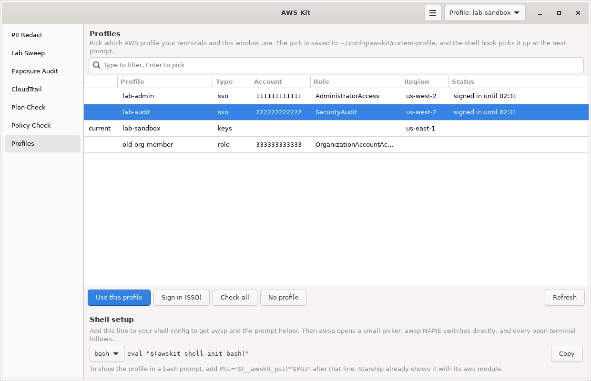

# Profiles

Picks which AWS profile your terminals use, from a small window, a keybind, or `awsp` in the shell. Every open terminal switches at its next prompt, and the window shows which profiles are signed in to SSO and until when.



Part of [AWS Kit](../awskit/). The screenshot uses test data.

## Why I made it

With IAM Identity Center and several accounts in an organization, I end up with a profile per account and role. Typing `export AWS_PROFILE=...` in each terminal gets old, and it's too easy to run a command in the wrong account because one terminal is still on the old profile. I wanted to pick a profile once, have every terminal follow, and see at a glance which ones need me to sign in again.

## How it works

- Picking a profile, in the window, the picker, or with `awsp`, writes its name to `~/.config/awskit/current-profile`.
- A small shell hook checks that file every time your prompt is drawn. If the name changed since that terminal last looked, it sets `AWS_PROFILE` to match. Picking "no profile" leaves the file empty, and the hook unsets `AWS_PROFILE`.
- Everything that uses the normal AWS credential chain then follows: the AWS CLI, Terraform, boto3, and AWS Kit's own commands.
- The AWS Kit window watches the same file, so its profile button updates as soon as you switch from a terminal.
- If you `export AWS_PROFILE=...` by hand in one terminal, the hook leaves it alone until the next time you pick a profile.

It reads your profiles from `~/.aws/config` and `~/.aws/credentials`, or wherever `AWS_CONFIG_FILE` and `AWS_SHARED_CREDENTIALS_FILE` point. It never changes those files and never stores credentials.

## Shell setup

Add one line to your shell config, then open a new terminal.

**bash**, in `~/.bashrc`:

```bash
eval "$(awskit shell-init bash)"
```

**zsh**, in `~/.zshrc`:

```bash
eval "$(awskit shell-init zsh)"
```

**fish**, in `~/.config/fish/config.fish`:

```fish
awskit shell-init fish | source
```

In bash the hook runs from `PROMPT_COMMAND`, in zsh from a `precmd` hook, and in fish on the `fish_prompt` event. It only reads one small file, so it doesn't slow your prompt down. Run `awskit shell-init bash` on its own to see exactly what gets added.

The Profiles page also shows the right line for your shell, with a Copy button.

## awsp

The shell hook adds an `awsp` command:

| Command | What it does |
|---|---|
| `awsp` | Open the picker window. Your terminal switches as soon as you pick. |
| `awsp lab-admin` | Switch to lab-admin |
| `awsp audit` | Switch to the only profile with "audit" in its name. If several match, it lists them. |
| `awsp --clear` | Go back to no profile (the default credential chain) |
| `awsp --list` | List profiles with their type, account, role, region and sign-in status |
| `awsp --check` | Same, but tests each one with `sts get-caller-identity` |
| `awsp --current` | Print the current profile |

When you switch to an SSO profile that isn't signed in, it tells you to run `aws sso login --profile NAME`.

## Showing it in your prompt

The hook also adds `__awskit_ps1`, which prints `(aws:lab-admin) ` when a profile is active and nothing when it isn't.

**bash**, in `~/.bashrc` after the hook line:

```bash
PS1='$(__awskit_ps1)'"$PS1"
```

**zsh**, in `~/.zshrc` after the hook line:

```bash
setopt PROMPT_SUBST
PROMPT='$(__awskit_ps1)'"$PROMPT"
```

**fish**: call `__awskit_prompt` at the start of your `fish_prompt` function.

If you use Starship, its `aws` module already shows `AWS_PROFILE`, so you don't need this.

## The window and the picker

The **Profiles** page in AWS Kit, and the smaller **AWS Profile Picker** window, list every profile:

| Column | What it shows |
|---|---|
| (first) | `current` next to the profile in use |
| Profile | The name from your config |
| Type | `sso`, `role`, `keys`, `process` (credential_process), `web identity`, or `settings only` for a profile with just a region |
| Account | From `sso_account_id`, or from the `role_arn` |
| Role | From `sso_role_name`, or from the `role_arn` |
| Region | The profile's default region |
| Status | For SSO profiles: `signed in until 21:30`, `expired` or `not signed in`. After **Check all**, the real result for every profile. |

Buttons:

- **Use this profile** (or double-click, or Enter) switches to it.
- **Sign in (SSO)** runs `aws sso login` for the selected profile, which opens your browser. When it finishes, it switches to that profile.
- **Check all** calls `sts get-caller-identity` for every profile, 8 at a time, and shows which ones work and the role they end up as.
- **No profile** goes back to the default credential chain.
- **Refresh** re-reads your config, for when you've just added a profile.

The **picker** is made for a keybind. It opens with the cursor in the filter box, so you type a few letters, press Enter to pick the top match, and it closes. Esc closes it without changing anything. If the profile you pick isn't signed in, it stays open and tells you to press Sign in.

Open it with `awskit profile`, `awsp`, or the **AWS Profile Picker** launcher entry.

### How sign-in status works without calling AWS

When you run `aws sso login`, the AWS CLI saves a token in `~/.aws/sso/cache/`, in a file named after a SHA-1 hash of the SSO session name (or the start URL for older configs). The token file has an `expiresAt` time. Reading that file is instant and needs no network, which is how the list can show every profile's status as soon as it opens. **Check all** is the slower, real check.

## Keybind for the picker

These are just the picker. [AWS Kit's README](../awskit/README.md#keybinds) has binds for the whole kit in one place, including PII Redact and the main window.

The examples use Super+Alt+A, so swap it for whatever is free in your config. They use the full path because your compositor's PATH might not include `~/.local/bin`.

The window rules are optional. They make the picker open floating, which suits a quick tool like this.

### Niri

In `~/.config/niri/config.kdl`:

```kdl
binds {
    Mod+Alt+A { spawn-sh "~/.local/bin/awskit profile"; }
}

window-rule {
    match app-id=r#"^io\.github\.Snowblind019\.AwsKit\.Profiles$"#
    open-floating true
}
```

`spawn-sh` needs niri 25.08 or newer. On older versions, use `spawn "sh" "-c" "~/.local/bin/awskit profile"`.

### Hyprland 0.55 and newer (Lua config)

In `~/.config/hypr/hyprland.lua`:

```lua
hl.bind("SUPER + ALT + A", hl.dsp.exec_cmd("~/.local/bin/awskit profile"))

hl.window_rule({
    match = { class = "^io.github.Snowblind019.AwsKit.Profiles$" },
    float = true,
})
```

### Hyprland before 0.55 (hyprland.conf)

```ini
bind = SUPER ALT, A, exec, ~/.local/bin/awskit profile

# 0.53 and 0.54
windowrule = match:class ^io.github.Snowblind019.AwsKit.Profiles$, float on

# 0.52 and older
windowrulev2 = float, class:^(io.github.Snowblind019.AwsKit.Profiles)$
```

### Sway

In `~/.config/sway/config`:

```text
bindsym $mod+Mod1+a exec ~/.local/bin/awskit profile
for_window [app_id="^io\.github\.Snowblind019\.AwsKit\.Profiles$"] floating enable
```

### i3

In `~/.config/i3/config`:

```text
bindsym $mod+Mod1+a exec --no-startup-id ~/.local/bin/awskit profile
for_window [title="^AWS profile$"] floating enable
```

### GNOME

1. Go to Settings, then Keyboard, then View and Customize Shortcuts, then Custom Shortcuts, and press **+**.
2. For the name, use **AWS Profile Picker**.
3. For the command, use `sh -c "$HOME/.local/bin/awskit profile"`.
4. Set the shortcut.

### KDE Plasma

1. Go to System Settings, then Keyboard, then Shortcuts, then Add New, then Command or Script.
2. For the command, use `sh -c "$HOME/.local/bin/awskit profile"`.
3. Set the shortcut.

## Adding profiles

AWS Kit reads profiles, it doesn't create them. For IAM Identity Center:

```bash
aws configure sso
```

That walks you through the start URL, account and role, and writes an `sso-session` and a profile to `~/.aws/config`. Run it once per account and role you use, then press **Refresh** on the Profiles page.

## Using it from other commands

Every `awskit` command uses the current profile when you don't pass `-p`. In order, it uses:

1. The profile picked here (`~/.config/awskit/current-profile`)
2. `AWS_PROFILE`, if nothing has been picked yet
3. `default`, if it exists
4. Otherwise the default credential chain, like environment variables

## Permissions

Only **Check all** calls AWS, and it only needs `sts:GetCallerIdentity`, which every identity is allowed to call.

## Limits

- Only terminals with the shell hook follow along. Apps that were already running keep whatever `AWS_PROFILE` they started with.
- The hook runs when a prompt is drawn, so a long-running command keeps the profile it started with, which is what you want.
- Sign in needs the AWS CLI v2 (`sudo dnf install awscli2` on Fedora).
- It doesn't log you out of SSO. Use `aws sso logout` for that.

## Files

| File | What it is |
|---|---|
| `profiles.py` | Reading profiles, the current profile file, SSO status, sign-in, and the shell hooks. No GTK. |
| `profiles_page.py` | The Profiles page and the picker window |
| `docs/screenshot.png` | The screenshot above |
